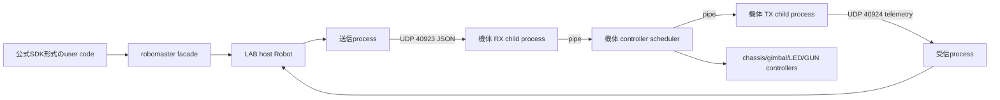

# RoboMaster S1 LAB-SDK

RoboMaster S1の機体内Lab PythonとPCをSocketで接続し、DJI公式
[`dji-sdk/RoboMaster-SDK`](https://github.com/dji-sdk/RoboMaster-SDK)のPython APIをS1で使うための互換SDKです。
公開APIは`robomaster.robot.Robot`と公式component構成に合わせ、Lab固有のupload・起動機能は
`robomaster_lab_sdk`へ分離しています。

> [!IMPORTANT]
> DJI公式SDKではありません。公開APIのmodule名、class名、定数、method signature、callback形式を公式SDKへ合わせていますが、
> stock S1に存在しないEP/Tello hardwareや、S1 Labから結果を取得できない機能は動作しません。
> その場合は成功を装わず`UnsupportedError`を送出します。

## 必要環境とインストール

- Host: Python 3.10以降
- S1機体内DSP: Python 3.6互換source
- RoboMaster S1とPCが相互にUDP通信できるWi-Fi
- FTP `21`、UDP `40923`、UDP `40924`を遮断しないfirewall
- 同梱の直接通信SDK `SDK/`

source treeから実行:

```bash
python -m pip install -r requirements.txt
PYTHONPATH=.:LAB-SDK:SDK python LAB-SDK/examples/basic_lab_control.py
```

packageとして入れる場合は、local dependencyを同時に指定します。

```bash
python -m pip install ./SDK
python -m pip install --no-deps ./LAB-SDK
```

`SDK`と`LAB-SDK`はどちらも`robomaster` facadeを含みます。LAB-SDKを使う環境では
`LAB-SDK`側のfacadeが選択されるよう、LAB専用virtualenvで上記のinstall順または`PYTHONPATH`順を使用してください。

## 公式SDK形式の使用例

```python
from robomaster import blaster, robot

ep_robot = robot.Robot(
    appid="b6359877",
    robot_ip="192.168.23.149",
)
ep_robot.initialize(conn_type="sta", proto_type="udp")

try:
    ep_robot.chassis.drive_speed(x=0.3, y=0, z=0, timeout=2)
    ep_robot.gimbal.drive_speed(pitch_speed=0, yaw_speed=30)
    ep_robot.blaster.fire(fire_type=blaster.INFRARED_FIRE, times=1)
finally:
    ep_robot.chassis.stop()
    ep_robot.gimbal.stop()
    ep_robot.close()
```

`Robot.initialize()`は通常、S1接続、Lab遷移、DSP生成・upload・start、PC側bridge起動までを自動実行します。
機体を動かすコードは必ず`try/finally`で停止してください。

### 接続・Lab起動シーケンス

`initialize(auto_lab=True)`（既定値）は、次の順序と待機条件をSDK内部で処理します。

1. AppID経路の`Connect`が完了してから既定`0.5 s`待機
2. Lab mode遷移用DUSS sequenceを送り、既定`1.0 s`待機
3. GUID/sign/size metadataを送ってからFTPで`/python/python_raw.dsp`へupload
4. FTP完了後に既定`0.5 s`待機
5. DSPのMD5付き`Start`、metadata、runtime notifyを順に送り、既定`1.0 s`待機
6. Host bridgeを開始し、機体bridgeへ停止指令と1 Hzのyaw実測telemetry要求をsession ID付きで送信
7. 同じsession IDのtelemetryが返った時点だけ初期化成功とし、通常の購読設定と50 Hz制御を開始

Lab mode切り替え直後にFTPがまだ受け付けられない場合、既定`5.0 s`以内はuploadを再試行します。
Start後も既定`5.0 s`以内に実測telemetryが返らなければ、成功を装わず`TimeoutError`を送出し、
Host bridgeと機体Lab programを停止して接続を閉じます。FTP転送完了とtelemetry応答を状態境界に使うため、
固定sleepだけで起動成功と判定する実装ではありません。

機体・firmware・無線環境に合わせた調整は`LabSdkConfig`で行えます。

| 設定 | 既定値 | 用途 |
|---|---:|---|
| `connect_settle_sec` | `0.5` | Connect完了後の安定待ち |
| `lab_mode_settle_sec` | `1.0` | Lab mode遷移後の安定待ち |
| `upload_settle_sec` | `0.5` | FTP upload完了後の安定待ち |
| `program_start_settle_sec` | `1.0` | Start/runtime notify後の初期待ち |
| `upload_retry_timeout_sec` | `5.0` | FTP upload再試行の期限 |
| `bridge_ready_timeout_sec` | `5.0` | Start後のtelemetry応答期限 |
| `bridge_probe_interval_sec` | `0.1` | upload再試行・応答probe間隔 |

## 実機用DSP

既定のUDP `40923`/`40924`、制御50 Hz・telemetry最大50 Hzで生成済みの実機用ファイルは
`lab/robomaster_s1_lab_control_bridge.dsp`です。`.py`を直接実行するのではなく、
Python code、GUID、signを含む`code_type=python`のDSPとして機体へuploadします。
既定出力を生成した場合は、wheel同梱用の
`robomaster_lab_sdk/templates/robomaster_s1_lab_control_bridge.dsp`も同時に更新されます。

```bash
python LAB-SDK/tools/build_lab_dsp.py
python LAB-SDK/tools/build_lab_dsp.py /tmp/custom_bridge.dsp \
  --control-port 40923 --telemetry-port 40924 \
  --control-period 0.02 --telemetry-period 0.02
```

## 実行アーキテクチャ



PC側も機体側もUDP受信と送信を別processにしています。Python threadだけに処理を集約しないため、
OSが別CPU coreへ割り当てられます。機体側のLab controller APIは複数thread/processから呼べないため、
すべてのgetter/setterをcontroller scheduler一箇所で直列実行します。I/O child processはSocketとpipeだけを扱い、
`chassis_ctrl`や`gimbal_ctrl`には触れません。

S1機体内runtimeはPython 3.6を前提にしています。DSPへ埋め込むsourceとRX/TX child codeは
Python 3.6 grammarで検査し、Host側だけで使う新しい型annotationや`dataclass`等を機体側へ持ち込みません。

### 周期制御

制御とtelemetryは「処理後にperiod分sleep」しません。開始時刻からの絶対deadlineを
`time.monotonic()`で進め、処理がdeadlineを超えた場合は遅れた周期をskipします。このため、
getterやcommand処理時間が毎周期へ加算され続けるdriftを防ぎます。

Hostは移動中だけ最新のchassis/gimbal速度状態を既定50 Hzで再送します。停止中はEvent待ちとなり、
zero packetを周期生成しません。通常の`drive_speed()`は次の指令または`stop()`まで維持され、
`timeout`指定時はHost timerが停止指令を送ります。Host通信が途絶えた場合は、機体側watchdogが最後の指令を減衰させて停止します。

Lab GUIの方向buttonは、押下時に対応componentの状態を一度設定し、その後はこの50 Hz streamで滑らかに維持します。
button解放時にはtimer停止だけでなく、chassisまたはgimbalの該当componentへ個別のzero/stop指令を送ります。
別groupのbuttonへ切り替えた場合も先のgroupを停止するため、以前のgimbal速度が後続のwheel/chassis指令へ残りません。
これは公式SDKの速度APIと同じく、押下で`drive_speed(...)`、解放で該当componentの`stop()`を呼ぶ使い方です。
GUI独自の短いpulse commandを連打する方式ではありません。

### bufferと優先度

車両制御では古い速度を後から再生しないことを優先します。

- chassis/gimbal速度state: capacity 1のlatest-only。新しいstateが古いstateを置換
- chassis/gimbal/global stop: capacity 8の有界priority FIFO。独立した停止を上書きせず、通常eventより先に送信
- stopより古い未送信event/state: sequenceを比較して破棄
- stopより後に発行したcommand: sequence順を維持して送信
- LED、発射、距離Action等のevent: Host側32件、機体側32件の有界FIFO
- event queue満杯: APIは待たずに`False`を返し、操作threadをblockしない
- 機体RX childのpipe: 長さ付きbinary framing、partial-write継続、priority/event/latest-onlyの有界queue
- 機体親processのRX buffer: 64 KiB上限。不正frameでも無制限に増加しない
- telemetry pipe: JSON wrapperを使わず、送信中1件と最新待機1件だけを保持
- telemetry/UI queue: latest値を優先し、表示遅延を増やす古い値を破棄

機体側は受信した速度packetをcontroller呼び出しごとのFIFOには入れず、chassisとgimbalの最新stateへそれぞれ集約します。
停止時は同componentの保持stateもzeroへ変更するため、停止後に古いジンバルや車輪速度が再適用されません。

DJI公式SDKの通常commandは、汎用のHost送信FIFOへ積まず`Client.send_msg()`からsocketへ即時送信されます。
Actionも`ActionDispatcher`が実行中targetを管理し、同一targetのActionが実行中なら次をFIFOへ積まず例外にします。
公式sourceにある`ACTION_QUEUE`定数と`action_type`引数は、調査対象commitの`send_action()`では送信分岐に使われていません。
また`robomaster.dds.Subscriber`の`_msg_queue`は受信telemetryをcallbackへ渡すためのもので、制御command queueではありません。

LAB-SDKにはHost process間通信と機体内DSPへのUDP転送が追加されるため、完全な即時socket送信にはできません。
そこで、連続motionだけは最新値へ集約し、停止と単発commandは上限付きで順序を保持します。
これは古い速度を遅れて再生せず、かつ停止や発射等を無制限に蓄積しないためのtransport上の差です。

## 機体内bridge

`robomaster_lab_sdk/templates/lab_control_bridge.py`が生成元です。

1. App互換DUSSでLab modeへ遷移し、切り替え待ち
2. Python codeをDSP templateへ埋め込み
3. GUID/signを更新
4. FTPで`/python/python_raw.dsp`へuploadし、完了待ち
5. MD5付きstart commandを送信し、起動待ち
6. 機体内PythonがRX/TX child processを起動
7. Hostが実測telemetry応答を確認
8. 親schedulerがcommandを直列実行しtelemetryを取得

ネットワークから任意のcontroller/methodを`getattr`実行しません。Host commandは機体側の明示的な
module/method mappingを通り、実機操作は
[`Robomaster S1 Python Commands.py`](https://github.com/Robomaster-S1-Python-Examples/ROBOMASTER-S1-Python-Examples/blob/master/Robomaster%20S1%20Python%20Commands.py)
に掲載されたstock S1 Lab commandを基準にしています。

## 実測telemetry

telemetryは送信指令のechoや積分推定ではなく、機体内で次のgetterを呼んだ実測値です。

```python
def read_telemetry_values(fields):
    values = {}
    if "x" in fields:
        values["x"] = value_text(
            chassis_ctrl.get_position_based_power_on,
            rm_define.chassis_forward,
        )
    # y/yaw/vx/vy/gimbal_yaw/gimbal_pitchも同様に購読中だけ取得
    return values
```

取得失敗はJSON `null`です。公式callbackとの対応は次の通りです。

| API | callback data |
|---|---|
| `chassis.sub_position(cs, freq, callback)` | `(x, y, yaw)`。`cs=0`は購読開始値を原点化 |
| `chassis.sub_velocity(freq, callback)` | `(None, None, None, vx, vy, None)` |
| `chassis.sub_attitude(freq, callback)` | `(yaw, None, None)` |
| `gimbal.sub_angle(freq, callback)` | `(pitch, yaw, None, None)` |

存在しない軸を0や推定値で埋めず`None`にします。getterは公式`sub_*()`で購読されたfieldだけを、
各購読の`freq`（1/5/10/20/50 Hz）で取得します。同じfieldを複数購読した場合は最大周波数を使用します。
実効周波数はDSP生成時の`telemetry_period_sec`を上限とします。購読がなければgetterを呼ばず、
rawの`robot.on("telemetry", callback)`は全7 fieldを50 Hzで要求します。

## API互換方針

公開側`LAB-SDK/robomaster/`は公式SDKと同じimport pathを提供します。
Lab管理、DSP選択、GUI helper、bridge直接操作は`robomaster_lab_sdk.gui`などの拡張APIです。

| 公式領域 | 状態 | S1での実装 |
|---|---:|---|
| `robot.Robot` lifecycle/mode | 対応/部分対応 | AppID接続 + Lab自動起動、3 robot mode |
| chassis速度/停止 | 対応 | `move_with_speed`、Host周期再送、timeout |
| chassis wheel/PWM/stick overlay | 対応/部分対応 | Lab commandへallowlist mapping。PWM frequencyは未対応 |
| chassis距離/角度Action | 部分対応 | distance/degree commandを有界の順序送信経路へ投入。公式progress/abortは取得不能 |
| chassis position/velocity/attitude購読 | 実測部分対応 | 上記getter値を公式tuple形状でcallback |
| chassis IMU/ESC/status/mode購読 | 未対応 | 取得元がないため`UnsupportedError` |
| gimbal速度/停止/recenter/move/moveto | 対応/部分対応 | Lab gimbal commandへmapping |
| gimbal角度購読 | 実測部分対応 | pitch/yaw実測値、ground角は`None` |
| blaster | 対応/部分対応 | IRはgun LED pulse、waterはphysical GUN |
| LED | 対応/部分対応 | top/bottom component、effect、single LED |
| camera video/audio | 部分対応 | Labではなく基礎Wi-Fi pathのraw stream |
| battery/armor event | 部分対応 | 基礎Wi-Fi telemetry/eventを利用 |
| vision command | 部分対応 | enable/disable/color/aim。認識結果callbackは未対応 |
| distance sensor command | 部分対応 | measure enable/disable。距離結果callbackは未対応 |
| media command | 部分対応 | sound/capture/record/zoom/exposure |
| servo/arm/gripper/UART/AI/sensor adaptor | 未対応 | stock S1にないためAPIは明示的に失敗 |
| Drone/flight/Tello | 未対応 | 地上機S1の対象外 |

公式API名が存在しても、実機機能まで提供できないものがあります。未対応APIは原則として
`robomaster.exceptions.SDKException`系の`UnsupportedError`を送出します。silent successは使用しません。

## Lab拡張API

次は公式SDKにはない管理用APIです。通常のロボット操作ではcomponent APIを使ってください。

| API | 用途 |
|---|---|
| `robomaster_lab_sdk.robot.Robot.enter_lab()` | Lab mode遷移 |
| `upload_lab_bridge()` | 現在のconfigからDSPを生成してupload |
| `start_lab_bridge()` | 機体DSPとHost I/O bridgeを起動 |
| `stop_lab_program()` | Lab programを停止 |
| `robomaster_lab_sdk.bridge.LabBridge` | JSON UDP bridgeのlow-level access |
| `robomaster_lab_sdk.gui` | DSP選択、GUI upload/start helper |

## command対応表

| 公式API | 機体側command |
|---|---|
| `Robot.set_robot_mode()` | `robot_ctrl.set_mode()` |
| `chassis.drive_speed()` | `chassis_ctrl.move_with_speed()` |
| `chassis.drive_wheels()` | `chassis_ctrl.set_wheel_speed()` |
| `chassis.move()` | `move_with_distance()` + `rotate_with_degree()` |
| `chassis.stick_overlay()` | `enable_stick_overlay()` / `disable_stick_overlay()` |
| `chassis.set_pwm_value()` | `chassis_ctrl.set_pwm_value()` |
| `gimbal.drive_speed()` | `gimbal_ctrl.rotate_with_speed()` |
| `gimbal.recenter()` | `gimbal_ctrl.recenter()` |
| `gimbal.move()` / `moveto()` | `rotate_with_degree()` / `angle_ctrl()` |
| `blaster.fire()` | `gun_ctrl.fire_once()`または`led_ctrl.gun_led_on/off()` |
| `led.set_led()` | `set_bottom_led()` / `set_top_led()` / `turn_off()` |
| `led.set_gimbal_led()` | color設定 + `set_single_led()` |
| `armor.set_hit_sensitivity()` | `armor_ctrl.set_hit_sensitivity()` |
| vision command | `vision_ctrl`の掲載command |
| media command | `media_ctrl`の掲載command |

## 制約と安全

- UDP command/telemetry、FTP uploadに暗号化・認証・再送保証はありません。閉じた信頼済みLANでのみ使用してください。
- 複数HostからUDP `40923`へ送らないでください。最後に受信したHostがtelemetry送信先になります。
- 物理GUNを試す前に弾を抜き、射線を空けてください。
- Actionはcommand投入結果を表す互換objectで、公式SDKの進捗、abort、実動作完了通知を完全には再現しません。
- firmwareやLab runtime差によりchild Python、FTP、DUSS sequenceが使えない場合があります。
- `lab/robomaster_s1_lab_control_bridge.py`はtemplateを既定設定でrenderした実機sourceです。DSP生成toolがDSPと同時に更新します。

## 調査基準

2026-07-19時点:

- DJI公式RoboMaster SDK commit `ff6646e115ab125af3207a4ed3df42cc76c795b2`
- S1 Python command list commit `f0a89f537710799a83ef7eb4b62923ced0dfcea8`

## English summary

LAB-SDK exposes the official RoboMaster Python module/component shape while executing allowlisted stock-S1 Lab commands through a robot-side bridge. Host TX/RX and robot TX/RX use separate processes; all Lab controller calls remain serialized in one robot-side scheduler. Scheduling uses monotonic absolute deadlines, commands are refreshed by the host, the robot watchdog stops motion after communication loss, and telemetry is sampled from the seven real chassis/gimbal getters shown above. Unsupported EP/Tello hardware raises an explicit SDK exception.
