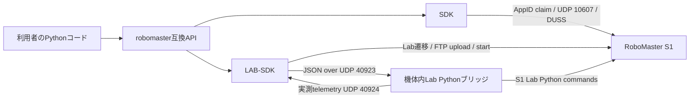

# RoboMaster S1 Wi-Fi SDK

RoboMaster S1を、Windows版RoboMaster Appと互換性のあるWi-Fi通信経路からPythonで操作するための実験的プロジェクトです。DJI公式の[RoboMaster Python SDK](https://github.com/dji-sdk/RoboMaster-SDK)が提供するEP向けAPIの形を、可能な範囲でS1へ移植しています。

> [!IMPORTANT]
> 本プロジェクトはDJI公式SDKではありません。通常状態のS1はEPと同じ公式SDK接続経路を公開していないため、QR/AppID、App互換UDP、DUSS、およびS1のLab実行環境を利用します。実機を安全に停止できる環境で使用してください。

## プロジェクトの構成

本リポジトリには、通信経路と互換性の考え方が異なる2つのSDKがあります。

| 実装 | 実行場所 | 機体操作の経路 | 向いている用途 |
|---|---|---|---|
| [`SDK/`](SDK/) | PC | Windows App互換Wi-FiプロトコルをPCから直接生成 | GUI、映像・音声、判明済みDUSSコマンド、S1固有設定 |
| [`LAB-SDK/`](LAB-SDK/) | PC + S1機体内 | PCからUDPで機体内Pythonブリッジへ指令し、ブリッジがLabコマンドを実行 | 公式SDK風APIとの互換性、Labコマンドで実現できる距離・角度操作 |
| [`robomaster_ros/`](robomaster_ros/) | ROS 2 Host + S1 | 選択した`robomaster` backendをROS topic/actionへ接続 | LAB-SDKを含むROS 2連携 |

`robomaster_ros`はGit Submoduleです。新規cloneでは`--recurse-submodules`を使用するか、
既存cloneで次を実行してください。

```bash
git submodule update --init --recursive
```



両方が`robomaster`互換パッケージを提供します。LAB-SDK内部は直接通信側の
`robomaster_s1_sdk`を基礎接続に使いますが、公開`robomaster` facadeはLAB-SDK側を選ぶ必要があります。
用途ごとにvirtualenvを分け、source実行時は`LAB-SDK`を`SDK`より前の`PYTHONPATH`へ置いてください。

## どちらを使うか

- まずS1を接続・操作し、映像や音声も扱いたい: [`SDK/README.md`](SDK/README.md)
- 公式SDK風コードを重視し、S1のLabコマンドで機体内実行したい: [`LAB-SDK/README.md`](LAB-SDK/README.md)
- パケットやGUIを調査・操作したい: `robomaster_s1_unified_app.py`
- Labのアップロード・起動手順をGUIで個別に確認したい: `robomaster_s1_lab_app.py`

## 仕組み

### 1. S1 Wi-Fi/App互換接続

`SDK`と`LAB-SDK`の基礎接続は共通です。

1. SSID、パスワード、AppIDからS1用QR payloadを生成する。
2. S1が送るブロードキャストを受信し、AppIDをclaimする。
3. PCからS1のUDP `10607`へApp互換のouter envelopeとDUSS frameを送る。
4. session、tick、sequence、CRCは接続状態から実行時に生成する。PCAPの固定再生ではない。
5. 必要に応じてSoloまたはLab状態へ遷移する。

主要ポート:

| ポート | 方向 | 用途 |
|---:|---|---|
| UDP `56789` / `45678` | S1 ↔ PC | 検索、AppID claim |
| UDP `10607` | PC → S1 | App互換control/DUSS |
| UDP `40921` | S1 → PC | H.264 video payload |
| UDP `40922` | S1 → PC | audio payload |
| FTP `21` | PC → S1 | Lab DSPを`/python/python_raw.dsp`へupload |
| UDP `40923` | PC → 機体内bridge | LAB-SDKのJSON command |
| UDP `40924` | 機体内bridge → PC | LAB-SDKの実測telemetry |

### 2. LAB-SDKの機体内Socketブリッジ

LAB-SDKの`Robot.initialize()`は、標準では次を自動実行します。

1. AppID経路でS1へ接続
2. Lab状態遷移用DUSS sequenceを送信
3. `lab_control_bridge.py`をDSP templateへ埋め込み
4. GUID/signを更新し、FTPで`python_raw.dsp`をupload
5. DSPのMD5を含む`0x3f/0xa2` start commandを送信
6. 機体内bridgeとHost側`LabBridge`を起動
7. 機体から実測telemetryが返ることを確認して初期化完了

Connect後、Lab切り替え後、upload後、Start後にはそれぞれ設定可能な安定待ちを入れます。
Lab切り替え直後のFTPは期限付きで再試行し、Start後は固定時間の経過だけでは成功にせず、
実測telemetry応答を既定5秒待ちます。応答がなければLab programを停止し`TimeoutError`にします。
既定値と変更方法は[`LAB-SDK/README.md`](LAB-SDK/README.md#接続lab起動シーケンス)を参照してください。

機体内bridgeはLab PythonプロセスからSocketを開くために実行環境を利用するHackです。一方、ロボットの駆動・LED・GUN・センサー等の操作は、S1実機で利用可能な[Robomaster S1 Python Commands.py](https://github.com/Robomaster-S1-Python-Examples/ROBOMASTER-S1-Python-Examples/blob/master/Robomaster%20S1%20Python%20Commands.py)にあるcontroller APIへ明示的にマッピングします。任意のcontroller名やmethod名をネットワークから直接実行する設計ではありません。

Telemetryは公式`sub_*()`で購読された項目と周波数に合わせ、機体内で次のgetterを周期取得した実測値です。

- chassis power-on基準位置 X/Y
- chassis yaw
- chassis forward/translation speed
- gimbal yaw/pitch angle

値を取得できない場合はJSONの`null`となります。UDPのため、到達保証や再送保証はありません。

## クイックスタート

HostはPython 3.10以降を使用します。S1へuploadするDSP内sourceは機体runtimeに合わせてPython 3.6互換です。

```bash
python -m pip install -r requirements.txt
```

### GUI

```bash
python robomaster_s1_unified_app.py
```

Windows PowerShell:

```powershell
python .\robomaster_s1_unified_app.py --appid b6359877 --ssid YOUR_SSID --password YOUR_PASSWORD
```

主な機能:

- S1接続用QR生成
- 機体検索、AppID claim、再接続
- Solo modeの開始・終了
- chassis / gimbal / GUN / LED操作
- H.264表示、機体音声受信、PC microphone送信
- gimbal、odometry、status、armor telemetry表示
- 解像度、anti-flicker、3D quality、speed、voice、volume設定
- 通信debug log

### 直接通信SDK

```bash
PYTHONPATH=.:SDK python SDK/examples/basic_control.py
```

```python
from robomaster import robot

ep_robot = robot.Robot(appid="b6359877")
ep_robot.initialize(conn_type="sta", enter_solo=True)
try:
    ep_robot.chassis.drive_speed(x=0.3, y=0.0, z=0.0)
finally:
    ep_robot.chassis.stop()
    ep_robot.close()
```

### robomaster_rosからLAB-SDKを使う

ROS 2環境では通常のPyPI `robomaster`を混在させず、使用するbackendのSDKだけをinstallします。
SOLO環境は`SDK/`だけを、LAB環境は基礎通信dependencyの`SDK/`に続けて`LAB-SDK/`をinstallし、
最後にinstallしたLAB facadeを選択します。backendごとにvirtualenvを分離してください。

```bash
python3 -m pip uninstall -y robomaster
python3 -m pip install --no-deps ./LAB-SDK
colcon build --packages-select robomaster_msgs robomaster_description robomaster_ros
source install/setup.bash
RM_ROBOT_IP=192.168.23.149 RM_APPID=b6359877 \
  ros2 launch robomaster_ros s1_lab.launch
```

`s1_lab.launch`は50 HzのLAB bridgeを選択し、stock S1 Lab commandに存在しない
speaker、EP arm/gripper/servo/ToF/UART等を無効化します。

SOLOモードでPCから直接制御する場合:

```bash
python3 -m pip uninstall -y robomaster robomaster-s1-lab-sdk
python3 -m pip install ./SDK
colcon build --packages-select robomaster_msgs robomaster_description robomaster_ros
source install/setup.bash
RM_ROBOT_IP=192.168.23.149 RM_APPID=b6359877 \
  ros2 launch robomaster_ros s1_solo.launch
```

#### ROS 2 backendの違い

| 項目 | DJI公式SDK | SOLO `SDK/` | LAB-SDK |
|---|---|---|---|
| Launch | `s1.launch` / `ep.launch` | `s1_solo.launch` | `s1_lab.launch` |
| 対象機 | S1 / EP | S1 | S1 |
| 接続経路 | 公式SDK transport | App互換Wi-Fi、Hostから直接DUSS/control | App互換Wi-Fi、機体内DSP、UDP bridge |
| ROS速度指令 | 公式chassis API | 解析済みcontrol payloadを50 Hz保持 | Lab `move_with_speed`を50 Hz更新 |
| command送信 | 通常commandをsocketへ即時送信 | 最新control state + 有界一時sequence | latest-only motion + 有界priority/単発FIFO |
| 停止 | 公式SDK/driver heartbeat | neutral control state、SOLO keepalive終了 | priority stop、機体watchdog |
| Odometry | 公式SDK内部telemetry配信層 | App/DUSS telemetryの実測decode | Lab getterの実測値 |
| IMU / ESC / status | 対応 | 未解析のため無効 | Lab getterがないため無効 |
| Gimbal | 速度・Action | 速度対応。角度Action/recenter未対応 | 速度・角度command。progress/cancel非対応 |
| Camera / audio | 公式LiveView | App互換raw H.264/audio | App互換raw H.264/audio |
| ROS module | 機体に応じて選択 | armor、battery、blaster、camera、chassis、gimbal、LED | 同左 |
| private heartbeat | 使用 | 使用せず直接SDKのreceive/keepalive | 使用せずbridge watchdog |

対応moduleではROS topic/action名を維持しますが、取得元が存在しない値を0や推定値で埋めません。
公式SDKの`robomaster.dds`は購読telemetryをcallbackへ配る内部module名であり、
ROS 2が通信middlewareとして使用するDDSそのものではなく、別のSDKでもありません。
この受信telemetry queueを制御commandのqueueと比較することはできません。公式SDKの通常commandは即時送信であり、
LAB-SDKは追加のprocess間・UDP bridgeで遅延した古いmotionを再生しないため、motionだけをlatest-onlyにしています。
詳細な制約は[`robomaster_ros/README.md`](robomaster_ros/README.md)を参照してください。

### LAB-SDK

```bash
PYTHONPATH=.:LAB-SDK:SDK python LAB-SDK/examples/basic_lab_control.py
```

```python
from robomaster import robot

ep_robot = robot.Robot(appid="b6359877", robot_ip="192.168.23.149")
ep_robot.initialize(conn_type="sta")  # Lab enter/upload/startも自動実行
try:
    ep_robot.chassis.move(x=0.5, xy_speed=0.3).wait_for_completed()
finally:
    ep_robot.chassis.stop()
    ep_robot.close()
```

実機へuploadできる50 Hz設定のDSPは
[`lab/robomaster_s1_lab_control_bridge.dsp`](lab/robomaster_s1_lab_control_bridge.dsp)です。
templateやportを変更した場合は次のコマンドで再生成します。既定出力の生成時は、
LAB-SDKのwheelに同梱するDSPも同時に更新されます。

```bash
python LAB-SDK/tools/build_lab_dsp.py
```

## 対応状況の要約

「対応」はAPI名が存在するだけでなく、実機処理へ接続されていることを意味します。「部分対応」は引数、Action完了、購読解除、結果取得などが公式SDKと異なります。

| 領域 | SDK | LAB-SDK |
|---|---|---|
| 接続・終了 | App互換経路で対応 | App互換接続 + Lab自動起動 |
| chassis速度 | 対応 | Lab `move_with_speed`で対応 |
| chassis距離・角度Action | 未対応（誤った速度指令へ変換せず例外） | Lab距離・角度commandへ部分対応 |
| wheel速度 | DUSS commandで対応 | Lab `set_wheel_speed`で対応 |
| gimbal速度 | 対応 | Lab `rotate_with_speed`で対応 |
| gimbal角度Action | 未対応 | Lab degree/angle commandへ部分対応 |
| blaster / LED | 部分対応 | Lab commandで部分対応 |
| video / audio | raw payloadを受信 | 基礎Wi-Fi経路のvideo/audio APIへ委譲 |
| telemetry | 解析済みDUSSをcallback | 機体内getterの実測値をUDP転送 |
| vision / sensor | 未対応 | command開始・停止は部分対応、検出値callbackは未対応 |
| EP拡張hardware | 対象外 | import互換stubのみ |

詳細は各SDKのREADMEを参照してください。

## ファイル案内

| パス | 役割 |
|---|---|
| `robomaster_s1_unified_app.py` | 通常操作用の統合GUI |
| `robomaster_s1_lab_app.py` | Lab upload/start/bridge操作GUI |
| `robomaster_s1_sdk_app.py` | SDK facadeを使用するGUI |
| `robomaster_s1_designed_motion.py` | 調査・単独実行用の通信例。SDK packageには含めない |
| `robomaster_s1_probe.py` | 調査用probe例。SDK packageには含めない |
| `robomaster_wifi_qr_generator.py` | QR payload、Header8/AppID変換 |
| `robomaster_s1_wifi_communication_spec.md` | 現在の通信仕様 |
| `robomaster_s1_all_in_one.md` | 解析履歴・調査メモ |
| `robomaster_s1_asset_inventory.md` | asset inventory |
| `robomaster_s1_sound_effects.md` | sound effect commandの調査 |
| `lab/` | Lab bridge、probe、過去の検証用program |

## 制約と安全性

- S1、PC、周囲の安全を確認し、最初は車輪を浮かせるか低速で試してください。
- `chassis.drive_speed()`は`stop()`または別指令まで動作を継続し得ます。必ず`try/finally`で停止してください。
- 物理GUNを使用するときは弾を抜き、発射方向と保護具を確認してください。
- Wi-Fi、FTP、UDP JSON bridgeには暗号化・認証・完全性保護がありません。信頼できる閉じたLANでのみ使用してください。
- LAB-SDKは機体へDSPをuploadして実行します。firmware差、App状態、network interface差により動作しない場合があります。
- LAB-SDKの実測telemetryは、対応する`sub_*()`の`freq`に合わせてgetter取得周期を変更します。
- 対応済みの`unsub_*()`は登録したcallbackを削除します。取得元がない購読APIは明示的に未対応です。
- 本リポジトリには実機依存の機能が多く、hardware-in-the-loopでの確認が必要です。

## 調査基準

READMEの互換性調査は2026-07-19時点で、以下を基準にしています。

- DJI公式[RoboMaster-SDK](https://github.com/dji-sdk/RoboMaster-SDK) `master`、commit `ff6646e115ab125af3207a4ed3df42cc76c795b2`
- S1実機用[Robomaster S1 Python Commands.py](https://github.com/Robomaster-S1-Python-Examples/ROBOMASTER-S1-Python-Examples/blob/master/Robomaster%20S1%20Python%20Commands.py)、commit `f0a89f537710799a83ef7eb4b62923ced0dfcea8`

## English summary

This is an experimental RoboMaster S1 Python project. It recreates an official-SDK-like API over the S1 Windows App-compatible Wi-Fi path. `SDK/` sends reconstructed App/DUSS traffic directly from the host. `LAB-SDK/` enters Lab mode, uploads and starts a robot-side Python bridge, sends allowlisted commands over UDP `40923`, and returns measured chassis/gimbal telemetry over UDP `40924`.

It is not the official DJI SDK. Use Python 3.10+, isolate the two `robomaster` compatibility packages, test at low speed, always stop motion in `finally`, and use the unauthenticated FTP/UDP paths only on a trusted network. See [`SDK/README.md`](SDK/README.md) and [`LAB-SDK/README.md`](LAB-SDK/README.md) for installation, API coverage, and limitations.
