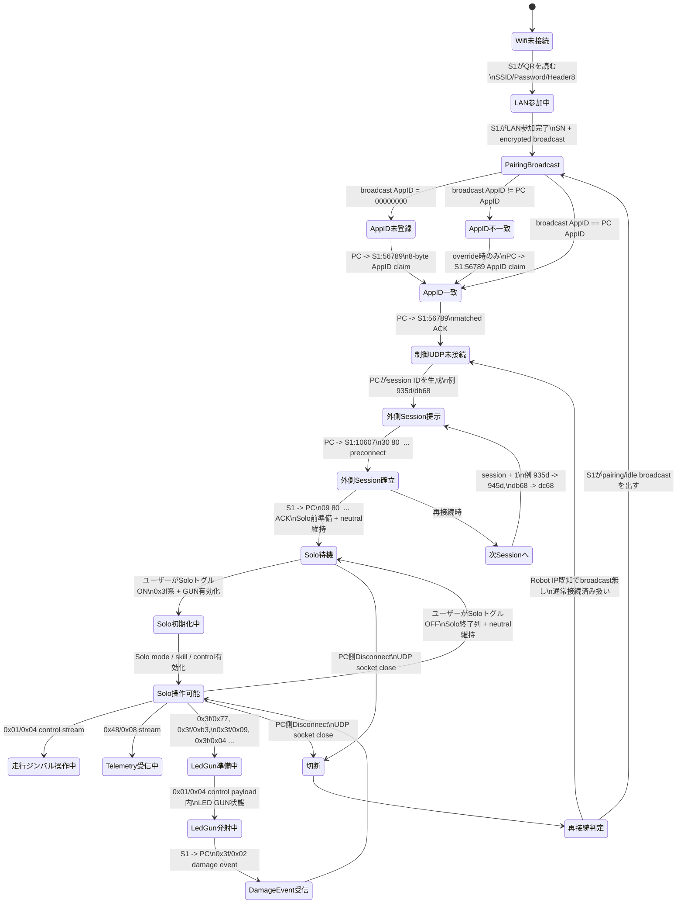
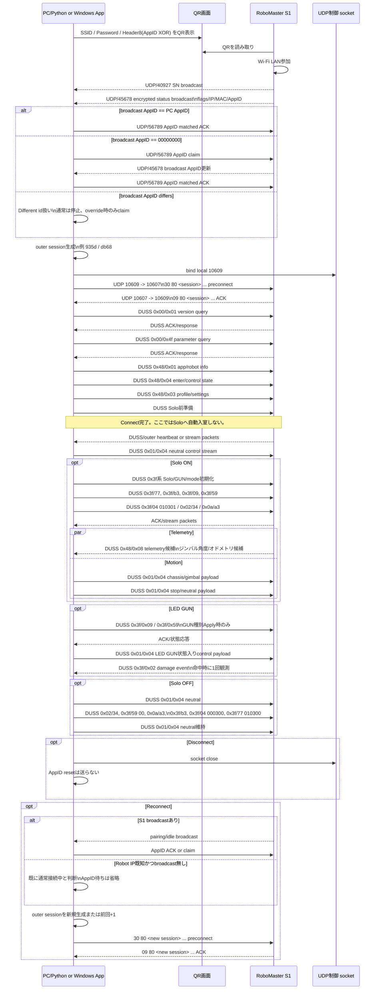

# RoboMaster S1 解析・実装 統合ドキュメント

このファイルは、これまで分かっているQR/AppID/接続/UDP/DUSS/速度設定/Telemetry GUI/Windows App通信解析を1つに集約したマスター文書です。

現在の実装仕様は `robomaster_s1_wifi_communication_spec.md` を正とする。この文書には過去の解析履歴、比較実験、当時の推定も含まれるため、現行アプリの挙動は「現行実装メモ」および仕様書の記述を優先する。

## 現行実装メモ

現行の統合Appは、接続、QR生成、H.264表示、telemetry表示、操作、音声、速度、Video、LED/GUN種別などを1つのGUIにまとめた実装である。現在の動作基準は次の通り。

```text
AppID:
  ユーザー指定またはHeader8から確認済みの8文字hex ASCIIを使う。
  matched ACKはAppID 8 bytes ASCIIを1 datagram送る。
  固定回数の複数送信は行わない。

Connect:
  AppID claim / ACK、preconnect、Solo前準備DUSS、neutral control維持までを行う。
  ConnectだけではSoloへ自動で入らない。

Solo:
  Disconnect横のSoloトグルでON/OFFする。
  Solo OFF中はneutral controlのみ維持し、ユーザー操作controlは送らない。
  Solo ON時にSolo入室列、GUN有効化、mode/state列を送る。
  Solo OFF時にSolo終了列を送ってSolo待機へ戻る。

DUSS seq:
  接続中は単調増加させる。
  Solo再入室で初期ログのseqへ巻き戻さない。

Apply型UI:
  Speed、Video、GUN種別、Voice、Volume、Control SensitivityはApply操作時だけ反映する。
  radio選択や数値編集だけでは送信しない。

Control Sensitivity:
  機体へ永続設定DUSSは送らない。
  App内のgimbal操作ゲインとして反映する。
  DefaultはPitch=40、Yaw=50。Customは0..100。

Cooldown:
  Cooldown制御UIは実装しない。
  `0x3f/0e` はS1からの状態通知として扱う。

Replay / PCAP:
  通常経路はPCAPを開かずにDUSS/outerを生成する。
  再生・比較系は明示オプションまたは履歴上の解析用途に限定する。
```

## 目次

- [1. QR接続と制御コマンド総合まとめ](#1-qr接続と制御コマンド総合まとめ)
- [状態遷移図](#状態遷移図)
- [2. AppID / 接続シーケンス推定](#2-appid--接続シーケンス推定)
- [3. Windows App速度設定解析](#3-windows-app速度設定解析)
- [4. Windows App通信解析](#4-windows-app通信解析)
- [5. 初期接続・Solo・LED GUN・ダメージ通知解析](#5-初期接続sololed-gunダメージ通知解析)


---

# 1. QR接続と制御コマンド総合まとめ

統合元: `robomaster_s1_connection_and_command_summary.md`

このメモは、これまで取得した `pcapng` / CSV / Windows App解析 / Python実装結果をもとに、RoboMaster S1をQRコードでWi-Fi接続し、その後Windows Appがどのような流れで機体へ指示を出しているかを整理したものです。

## 全体像

現時点で最も自然な接続モデルは以下です。

```text
1. AppがWi-Fi接続用QRコードを表示する
2. S1がQRコードを読み、指定SSID/PasswordのLANへ参加する
3. S1がLAN上へ discovery broadcast を送る
4. AppがS1のSN/MAC/IP/AppID状態を検出する
5. 必要に応じてAppが自分のAppIDを S1:56789 へ送る
6. Appが S1:10607 へUDP制御接続を開始する
7. Solo前準備DUSSとneutral controlを送る
8. ユーザーがSoloトグルをONにした場合にSolo初期化DUSSを送る
9. Solo ON完了後、走行・ジンバル・GUN・設定などをDUSSで送る
```

### 初回session seedの調査

DJI公式QRで取得した `appid-<Header8>.pcapng` について、Header8から復元したAppIDと、preconnectでPCが提示したouter sessionを比較した。

| pcap | Header8 | 復元AppID | 観測session |
| --- | --- | --- | --- |
| `appid-10f801bd5aa51a0c.pcapng` | `10f801bd5aa51a0c` | `a2be7ce8` | `f30c`, `4f0d -> 500d` |
| `appid-17af55bd0ff01e00.pcapng` | `17af55bd0ff01e00` | `fe6eb6a4` | `4009`, `c20a -> c30a` |
| `appid-41fb01ba59f44e0c.pcapng` | `41fb01ba59f44e0c` | `01bb4218` | `160e`, `6b0e -> 6c0e` |

確認したが一致しなかった候補:

```text
Header8先頭/末尾16bit
復元AppID先頭/末尾16bit
Header8 crc32下位16bit
復元AppID crc32下位16bit
Header8 byte sum
復元AppID byte sum
```

したがって、初回session seedはAppID/QRから直接導出される値ではなく、Windows App側の接続時生成値として扱う。S1へは必ずpreconnectで通知されるため、S1側が事前に同じ計算をしている必要はない。

重要なのは、QRコードは「S1をLANへ参加させる情報」と「AppIDをS1側へ登録するためのHeader8」を含み、実際の操作対象の紐づけは、Wi-Fi接続後の discovery / AppID broadcast / UDP制御セッション / DUSS初期化で成立している点です。

## 状態遷移図

現在の解析結果を状態遷移として整理すると以下です。



状態ごとの責務は次の通りです。

| 状態 | 主体 | 決まる情報 | 根拠/注意 |
| --- | --- | --- | --- |
| QR生成 | PC/App | SSID、Password、Header8 | Header8はAppID ASCII 8 bytesの固定XOR表現 |
| LAN参加 | S1 | IP、SN broadcast開始 | SNは `S1:56789 -> broadcast:40927` |
| PairingBroadcast | S1 | flags、IP、MAC、現在AppID | encrypted broadcastをXOR復号 |
| AppID claim/ACK | PC/App | 接続に使う8文字AppID | `PC:45678 -> S1:56789` |
| 外側Session提示 | PC/App | `935d` / `945d` / `db68` / `dc68` など | AppIDからの計算ではなくPC側生成。preconnectで通知 |
| 外側Session確立 | PC/App + S1 | UDP outer envelopeのsession共有 | S1は同じsessionでACK/応答 |
| Solo待機 | PC/App + S1 | Solo前準備、neutral維持 | Connect完了後の状態。走行・ジンバル・GUN操作はまだ送らない |
| Solo初期化 | PC/App | DUSS seq、mode、skill/control状態 | SoloトグルON時に実行。AppIDだけでは走行・ジンバル・telemetryは出ない |
| Solo操作可能 | PC/App + S1 | `0x01/0x04` 操作、`0x48/0x08` telemetry | telemetryはSolo初期化状態に依存 |
| LED GUN準備 | PC/App | `0x3f` 系のGUN関連状態 | 操作payloadだけでは不足 |
| DamageEvent | S1 | `0x3f/0x02` 受信イベント | `initial-connect-solo-damage1time` で1回観測 |

実装上の重要点:

```text
通常実行:
  AppIDは --appid で指定
  外側sessionはPC側で生成
  preconnectで session をS1へ通知
  同一接続中にpreconnectをやり直す/再接続する場合は前session + 1
  DUSSは実行時にCRC8/CRC16を再計算して生成
  DUSS seqは接続中に単調増加
  ConnectだけではSoloへ自動入室しない
  CSV/PCAP payloadは通常参照しない

比較実験:
  --exact-reference など明示指定時だけログ再生/比較系を使う
```

現在方針:

```text
生成がメイン。
Replay/PCAPそのものの送信は、成功基準との差分確認や緊急退避のための明示オプションに限定する。
ただし生成結果の目標挙動は、実機で動作確認済みのReplay成功列と同じである。
```

### シーケンス図

初回接続からSolo操作、LED GUN、再接続までを送受信順に並べると以下です。



ログ上の具体例:

| pcap | 段階 | PC送信 | S1応答 |
| --- | --- | --- | --- |
| `initial-connect-solo-damage1time` | 初回preconnect | frame 165 `3080935d...` | frame 169 `0980935d...` |
| `initial-connect-solo-damage1time` | 2回目preconnect | frame 1058 `3080945d...` | frame 1059 `0980945d...` |
| `connect-solo` | 2回目preconnect | frame 139019 `3080dc68...` | 同じ`dc68` sessionで後続応答 |

このため、実装でログから `dc68` を固定で持ってくるのではなく、PC側がsessionを決め、その値をpreconnectから全outer envelopeへ一貫して使う必要があります。

再接続で直前sessionが分かっている場合は、完全新規ランダムではなく直前session + 1を使う。実装では `robomaster_s1_designed_motion.py --previous-session 935d` のように指定すると、今回sessionは `945d` になる。`--previous-session db68` なら `dc68` になる。

## 外側UDP envelope生成ルール

このフォルダ内の `*-duss.csv` / 元pcapng横断で確認した外側UDP envelopeのルール:

```text
direct packet:
  offset 0..1   UDP payload length/type
  offset 2..3   PC側が決めたouter session
  offset 4..5   PC direct tick。direct送信ごとに +8
  offset 6      0x05
  offset 7      offset 0..6 のXOR
  offset 8..9   S1 inbound packet の offset 24..25 に追従するbackref/window
  offset 10..11 PC direct tick再掲
  offset 16     PC側packet index
  offset 17     0x01
  offset 18..19 outer flags。cmd/状態ごとに2バイトで扱う
  offset 20..   DUSS

control packet:
  offset 0..1   UDP payload length/type
  offset 2..3   outer session
  offset 4..5   0x0000
  offset 6      0x04
  offset 7      offset 0..6 のXOR
  offset 8..11  control stream tick/window
  offset 16..31 direct/control carrier window
  offset 32..33 DUSS length
  offset 34..   DUSS
```

重要な実装上の訂正:

```text
control offset 7:
  固定値ではない。sessionがdc68なら結果的に0x0aになるが、
  945dでは0x77になる。先頭7 bytes XORで生成する。

direct offset 8..9:
  単純なPC送信カウンタではない。
  直近S1 inbound outerの offset 24..25 と強く一致する。
  したがって、S1応答を読み捨てず、outer状態更新に使う。

control offset 8..11:
  CSVに出るDUSS行だけでは復元できない。
  pcapng内の1472 byte級stream packetやDUSS応答を含む全UDP inboundを使う必要がある。
  DUSS control packetでは、直近S1 inbound stream/data outerの offset 10..11 を2回並べる。
  34 byte heartbeatはkeepalive/window用であり、DUSS control用tickを上書きしてはいけない。

control offset 16..19:
  direct ACKのDUSS seqから送信時tickを逆引きするのではなく、
  S1 inbound direct response packet自体の outer offset 4..5 を使う。
  例: seq10092のresponseはDUSS seq10092だがouter offset 4..5は `18ed` で、
  次のcontrol packetも `18ed18ed` を使う。

control offset 24..31:
  34 byte heartbeat/window packetの offset 24..27 と、
  直近direct tick/windowを組み合わせて構成される。
  大きいstream fragmentのoffset 24以降はpayload断片であり、window更新には使わない。

Solo初期化送信順:
  DUSS seq昇順ではない。
  direct列とcontrol streamが並行しており、Replay成功列では
  10072, 10073, 10074, 10075, 10076, 10078, 10079, 10077, ...
  の順で送られる。
```

実装では `robomaster_s1_designed_motion.py` に、送信順 `SUCCESS_SOLO_SETUP_SEND_ORDER`、control XOR、S1 inboundからのouter window更新を反映した。

検証結果:

```text
initial-connect-solo-damage1time.pcapng
2回目接続 945d
Solo setup seq 10072..10113

生成DUSS + 生成outer + pcapng全UDP inboundによる状態更新
=> 42 / 42 packet がReplay成功列と完全一致
```

### 全pcapng横断検証結果

2026-07-12時点で、このフォルダ内の全 `*.pcapng` を走査し、UDP/10607制御セッションの外側envelopeとDUSSコマンドを再集計した。

対象pcapng:

```text
appid-10f801bd5aa51a0c.pcapng
appid-17af55bd0ff01e00.pcapng
appid-41fb01ba59f44e0c.pcapng
appid-timeout.pcapng
armor-addressing-back-front-left-right.pcapng
buttle-in-out.pcapng
change-gimbal-sensivility.pcapng
chasis-gimbal-calib-horizon-front-keft-back-right-gimbal.pcapng
connect-solo.pcapng
fastspeedsolo.pcapng
formatsd.pcapng
gps-deviceinfo-log-on-off.pcapng
gun-on-off-gimballimit-off-on.pcapng
initial-connect-solo-damage1time.pcapng
labo-in-out.pcapng
labo.pcapng
led.pcapng
med-fast-custom-slow.pcapng
midspeedsolo.pcapng
motor-addressing-fr-fl-rl-rr.pcapng
robomaster_s1_random_appid_connect.pcapng
sleep-on-30-1-5-10-poweroff.pcapng
solo-gelgun-customspeed.pcapng
solo-in-out.pcapng
test-appid.pcapng
video-resolution-change.pcapng
wifi-connect-appid-reset-connect.pcapng
wificonnect.pcapng
```

外側envelopeの確認結果:

| 項目 | 全pcapng横断結果 | 結論 |
| --- | ---: | --- |
| offset 7 | `444953 / 444953` | 先頭7 bytes XORで確定 |
| direct offset 8..9 | `1856 / 1858` | S1 inbound window offset 24..25。残り2件はcapture途中/境界の欠落扱い |
| control offset 8..11 | `9282 / 9660` | S1 stream/data offset 10..11の2回反復。34 byte heartbeatでは上書きしない |
| control offset 16..17 | `9507 / 9659` | S1 direct response offset 4..5、またはwindow offset 16..17に追従 |
| control offset 24..27 | `9653 / 9659` | window offset 24..25 + 直近PC direct tick |

`control offset 8..11` と `control offset 16..17` の残差は、ほぼすべてが以下のどちらかに分類できる。

```text
1. pcapngが既に接続済み状態から始まっており、直前のS1 inbound stateがcapture外にある
2. 同一時刻付近でS1 stream fragment / heartbeat / DUSS応答が密集し、単純な1本のlatest stateだけではWindows App内の受信処理順と一致しない
```

ただし、`initial-connect-solo-damage1time.pcapng` の2回目接続Solo setup区間では、pcapng内の全S1 inboundを順に反映すると生成packetが `42 / 42` 完全一致している。このため、LED GUN/Solo初期化で必要な外側生成ルールは、少なくとも成功基準区間では確定している。

sessionの確認結果:

| pcap | preconnectで見えるsession遷移 |
| --- | --- |
| `initial-connect-solo-damage1time.pcapng` | `935d -> 945d` |
| `connect-solo.pcapng` | `db68 -> dc68` |
| `appid-10f801bd5aa51a0c.pcapng` | `4f0d -> 500d` |
| `appid-17af55bd0ff01e00.pcapng` | `c20a -> c30a` |
| `appid-41fb01ba59f44e0c.pcapng` | `6b0e -> 6c0e` |
| `test-appid.pcapng` | `da20 -> db20` |
| `wificonnect.pcapng` | `7e70 -> 7f70` |

結論:

```text
外側sessionはAppIDやQR Header8から直接計算されていない。
PC側がpreconnectでS1へ提示する。
同一App接続中の再接続では、リトルエンディアン16bitとして前session + 1 が繰り返し観測される。
初回sessionのseedはPC側生成値であり、ログから固定値を拾って使うものではない。
```

DUSSコマンド横断集計:

| cmdset/cmdid | 方向 | 件数 | 意味/扱い |
| --- | --- | ---: | --- |
| `0x01/0x04` | PC -> S1 | 11717 | 走行、ジンバル、停止、LED GUN状態を含む高頻度control |
| `0x48/0x08` | S1 -> PC | 7138 | telemetry stream。ジンバル角度/オドメトリ候補はここ |
| `0x02/0xe4` | S1 -> PC | 3387 | stream/status系。未完全復号 |
| `0x3f/0xa5` | S1 -> PC | 3268 | mode/game/gun周辺の周期状態候補。未完全復号 |
| `0x3f/0x04` | PC -> S1 | 738 | Solo/Labo等のmode/state設定で頻出 |
| `0x07/17` | PC -> S1 | 459 | 設定/デバイス系で頻出 |
| `0x48/01` | PC -> S1 | 12 | App/robot infoまたは制御開始前処理 |
| `0x48/03` | PC -> S1 | 36 | telemetry/profile購読または設定登録 |
| `0x3f/77` | PC -> S1 | 73 | LED GUN/skill初期化の重要コマンド |
| `0x3f/b3` | PC -> S1 | 9 | LED GUN関連初期化。応答payloadは `e401` が多い |
| `0x3f/09` | PC -> S1 | 12 | 大きいGUN/skill設定。外側length上位bitが必要 |
| `0x3f/10` | S1 -> PC | 144 | LED GUN発射/被弾/ダメージ周辺イベント候補 |

AppIDだけのpcapng:

```text
appid-timeout.pcapng
robomaster_s1_random_appid_connect.pcapng
```

この2つにはUDP/10607の制御セッションが無い。したがって、AppID照合やbroadcastの確認には使えるが、Solo初期化、telemetry、LED GUN、車輪/ジンバル操作の解析材料にはならない。

現時点で残る未確定点:

```text
1. 初回session seedそのものをWindows Appがどう選んでいるか。
   DJI公式QR Header8 / 復元AppID / crc32 / 単純sum / 先頭末尾16bitとは一致しない。
   ただしS1へはpreconnectで通知されるため、生成実装にはランダム/指定/前session+1で足りる。

2. 0x48/08 telemetry payload内の詳細名。
   len=11はgimbal角度系、len=62はheading/position/velocity系まで絞れた。
   ただしraw0/raw1/raw2/raw3の正式名称、world/body速度の厳密な対応名は未確定。

3. 0x3f/10の全payload意味。
   0x3f/02がダメージイベント本体で、0x3f/10は発射/被弾周辺の状態遷移通知。
   全bitの意味は未確定。

4. control offset 16..17の境界時の数件。
   成功Solo setup区間では完全一致するため実装上のブロッカーではないが、
   全captureを一本のlatest stateだけで再現すると1-5%程度の境界差が残る。
```

追加で明らかになった点:

```text
0x02/e4:
  全CSVで1751件。payloadは実質2種類のみ。
  ほぼ固定heartbeat/statusであり、gimbal/odometry値ではない。

0x3f/a5:
  全CSVで1576件。payloadは2種類のみ。
  ASCII "000...ABC...789..." を含む固定的なgame/skill状態通知であり、角度/オドメトリではない。

0x3f/02:
  全CSVで initial-connect-solo-damage1time の1件のみ。
  LED GUNダメージイベント本体として扱う。
```

## QRコード

QRコードの中身は、現時点では以下の構造と見ています。

```text
[0:2]   length header
[2:10]  Header8
[10:12] 固定値 ca 6c
[12:]   XOR(SSID + Password)
```

`Header8` は、AppID 8文字ASCIIを固定XORマスクで変換した8バイト値と見ています。

```python
HEADER8_APPID_MASK = bytes.fromhex("71ca63d86dc67f34")
header8 = xor(appid_ascii_8_bytes, HEADER8_APPID_MASK)
appid_ascii_8_bytes = xor(header8, HEADER8_APPID_MASK)
```

つまりQR内には平文AppIDそのものではなく、`Header8`として難読化されたAppID要素が入ります。

`length header` は、SSIDとPasswordの長さから以下のように計算できています。

```python
ssid_length_field = len(ssid_utf8) + utf8_continuation_count(ssid_utf8) + 1
value = 0xbc00 + ssid_length_field + (len(password_utf8) << 6)
length_header = value.to_bytes(2, "little")
```

例えば、ASCIIの `'` とスマートクォート `’` はUTF-8長が異なるため、SSIDが見た目上似ていても `length header` が変わります。

作成済みスクリプト:

```powershell
.\venv\Scripts\python.exe .\robomaster_wifi_qr_generator.py
```

GUI版では `SSID`、`Password`、`Header8` を入力し、長さヘッダは自動計算します。`Header8`欄は編集不可にし、Generateボタンでランダム8バイトを生成できます。ただし、ランダムHeader8から復元されるAppID生バイトが必ず8文字ASCII hexになるとは限らないため、統合AppのAppID欄には、S1 broadcastまたはDJI公式QR/Header8比較で確認できた8文字AppIDを入れる。

## DiscoveryとAppID

S1がLANに参加すると、主に以下のbroadcastを送ります。

```text
S1:56789 -> broadcast:40927
  payload: SN文字列 + NUL

S1:xxxx -> broadcast:45678
  payload: 暗号化された24バイト程度の状態通知
```

SNは平文で取得できます。観測例:

```text
SN  = 159CG7X0040CK2
MAC = 60:60:1F:CD:76:65
```

UDP/45678の暗号化broadcastは、以下の単純なXORストリームで復号できます。

```python
key = 7
out = []
for b in data:
    out.append(b ^ key)
    key = ((key + 7) ^ 178) & 0xff
```

復号後の構造は以下です。

```text
[0:2]   magic 5a5b
[2]     flags。bit0 が pairing 状態らしい
[6:10]  S1 IP
[10:16] S1 MAC
[16:24] AppID 8バイト
```

AppIDはWindows App側のUUIDから作られ、QRの`Header8`にも固定XORされた形で入ります。Windows App解析では以下の流れでした。

```text
GetAppUUID():
  DJIPlayerPrefsからUUIDを読む
  なければ Guid.NewGuid().ToString() を保存

GetAppID():
  UTF8(AppUUID) の先頭8バイトを UInt64 として読む
```

実際の通信上は8文字ASCIIとして見えます。観測例:

```text
3bc50c79
42f2225f
a99dcf74
```

Appは、S1のbroadcast内AppIDが `00000000` だったり、自分のAppIDと一致したりしたときに、以下を送ってclaim/ACKしていると見ています。

```text
App:45678 -> S1:56789
payload = AppID 8バイトASCII
```

作成済みスクリプト:

```powershell
.\venv\Scripts\python.exe .\robomaster_s1_random_appid_connect.py --robot-ip 192.168.23.149 --local-ip 192.168.23.192
```

このスクリプトは指定したAppIDでS1のdiscoveryを待ち、AppID claim/ACKだけを行います。走行制御までは行いません。現在は `--appid` が必須で、ランダム生成は行いません。

## 48文字Hashの整理

以前 `pair_hash` と仮称していた48文字値は、機体固有の認証Hashではなく、Windows App内部ではScratch/DSPプロジェクト識別値として扱われている可能性が高いです。

構造:

```text
48文字値 = guid 32文字 + sign 16文字
```

`sign` は以下のようなプロジェクト情報からMD5で作られます。

```text
MD5("wwxnMmF8" + creation_date + title + creator
    + firmware_version_dependency + guid
    + python_code + scratch_description
    + code_type + audio_list_content)
```

この値は `0x3f/0xa3` でS1へ送られ、Solo/Labo系の初期化に関係します。ただし、単独の機体認証Hashではありません。

## UDP制御セッション

Windows Appの主な制御通信は以下です。

```text
App:10609 など -> S1:10607
```

UDPペイロード外側には `dc68` / `db68` / `935d` / `945d` などのApp独自エンベロープがあり、その中にDUSSフレームが入ります。

この2バイトは固定値ではなく、PC側Appが制御セッション開始時に提示する外側session IDです。ロボットが先に提示している値ではありません。`initial-connect-solo-damage1time.pcapng` では、PCが最初に以下の48バイトpreconnectを送っており、この時点で `935d` が入っています。

```text
frame 165  PC:10609 -> S1:10607
3080935d0000007e98ec64006400c005140000640064006400c005140000640014006400c00514000064000101040102
```

その後S1が同じ `935d` で `0980935d...` を返します。2回目の接続ではPCが先に `945d` を入れたpreconnectを送り、S1が同じ値で返します。

```text
frame 1058 PC:10609 -> S1:10607
3080945d0000007998ec64006400c005140000640064006400c005140000640014006400c00514000064000101040102
frame 1059 S1:10607 -> PC:10609
0980945d0000004001
```

`connect-solo.pcapng` でも同じで、2回目接続の `dc68` はPCが先に `3080dc68...` として提示しています。

```text
frame 139019 PC:10609 -> S1:10607
3080dc6800000004d84664006400c005140000640064006400c005140000640014006400c00514000064000101040102
```

観測されたペアは `935d -> 945d`、`db68 -> dc68` で、どちらもリトルエンディアン16bit値として +1 です。したがって、現在の結論は「初期値はPC側が接続ごとに選び、再接続時に+1している」です。AppID `b6359877` のASCII bytesやQR Header8から直接この値が計算されている証拠はありません。単純なランダム/疑似ランダム初期値である可能性が高く、その値はPCが最初のpreconnectでS1へ知らせています。

自作スクリプトでは以下の2種類の包み方を実装しています。

```text
direct envelope:
  初期化・設定・単発コマンド向け

control envelope:
  走行/ジンバルなどの周期送信向け
```

DUSS自体は、送信元、宛先、属性、cmdset、cmdid、payload、CRC8/CRC16を持つフレームです。作成済みの `build_duss()` で生成しています。

## Solo初期化

走行やジンバルを受け付けるには、AppID送信だけでは足りず、Soloモード/Skill table/Control有効化を含む初期化が必要です。

現在の方針では、PCAPのUDP payloadをGUIから再生しません。`robomaster_s1_unified_app.py` は現在のouter session、S1 inbound window/tick、DUSS seq/CRCから接続・Solo・telemetry initを生成します。

`robomaster_s1_designed_motion.py` は、以下を組み合わせて動作を再現しています。

```text
1. AppID claim / ACK
2. PC側で外側session IDを選び、その値を入れたpreconnectを送る
3. preconnect ACKとS1 inbound window/tickを確認する
4. Connect完了後はSolo待機としてneutral controlを維持する
5. SoloトグルONでSolo入室列を送る
6. designed motion / GUI操作を `0x01/04` として送る
```

過去には検証目的でPCAP区間の再送を試したが、現在はコマンドを解析して生成する方針に寄せています。GUIにはPCAP再生機能を入れません。

作成済みスクリプト:

```powershell
.\venv\Scripts\python.exe .\robomaster_s1_designed_motion.py --robot-ip 192.168.23.149 --local-ip 192.168.23.192 --demo
```

## 走行・ジンバル制御

Solo中の走行/ジンバルは、主に以下のDUSSで送ります。

```text
sender   = 0x02
receiver = 0x09
attr     = 0x00
cmdset   = 0x01
cmdid    = 0x04
payload  = 11 bytes
```

観測・実機確認済みのpayload例:

```text
stop         0000042000010840000210
forward      020004200001084000be0f
back         0200042000010840004210
left         020004200001784200f60e
right        020004200001984600620c

gimbal_stop  0000042000010840000210
gimbal_left  020004200001283f000210
gimbal_right 020004200001d840000210
gimbal_up    0200042000010840004210
gimbal_down  020004200001084000c610

LED GUN triggerを同時に入れる場合は payload[10] に 0x20 をORする。
例: stop + trigger は 0000042000010840000230
```

このコマンドは一回だけ送るのではなく、Appと同様に一定周期で送り続ける必要があります。自作スクリプトでは既定で約45Hzにしています。

## LED銃/LED色

Solo操作中のトリガー系payloadでは、実機ではLED銃側が動くことを確認しました。

```text
led_trigger   0200042000010840000232
led_trigger2  0200042000010840000212
led_trigger3  0200042000010840000231
```

一方、LED色変更は走行payloadではなく、別のDUSS設定コマンドです。

```text
sender   = 0x02
receiver = 0x09
attr     = 0x40
cmdset   = 0x3f
cmdid    = 0x34
payload  = R G B 00
```

`led.pcapng` で赤から順に色変更した結果、以下のようにRGB値がそのままpayloadに入っていることを確認しました。

```text
c8000000 = RGB(200, 0, 0)
ff0f5000 = RGB(255, 15, 80)
be00ff00 = RGB(190, 0, 255)
0000ff00 = RGB(0, 0, 255)
32c8ff00 = RGB(50, 200, 255)
00ee8b00 = RGB(0, 238, 139)
288c0000 = RGB(40, 140, 0)
aabd3200 = RGB(170, 189, 50)
ff1e0000 = RGB(255, 30, 0)
ff5f0000 = RGB(255, 95, 0)
ffffff00 = RGB(255, 255, 255)
```

作成済みスクリプト:

```powershell
.\venv\Scripts\python.exe .\robomaster_s1_led.py --robot-ip 192.168.23.149 --local-ip 192.168.23.192 --rgb 255,0,0
.\venv\Scripts\python.exe .\robomaster_s1_led.py --robot-ip 192.168.23.149 --local-ip 192.168.23.192 --demo
```

## 物理銃

物理弾発射コマンドは、現時点では確定できていません。

CAN Hack情報から `0x3f/0x51` や `0x3f/0x55` などを推定して試しましたが、UDP App経路では物理銃は動きませんでした。`connect-solo.pcapng` や `led.pcapng` にはLED銃系の操作はありますが、物理銃発射そのもののpcapは含まれていません。

したがって、物理銃については追加の実App操作pcapが必要です。

## 速度設定

走行速度は、走行payload `0x01/0x04` に毎回含まれるのではなく、速度変更時に設定コマンドとして送られ、S1側に保持されると見ています。

プリセット速度の設定コマンド:

```text
sender   = 0x02
receiver = 0x09
attr     = 0x40
cmdset   = 0x3f
cmdid    = 0x3f
payload  = 01 | 02 | 03 | 04
```

| payload | Speed UI |
| --- | --- |
| `01` | Fast |
| `02` | Medium |
| `03` | Slow |
| `04` | Custom |

Custom選択時は、`0x3f/0x3f payload=04` の後に7個の `0x03/0xf9` parameterを書き込む。統合AppではSpeed UIの選択やCustom値の編集だけでは送信せず、Applyを押した時だけ現在選択値を送る。Custom値を編集しても自動でCustomへ切り替えない。

## Gun種類/ジンバル発射抑制角度

`gun-on-off-gimballimit-off-on.pcapng` では、Gun種類変更やジンバル発射抑制角度ON/OFFに対応する明確なPC->S1設定書き込みは見つかっていません。

観測されたPC->S1は主に以下でした。

```text
0x01/0x04 neutral control
0x3f/0x04 payload=000300
0x07/0x17 empty query
```

このpcapだけからは、設定画面の値をまとめて送っているとは断定できません。UI上の変更がローカル保持だけだった、実際の適用タイミングが別だった、または該当通信が別ログに入っている可能性があります。

## 電源OFF

`sleep-on-30-1-5-10-poweroff.pcapng` から、本体Poweroffは以下のDUSSと見ています。

```text
sender   = 0x02
receiver = 0x0b
attr     = 0x40
cmdset   = 0x00
cmdid    = 0x0b
payload  = 0002000000000000000000000000
```

直前に以下も送られています。

```text
sender   = 0x02
receiver = 0x09
attr     = 0x00
cmdset   = 0x3f
cmdid    = 0x04
payload  = 000300
```

作成済みスクリプト:

```powershell
.\venv\Scripts\python.exe .\robomaster_s1_poweroff.py --robot-ip 192.168.23.149 --local-ip 192.168.23.192 --yes
```

ローカルIPがWindows上でbindできない場合は、`--local-ip 0.0.0.0` を使います。

## Laboモード

Laboでは、UDP制御に加えてFTPが使われます。

観測:

```text
anonymous FTP login
CWD python
STOR python_raw.dsp
```

Appで作成したScratch/Python相当のDSPプロジェクトをFTPで転送し、その後DUSSで実行状態を制御していると見ています。

## 映像ストリーム

Solo接続中、S1からAppへ大きなUDPパケット列が流れます。サイズは1480バイト級が多く、H.264映像ストリームを含む。統合AppではH.264として復号し、SPSから実ストリーム解像度を取得して表示する。

## 作成済みツール一覧

```text
robomaster_wifi_qr_generator.py
  QRコードGUI/CLI生成

robomaster_s1_random_appid_connect.py
  指定AppIDでdiscovery/claimだけ行う。--appid必須

robomaster_s1_telemetry_gui.py
  旧Telemetry GUI。現行の統合Appでは robomaster_s1_unified_app.py を使う

robomaster_s1_designed_motion.py
  Solo初期化後、設計した走行/ジンバル/LED銃動作を送る

robomaster_s1_unified_app.py
  QR生成、AppID接続、Soloトグル、H.264表示、telemetry表示、操作、音声、速度、Video、LED/GUN設定を統合した現行GUI

robomaster_s1_led.py
  RGB指定でLED色変更

robomaster_s1_poweroff.py
  本体Poweroff

replay_pcap_udp.py
  pcap内UDP送信の再生

analyze_duss_pcap.py
  pcapからDUSSフレームを抽出

extract_s1_identity.py
  discovery等からS1識別情報を抽出
```

## 現時点の確度

高い:

```text
QR Header8にはAppID要素が固定XORで含まれる
AppIDはApp側UUID由来の8バイト
S1 broadcastからSN/MAC/IP/AppID状態を取得できる
走行/ジンバルは 0x01/0x04 の11バイトpayload
LED色は 0x3f/0x34 の RGB00
Poweroffは 0x00/0x0b
速度プリセットは 0x3f/0x3f、Custom値は 0x03/0xf9 で設定する
```

中程度:

```text
48文字値は機体認証ではなくDSP/Scratchプロジェクト識別値
Solo制御にはAppID接続後のDUSS初期化列が必要
Battleルーム内の参加者/機体割当通信
```

未確定:

```text
物理銃のUDP App経路コマンド
Gun種類/ジンバル発射抑制角度の実設定コマンド
```

## 実用的な接続手順

PythonだけでQR接続から制御まで寄せる場合、現時点の実装方針は以下です。

```text
1. robomaster_wifi_qr_generator.py でSSID/Password/Header8のQRを作る
2. S1にQRを読ませ、同一LANへ参加させる
3. random_appid_connect 相当でS1 discoveryを受信する
4. AppIDが未設定/対象なら、8バイトAppIDを S1:56789 へ送る
5. すでに接続済みでbroadcastが見えずRobot IPが既知なら、AppID claimを省略して通常再接続扱いにする
6. S1:10607 にSolo profileのpreconnect/keepaliveを送る
7. Solo初期化DUSSを送る
8. 0x01/0x04 を周期送信して走行/ジンバル制御する
9. 必要に応じて 0x3f/0x34 でLED色、0x00/0x0b でPoweroffを送る
```

現在は `robomaster_s1_unified_app.py` が、QR生成、AppID claim、UDP制御接続、Soloトグル、H.264表示、telemetry表示、操作、音声、速度、Video、LED/GUN設定を統合している。`robomaster_s1_designed_motion.py` は設計動作や切り分け用の補助スクリプトとして扱う。

## 統合Appの現状

`robomaster_s1_unified_app.py` は通常のTk GUIとして起動する。バックグラウンド実行や `pythonw.exe` への自動再起動は行わない。

GUIの入力項目:

```text
Robot IP  任意。入力されていれば起動直後でも再接続候補として扱う
AppID     必須。8文字hex ASCII
```

Local IPはGUI入力に出さず、内部既定では `0.0.0.0:10609` にbindする。PCのWi-Fi IPが変わっても受信できるようにするため。

Connect時の分岐:

```text
Robot IP空:
  broadcastを待ち、S1 IP/AppID状態を取得してからAppID claim/ACKする

Robot IPあり:
  約2秒だけbroadcastを見る
  broadcastが見えなければ、すでに通常接続中と判断してAppID claimを省略する
  そのRobot IPへUDP 10609 -> 10607で接続を進める
```

Disconnect時はAppID resetを送らない。単にローカルUDPソケットとworkerを停止する。

SoloはConnectとは別のトグルでON/OFFする。ConnectだけではSoloへ自動入室しない。Solo OFF中はneutral controlを維持し、走行・ジンバル・GUNのユーザー操作は送らない。

表示対象:

```text
Robot Broadcast: SN/IP/MAC/AppID/flags
Telemetry: 0x48/0x08 decoded fields
Gimbal: yaw/pitch系候補
Odometry: position/velocity系候補
Stats: packet/DUSS/video/audio counters
Video: H.264 SPS由来の実ストリーム解像度
```


---

# 2. AppID / 接続シーケンス推定

統合元: `robomaster_s1_appid_connection_analysis.md`

対象:

- `wifi-connect-appid-reset-connect.pcapng`
- 比較: `wificonnect.pcapng`, `connect-solo.pcapng`, `labo.pcapng`

## 結論

`wifi-connect-appid-reset-connect.pcapng` と後続のDJI公式QR/AppID比較から見る限り、AppIDは App から S1 に送られる `UDP 45678 -> 56789` の8文字ASCII値であり、QRコード内では `Header8` に固定XORされた形で入る。

今回のpcapでは以下が送信されている。

```text
frame=673 time=32.576731600
192.168.23.192:45678 -> 192.168.23.149:56789
payload hex: 3362633530633739
payload ascii: 3bc50c79
```

比較として、以前の `connect-solo.pcapng` では以下が出ている。

```text
frame=128724 time=88.425594200
192.168.23.192:45678 -> 192.168.23.149:56789
payload hex: 3432663232323566
payload ascii: 42f2225f
```

したがって、AppIDは「8文字ASCII hex風の値」としてQR登録時およびdiscovery/接続開始時にS1へ渡る。

## QR Header8 と AppID

DJI公式ツールで取得した `appid-<Header8>.pcapng` 群、および `robomaster_wifi_qr_generator.py` の解析結果から、QRの `Header8` はAppIDそのものではなく、AppID 8文字ASCIIを固定マスクでXORした値と見ている。

```python
HEADER8_APPID_MASK = bytes.fromhex("71ca63d86dc67f34")
header8 = bytes(appid_byte ^ mask_byte for appid_byte, mask_byte in zip(appid_ascii, HEADER8_APPID_MASK))
appid_ascii = bytes(header_byte ^ mask_byte for header_byte, mask_byte in zip(header8, HEADER8_APPID_MASK))
```

例として、`Header8` が `af80c682948b2c21` の場合、固定XORで復元される生バイトは `de4aa55af94d5315` になる。ただしこれはASCIIの8文字hexではないため、Windows App由来の通常AppIDとしては扱えない。つまり、ロボットがbroadcastで提示しているAppID値とQRのHeader8をそのまま比較してはいけないし、ランダムHeader8が常にGUIで入力可能なAppIDを表すわけでもない。

## 観測された大きな流れ

`wifi-connect-appid-reset-connect.pcapng` は、以下の3段階に分かれる。

### 1. Wi-Fi接続待ち / 旧宛先へのprobe

PC側は最初、まだ実機ではない `192.168.2.1:10607` に対して約0.5秒周期でpreconnectを送っている。

```text
192.168.23.192:10610 -> 192.168.2.1:10607
payload prefix: 3080b97d...
```

これは実機S1へまだ制御接続できていない状態の探索/待機に見える。

### 2. S1のLAN参加とdiscovery broadcast

S1は同一LANに参加後、`56789` からブロードキャストを出す。

```text
192.168.23.149:56789 -> 192.168.23.255:40927
ascii: 159CG7X0040CK2
```

これは機体SNまたは機体識別子と見てよい。

同時に `45678` にも24バイトのtoken風データを出す。

```text
192.168.23.149:56789 -> 192.168.23.255:45678
5de771ca63d8ad6e68a1e94284ddd37ba74de40ac429c9d3
```

このtokenは固定ではなく、Wi-Fi接続/再接続/状態変化で末尾が変わっている。

例:

```text
5de771ca63d8ad6e68a1e94284ddd37ba74de40ac429c9d3
5de770ca63d8ad6e68a1e94284ddd37b972c813af348fdb6
5de770ca63d8ad6e68a1e94284ddd37ba44ee20fc32bca8f
5de772ca63d8ad6e68a1e94284ddd37ba44ee20fc32bca8f
```

推定としては、前半は機体/プロトコル固定寄り、末尾8バイト付近がセッション/App状態/登録状態の派生値に見える。

### 3. AppID送信と制御接続

今回のpcapでは、Appが以下の8文字ASCIIをS1へ送っている。

```text
3bc50c79
```

送信先は discovery と同じ `56789`。

```text
192.168.23.192:45678 -> 192.168.23.149:56789
```

このパケットはDUSSではなく、短いApp discovery/claim系のパケットに見える。  
複数台が同一LAN上に存在する場合、Appはこの値を使って「自分のAppID/登録状態に対応するS1」をclaimまたは確認している可能性が高い。

## 2回の接続セッション

このpcapには、reset前後で2回の接続が入っている。

### 1回目

```text
31.645203600
192.168.23.192:10611 -> 192.168.23.149:10607
preconnect: 30808a7e...
```

このあとDUSS初期化が始まる。以下は当時の接続ログで観測された旧観測例であり、現行統合AppのSolo入室列そのものではない。

主要な流れ:

```text
0x00/0x01   receiver=0x28
0x3f/0xfe   receiver=0x28 payload=00
0x00/0x4f   receiver=0x28 payload=0100000000ffffffff など複数
0x07/0x30   receiver=0x07 payload=4a5000004a5000000100
0x01/0x04   receiver=0x09 neutral control
0x48/0x01   receiver=0x09 payload=0200000003
0x48/0x03   receiver=0x09 payload=02010000...
0x3f/0x04   receiver=0x09 payload=000300
0x3f/0x77   receiver=0x09 payload=040500030004000200
0x3f/0xa3   receiver=0xa9 pair_hash群
```

### App reset後の2回目

```text
61.413290200
192.168.23.192:10613 -> 192.168.23.149:10607
preconnect: 3080ec7e...
```

2回目もほぼ同じ初期化シーケンスが繰り返されている。  
App resetでソケット/セッションは切れているが、機体側の登録済みpair hashは変わっていない。

## pair_hash

今回のpcapでも、Solo接続で使っていたpair hashと同じ値が再利用されている。

```text
ba7dc15a96c84f408e436c7bca716ae67b2188f68100b217
ca01dd0a449f4c8f844008cc9aa9140e56b47e09372be5b2
```

送信形は `cmdset=0x3f / cmdid=0xa3`。

今回のpcapではタグ `0x51` として送られているものもある。

```text
51 + ba7dc15a...
51 + ca01dd0...
08 + ba7dc15a...
a8 + ca01dd0...
```

以前の `connect-solo.pcapng` では `0x01`, `0x08`, `0xa8` が中心だった。  
`0x51` はWi-Fi接続直後またはAppID claim後の接続で使うタグの可能性がある。

## AppIDとpair_hashの関係の推定

現時点で最も自然なモデルは以下。

```text
S1がLAN参加
  ↓
S1が SN と token をbroadcast
  ↓
Appが自分のAppID候補 8文字を 45678 -> 56789 で送る
  ↓
Appが選択したS1に 106xx -> 10607 で接続
  ↓
Appがpair_hash群を 0x3f/0xa3 で送る
  ↓
S1がApp接続済み状態になり、Solo/Labo/Battleなどの制御が通る
```

この構造なら、同じLAN上に複数台S1がいても、Appは以下で対象を選べる。

```text
SN / broadcast token / AppID応答 / pair_hash確認
```

QRコードのWi-Fi接続情報の中に、`Header8`としてAppID要素が含まれる。その後、Wi-Fi接続後のApp discovery/claim段階で、同じAppIDがbroadcast照合とACKに使われる、と見るのが現在の観測には合っている。

## 接続実装への反映案

現在のGUI/接続スクリプトでは、PCAP payloadの丸ごと再送ではなく、解析したAppID接続、outer envelope生成、DUSS生成で接続する方針にしている。AppID対応の流れは以下。

```text
1. UDP/40927, UDP/45678 をlistenしてS1のSN/tokenを取得
2. 必要なら AppID 8文字を UDP/45678 -> S1:56789 に送信
3. broadcast内AppIDが自分のAppIDと一致していれば、同じAppIDをACKとして返す
4. broadcast内AppIDが `00000000` またはpairing中の別IDなら、必要に応じて自分のAppIDを送る
5. Robot IPが既知でbroadcastが見えない場合は、すでに通常接続済みと判断してAppID claimを省略する
6. 10609/10607でpreconnectを送り、ACKを確認する
7. Connect完了後はSolo待機としてneutral controlを維持する
8. SoloトグルONでSolo初期化DUSS列を送る
9. telemetry/operation controlを開始する
```

今回のAppID候補:

```text
3bc50c79
```

既存pcapのAppID候補:

```text
42f2225f
```

この2つの違いは、App UUIDまたはQR生成時のAppID選択に由来する可能性が高い。

## 追加検証したいこと

1. `3bc50c79` を送らずに接続すると、車輪/ジンバル有効化が失敗するか
2. `3bc50c79` だけ送ってから、PCAP再送なしの生成DUSS初期化で動くか
3. `42f2225f` と `3bc50c79` を入れ替えると挙動が変わるか
4. 別App/別PC/別スマホでAppID 8文字が変わるか
5. 同一AppでWi-Fi再登録だけした場合にAppID 8文字が維持されるか

この5点が分かると、AppIDが「App固有」なのか「セッション固有」なのか「登録操作ごとに生成される値」なのかを切り分けられる。

## 2026-07-11 追記: 48文字Hashの生成元

これまで `pair_hash` と仮称していた48文字の値は、Windows App内部では少なくとも接続ペアリング専用Hashではなく、Scratch/DSPプロジェクトの識別値として扱われている可能性が高い。

実体は以下の結合。

```text
48文字値 = guid 32文字 + sign 16文字
```

例:

```text
ca01dd0a449f4c8f844008cc9aa9140e + 56b47e09372be5b2
= ca01dd0a449f4c8f844008cc9aa9140e56b47e09372be5b2
```

AppData上の `skills.xml` には `guid` だけが保存され、個別 `.dsp` XMLには以下のように `guid` と `sign` が分かれて保存されていた。

```xml
<sign>56b47e09372be5b2</sign>
<guid>ca01dd0a449f4c8f844008cc9aa9140e</guid>
```

Windows Appの `RobotService.dll` をIL解析した結果、`DJI.DJIScratchProject` に以下の実装がある。

### guid

新規 `DJIScratchProject` 生成時に作られる。

```text
System.Guid.NewGuid().ToString("N")
```

つまり32文字の小文字hex GUID。

### sign

`DJIScratchProject.RegenerateSign()` で再生成される。

疑似コード:

```text
source =
  "wwxnMmF8" +
  creation_date +
  title +
  creator +
  firmware_version_dependency +
  guid +
  python_code +
  scratch_description +
  code_type +
  audio_list_content

md5 = MD5(source)
sign = md5.Substring(7, 16)
```

固定キーは `wwxnMmF8`。  
したがって、48文字値の後半16文字は、機体SNやDiscovery Tokenからではなく、DSPプロジェクト内容と固定キーから作られる。

## 接続/走行許可との切り分け

AppID側は `DJI.Foundations.DJIHelper` に以下の実装がある。

```text
GetAppUUID():
  DJIPlayerPrefsからUUIDを読む
  なければ Guid.NewGuid().ToString() を保存

GetAppID():
  UTF8(AppUUID) の先頭8バイトを UInt64 として読む
```

機体broadcastは `DJIConnectionController.DJIRobotBroadcastMessage` で復号され、以下を取り出す。

```text
data[0:2]   magic 0x5a 0x5b
data[2]     flags; bit0 = IsPairing
data[6:10]  IP
data[10:16] MAC
data[16:24] AppID UInt64
```

Appはbroadcast内のAppIDが自分のAppIDと一致すると、ACKとして同じAppID 8バイトを返す。  
また、接続済み機体の記憶は `SSID + MAC` で `DJIPlayerPrefs` に保存される。

したがって現時点の整理は以下。

```text
AppID: App側UUID由来。QR/Pairing時にS1へ渡る識別子。
SSID+MAC: Windows Appが「前回接続した機体」を覚えるための機体識別。
guid+sign 48文字: Scratch/DSP/SkillをS1側へ登録・有効化するための識別値。
```

走行が通るには、AppID接続だけでなく、Soloモード/Skill table/Control有効化を含むDUSS初期化が必要。`0x3f/0xa3` の48文字値はその一部で、単独の機体認証Hashではない。

## 2026-07-12 追記: AppID timeout / Different id / 再接続

`appid-timeout.pcapng` では、PC側が送ったAppIDとS1 broadcast内AppIDが一致せず、`Different id` 状態になっていた。これはPC側の送信ポート番号がAppIDに含まれるというより、QR/Header8またはS1側に残っている登録AppIDと、PC側が送ったAppIDが一致していない状態と見るのが自然。

`robomaster_s1_random_appid_connect.py --appid <8hex>` で成功したログでは、S1 broadcast内AppIDが送信AppIDと一致した後、PCが同じ8バイトをACKとして返し、接続成功音が出ている。

GUI実装での現在の扱い:

```text
Disconnect:
  AppID resetは送らない
  UDPソケットを閉じるだけ

Connect, Robot IP空:
  broadcastを待つ
  AppID未設定/一致/別IDを見てclaimまたはACKする

Connect, Robot IPあり:
  起動直後でも再接続候補として扱う
  約2秒だけbroadcastを見る
  broadcastが見えなければ、通常接続済みと判断してAppID claimを省略する
```

この分岐は、S1がすでに通常接続状態に入っていてpairing broadcastを出していない場合に、AppID待ちで止まらないようにするためのもの。

## 2026-07-12 追記: fail/fail2 の教訓

古い失敗例では、PCからS1への送信は多数あっても、S1からのDUSS応答が返らないケースがあった。現在の実装では、固定session profileを使わず、preconnect ACKとS1 inbound packetを見てouter session/window/tickを更新する。

```text
outer session:
  PC側が提示する
  S1側sessionが見えた場合は inbound_session + 1 を再提示する

DUSS:
  seq/CRCは都度生成する
  PCAP payloadをそのままGUIから再送しない
```


---

# 3. Windows App速度設定解析

統合元: `robomaster_s1_speed_setting_analysis.md`

解析対象:

- `med-fast-custom-slow.pcapng`
- `med-fast-custom-slow-duss.csv`

関連する比較ログ:

- `midspeedsolo.pcapng`
- `fastspeedsolo.pcapng`

## 結論

Windows AppでSoloの速度設定を変更すると、機体へ速度設定反映コマンドが送られている。

プリセット速度の選択は、次のDUSSコマンドで送信される。

```text
dir=out sender=0x02 receiver=0x09 attr=0x40 cmdset=0x3f cmdid=0x3f
```

ペイロードは1バイトで、ログ名 `med-fast-custom-slow` の操作順から次の対応と見てよい。

| Speed UI | Payload |
| --- | --- |
| Fast | `01` |
| Medium | `02` |
| Slow | `03` |
| Custom | `04` |

機体側は同じ `seq` に対して、`payload=00` のACKを返す。

```text
dir=in attr=0x00 cmdset=0x3f cmdid=0x3f payload=00
```

## `med-fast-custom-slow` のタイムライン

`med-fast-custom-slow.pcapng` では、速度設定の切り替えタイミングで以下が送信されていた。

| Time | Frame | Seq | Command | Payload | 推定設定 |
| ---: | ---: | ---: | --- | --- | --- |
| 2.821474200 | 1970 | 10850 | `0x3f/0x3f` | `02` | Medium |
| 3.860033800 | 2674 | 10860 | `0x3f/0x3f` | `01` | Fast |
| 4.897373400 | 3397 | 10870 | `0x3f/0x3f` | `04` | Custom |
| 6.807518500 | 4690 | 10896 | `0x3f/0x3f` | `03` | Slow |
| 7.877904200 | 5393 | 10907 | `0x3f/0x3f` | `02` | Medium |
| 8.782702700 | 6075 | 10916 | `0x3f/0x3f` | `01` | Fast |
| 9.719131000 | 6694 | 10926 | `0x3f/0x3f` | `04` | Custom |
| 12.864674500 | 8860 | 10962 | `0x3f/0x3f` | `03` | Slow |

各コマンドに対して、機体から `payload=00` の応答が返っているため、アプリ内表示だけでなく機体側へ設定が通知されている。

## Custom選択時の追加パラメータ

Customを選んだ直後だけ、`0x3f/0x3f payload=04` に続いて、7個の追加パラメータが送られる。

```text
dir=out sender=0x02 receiver=0x09 attr=0x40 cmdset=0x03 cmdid=0xf9
```

ペイロードは次の形式に見える。

```text
parameter_id: 4 bytes
value:        float32 little-endian
```

Custom画面のUI値が次の状態のとき:

- Forward Speed: `1.50 m/s`
- Backward Speed: `1.50 m/s`
- Starting Acceleration: `50`
- Braking Acceleration: `50`
- Lateral Speed: `1.50 m/s`
- Lateral Starting Acceleration: `50`
- Lateral Braking Acceleration: `50`

送信される `0x03/0xf9` は以下だった。

| Parameter ID | Float Value | 推定UI項目 |
| --- | ---: | --- |
| `810636fe` | `1.5` | Forward Speed |
| `d9980ced` | `1.5` | Backward Speed |
| `1b175310` | `50.0` | Starting Acceleration |
| `e96d5133` | `50.0` | Braking Acceleration |
| `6fe6a05e` | `1.5` | Lateral Speed |
| `0e1a53a0` | `50.0` | Lateral Starting Acceleration |
| `dc7051c3` | `50.0` | Lateral Braking Acceleration |

実際の送信例:

```text
4.898233100 seq=10871 payload=810636fe0000c03f  # 1.5
4.898300500 seq=10872 payload=d9980ced0000c03f  # 1.5
4.898321900 seq=10873 payload=1b17531000004842  # 50.0
4.898337000 seq=10874 payload=e96d513300004842  # 50.0
4.898358700 seq=10875 payload=6fe6a05e0000c03f  # 1.5
4.898377200 seq=10876 payload=0e1a53a000004842  # 50.0
4.898392600 seq=10877 payload=dc7051c300004842  # 50.0
```

同じCustom選択は9.719秒付近にもあり、同じ7個のパラメータが再送されていた。

機体側の応答は、`00` を先頭に付けた同一payloadだった。

```text
in cmdset=0x03 cmdid=0xf9 payload=00810636fe0000c03f
in cmdset=0x03 cmdid=0xf9 payload=00d9980ced0000c03f
...
```

これは、値の受理を示すACKと考えられる。

## 操作入力コマンドとの関係

速度設定中も、通常の操作入力または中立入力と見られるコマンドは継続して送信されていた。

```text
dir=out cmdset=0x01 cmdid=0x04 payload=0000042000010840000210
```

このログでは、速度設定そのものは `0x3f/0x3f` とCustom時の `0x03/0xf9` で反映され、実際の走行時にはその設定が後続の移動入力 `0x01/0x04` に対して内部的に効く構造と考えられる。

## 実装メモ

プリセット切り替えを再現する場合は、まず以下を送ればよい可能性が高い。

```text
cmdset=0x3f cmdid=0x3f attr=0x40 payload=<01|02|03|04>
```

Customを使う場合は、`payload=04` の後に7個の `cmdset=0x03 cmdid=0xf9` を送る。

値はfloat32 little-endianでエンコードする。

```python
payload = bytes.fromhex(parameter_id) + struct.pack("<f", value)
```

現行実装では、上記7個のParameter IDをWindows AppのCustom UI項目に対応する値として扱う。Slow/Medium/Fastは `0x3f/0x3f` のpreset IDのみを送信し、内部数値はS1側の既定テーブルに委ねる。

## 2026-07-12 追記: 現在の整理

速度設定は、走行/ジンバル操作の周期コマンド `cmdset=0x01 cmdid=0x04` に毎回直接入っている値ではなく、設定変更時に別DUSSとしてS1へ送られる。

現在の確度:

```text
プリセット選択:
  sender=0x02 receiver=0x09 attr=0x40 cmdset=0x3f cmdid=0x3f
  payload:
    01 Fast
    02 Medium
    03 Slow
    04 Custom

Custom詳細:
  sender=0x02 receiver=0x09 attr=0x40 cmdset=0x03 cmdid=0xf9
  payload = parameter_id(4 bytes) + float32_le(value)
```

`med-fast-custom-slow` のログでは、`Medium -> Fast -> Custom -> Slow` のUI操作順と `0x3f/0x3f` payloadの変化が一致しており、Custom選択時だけ7個の `0x03/0xf9` が追加送信される。

統合Appの速度UIは、Apply時に以下の順で送る。

```text
1. 速度プリセットを選ぶ: 0x3f/0x3f payload=<01|02|03|04>
2. Customの場合だけ、7個の 0x03/0xf9 を送る
3. 以後の 0x01/0x04 周期操作は同じpayload形式でよい
```

Custom値を編集しても自動でCustomへ切り替えない。radio選択や値編集だけでは送信せず、Apply時だけDUSSを送る。


---

# 4. Windows App通信解析

統合元: `robomaster_s1_windows_app_traffic_analysis.md`

解析対象:

- `connect-solo.csv`
- `connect-solo.pcapng`
- `labo.pcapng`

キャプチャ日時:

- Solo: 2026-07-09 23:01:51.997644400 - 23:04:15.758463800 JST
- Labo: 2026-07-09 23:04:49.096340800 - 23:06:03.393822700 JST

## 結論

この通信は、単純な「UDPでコマンド、UDPでH.264」ではなく、少なくとも次の層に分かれている。

1. ロボット探索用ブロードキャスト
2. Windows App と S1 間の独自UDPセッション
3. 独自UDPセッション内の32バイト程度の外側ヘッダ
4. 必要に応じて、その中に `0x55` で始まる DJI RoboMaster SDK/DUSS系コマンドフレーム
5. Solo/Laboで常時流れる大容量データフラグメント
6. Labo実行時の FTP による `python_raw.dsp` 転送

IPの対応は次の通りと見てよい。

| 役割 | IP | 根拠 |
| --- | --- | --- |
| Windows PC | `192.168.23.192` | App側から制御UDP/FTPを送信 |
| RoboMaster S1 | `192.168.23.149` | ブロードキャスト送信、UDP/FTPサーバ、映像/状態データ送信 |
| 初期AP/既定ロボット宛先候補 | `192.168.2.1` | Solo前半で `10608 -> 10607` の周期UDP |
| ルータ/DNS等 | `192.168.23.1` | DNS/SSDP等 |

## 外部資料との対応

DJIのRoboMaster SDKソースでは、SDKのv1バイナリメッセージは `0x55` で始まり、長さ、CRC8、sender/receiver、seq、attr、cmdset、cmdid、payload、CRC16を持つ。これは今回のUDP内で見える `55 xx 04 ...` の内側フレームと一致する。

公式SDK側の定数では、ロボット発見ポートが `40927`、SDKデバイスポートが `20020`、プロキシポートが `30030`、映像ストリームの標準ポートが `40921` とされている。ただし今回のWindows App実通信はSDK標準ポートそのものではなく、`10607/10609` を中心にしたApp用セッションを使っている。

参考:

- DJI RoboMaster SDK: https://github.com/dji-sdk/RoboMaster-SDK
- RoboMaster Developer Guide: https://robomaster-dev.readthedocs.io/en/latest/
- SDK `protocol.py`: `0x55`、長さ、CRC8、cmdset/cmdid、CRC16のv1メッセージ構造
- SDK `config.py`: `ROBOT_BROADCAST_PORT=40927`、`ROBOT_DEVICE_PORT=20020`、`ROBOT_PROXY_PORT=30030`
- SDK `media.py`: 映像ストリームは `H264Decoder` へ投入される設計

## Solo接続の流れ

`connect-solo.pcapng` は 143.76秒、187,052パケット、268MB。ローカルのRoboMaster関連UDPはおおむね次の順序で出る。

### 1. 起動直後の外部通信

キャプチャ冒頭には、Microsoft/Akamai/DJIクラウドと思われる外部TCP/TLS/HTTP/QUIC通信が大量に入っている。これはApp自体のクラウド通信、Webコンテンツ、ログ、アップデート確認などの背景通信と見られる。ロボット制御プロトコルの本体ではない。

### 2. 既定アドレス `192.168.2.1:10607` への周期UDP

Solo前半では Windows App から以下のUDPが約0.5秒周期で出る。

```text
192.168.23.192:10608 -> 192.168.2.1:10607
udp.length = 56
payload = 30800267000000d5103864006400c005140000640064006400c005140000640014006400c00514000064000101040102
```

これは「接続前の探索/維持/初期ハンドシェイク」候補。`192.168.2.1` はRoboMasterがAPモード時に使う既定アドレスとして自然で、SDK側にも既定Wi-Fiアドレスとして現れる。

### 3. ロボット発見ブロードキャスト

約27秒以降、S1からブロードキャストが周期的に出る。

```text
192.168.23.149:56789 -> 192.168.23.255:40927
payload = 3135394347375830303430434b3200
ASCII   = 159CG7X0040CK2\0

192.168.23.149:56789 -> 192.168.23.255:45678
payload = 5de771ca63d8ad6e68a1e94284ddd37ba119b20fc37d9f81
```

`40927` 側はSNらしきASCIIを平文で出す。`45678` 側は暗号化/難読化されたペアリングまたはApp向け発見情報と見られる。

### 4. App用UDPセッション開始

約87.85秒以降、実際のApp-S1通信が始まる。

```text
192.168.23.192:10609 <-> 192.168.23.149:10607
```

Soloでの主要量:

| 方向 | 主なUDP長 | 個数 | 推定内容 |
| --- | ---: | ---: | --- |
| S1 -> App | 1480 | 16,227 | 大容量ストリーム断片 |
| S1 -> App | 42 | 3,145 | ACK/heartbeat/status |
| App -> S1 | 66 | 948 | コマンド/状態要求 |
| App -> S1 | 42 | 668 | heartbeat/ACK |
| App -> S1 | 90 | 500 | 操作入力、モード制御候補 |
| S1 -> App | 66/99/114/117等 | 数百 | DUSS系応答またはイベント |

Soloの大容量S1->AppデータはH.264映像ストリームを含む。受信側は外側フレーミングを処理し、H.264 bytestreamをデコーダへ渡す。統合Appでは受信・復号・表示、およびSPS由来の実解像度表示を行う。

## Laboモードの流れ

`labo.pcapng` は 74.29秒、75,653パケット、90MB。LaboではSoloと同じ `10607/10609` UDPに加えて、明確なFTP転送がある。

### 1. UDPストリーム開始

Labo開始直後から以下の双方向UDPが出る。

```text
192.168.23.149:10607 <-> 192.168.23.192:10609
```

Laboでの主要量:

| 方向 | 主なUDP長 | 個数 | 推定内容 |
| --- | ---: | ---: | --- |
| S1 -> App | 1480 | 35,117 | 大容量ストリーム断片 |
| S1 -> App | 42 | 5,507 | ACK/heartbeat/status |
| App -> S1 | 42 | 2,937 | heartbeat/ACK |
| S1 -> App | 66 | 593 | DUSS系応答/イベント |
| App -> S1 | 66 | 523 | DUSS系コマンド |
| S1 -> App | 99/114/117等 | 数百 | 状態・イベント |

Laboにも大容量UDPがある。ユーザー想定では「画像データはないかも」とのことだったが、少なくともpcap上はS1->Appの1480バイト級断片が大量にあり、総量はSoloより多い。これは映像、内部状態ストリーム、または両方の可能性がある。

### 2. FTPでプログラム転送

Laboでは、Scratch/Pythonプログラム実行時にFTPが使われている。

1回目:

```text
21.059905  S1:21 -> App        220 Operation successful
21.060090  App -> S1:21        USER anonymous
21.063007  S1 -> App           230 Operation successful
21.063143  App -> S1           PWD
21.069131  S1 -> App           257 "/"
21.069263  App -> S1           CWD python
21.076230  App -> S1           EPSV
21.090446  S1 -> App           229 EPSV ok (|||55631|)
21.104059  App -> S1           TYPE I
21.111808  App -> S1           STOR python_raw.dsp
21.117843  App:50946 -> S1:55631  783 bytes
21.124698  S1 -> App           226 Operation successful
```

2回目:

```text
47.289200  S1:21 -> App        220 Operation successful
47.289902  App -> S1:21        USER anonymous
47.299950  App -> S1           CWD python
47.307530  S1 -> App           229 EPSV ok (|||34506|)
47.316793  App -> S1           STOR python_raw.dsp
47.320250  App:50948 -> S1:34506  5201 bytes
47.324549  S1 -> App           226 Operation successful
```

つまりLabo実行は、制御UDPだけで完結せず、AppがFTPで `/python/python_raw.dsp` をアップロードしている。実行命令や状態監視はその前後の `10609 -> 10607` UDPで行っている可能性が高い。

## UDPペイロードの構造仮説

`10607/10609` のUDP payloadは、外側にRoboMaster App用の独自フレームを持つ。典型例:

```text
UDP length 42 / payload 34:
2280dc6800000117886c886c000000006048604800000000c84ac84a000000000000

UDP length 66 / payload 58:
3a80dc680000010fe86be86b000000006048604800000000c84ac84a0000000018005518042009027b08404808000aa1ffaa005fff870002781f
```

観察からの仮説:

| オフセット | サイズ | 例 | 推定 |
| ---: | ---: | --- | --- |
| 0 | 1 | `22`, `3a`, `c0`, `08`, `7b` | payload長またはフラグ付き長さ |
| 1 | 1 | `80`, `82`, `85` | 種別/断片フラグ |
| 2 | 2 | `dc68`, `db68`, `935d`, `945d` | PC側がpreconnectで提示する外側session ID |
| 4-15 | 12 | 連番らしき値 | sequence/timestamp/window |
| 16-31 | 16 | `60486048...c84ac84a...` | heartbeat/controlチャネル識別子 |
| 32-33 | 2 | `1800`, `4b00`, `3900` | 内側DUSSフレーム長 |
| 34- | 可変 | `55...` | SDK/DUSS v1メッセージ |

`0x55` 内側フレームはSDKのv1構造と整合する。

```text
55 len len_crc_flags crc8 sender receiver seq_lo seq_hi attr cmdset cmdid payload... crc16
```

例:

```text
55 18 04 20 09 02 7b 08 40 48 08 00 aa 1f fa a0 05 ff f8 70 00 27 81 f
```

ここから読める候補:

| 項目 | 値 |
| --- | --- |
| SOF | `0x55` |
| DUSS長 | `0x18` = 24 bytes |
| sender | `0x09` |
| receiver | `0x02` |
| seq | `0x087b` |
| attr | `0x40` |
| cmdset | `0x48` |
| cmdid | `0x08` |

SDKで公開されているS1/EP系コマンドは `cmdset=0x3f` に、装甲イベント、IRヒット、ゲームメッセージ、車輪速度、LED、ロボットモード、SDKモード、ストリーム制御、接続制御などがまとまっている。今回のWindows Appは公開SDKと完全同一ではなく、`cmdset=0x48` などApp専用/別系統らしいコマンドも使っている。

## コマンド候補

現在の抜粋から確度高く言えるもの:

| 通信 | 候補 | 根拠 |
| --- | --- | --- |
| `56789 -> 40927` | ロボット発見/SN通知 | ASCII SNが入る |
| `56789 -> 45678` | App向け発見/ペアリング情報 | SDK `scan_robot_ip` でも45678を使う互換処理がある |
| `10608 -> 10607` to `192.168.2.1` | 接続前探索/初期維持 | 0.5秒周期で同一ペイロード |
| `10609 <-> 10607`, UDP長42 | heartbeat/ACK | payloadのみ、内側`0x55`なし、非常に高頻度 |
| `10609 <-> 10607`, UDP長66/99/117等 | DUSS系コマンド/応答 | 外側ヘッダ後に `len + 0x55` が出る |
| S1 -> App, UDP長1480 | 映像/状態ストリーム断片 | MTU近い大量連続送信 |
| FTP `STOR python_raw.dsp` | Laboプログラム転送 | pcap上で明確にFTPコマンド確認 |

## 自前アプリ実装への示唆

最初の実装は、公開SDK相当の経路から始めるのがよい。

1. UDP `40927` または `45678` をlistenしてS1のIP/SNを得る。
2. App独自互換を狙う場合は `10609 -> 10607` の独自フレームを再現する。
3. コマンド解析は、まず32バイト外側ヘッダを剥がし、`uint16_le length` の後ろに `0x55` があるものをDUSSフレームとして切り出す。
4. `0x55` DUSSフレームは、SDK `protocol.py` と同じ長さ/CRC8/CRC16で検証する。
5. Labo実行を再現する場合は、FTP anonymousで `/python/python_raw.dsp` をアップロードし、その前後で実行開始/停止コマンドをUDPで送る必要がある。
6. Soloの映像は、大容量UDP payloadからH.264 Annex-B bytestreamとして抽出できる。統合Appは受信映像をH.264として復号し、SPSから実ストリーム解像度を表示する。

## 未確定点

- `cmdset=0x48 cmdid=0x08` など、Windows App専用と思われるコマンドの意味。
- LaboでFTPアップロード後に実行開始するUDPコマンドの正確なcmdset/cmdid。

現在の主仕様は `robomaster_s1_wifi_communication_spec.md` に集約する。この節の古い解析方針より、仕様書と現行統合Appの実装を優先する。

## 2026-07-12 追記: 統合App / 再接続 / PCAP再生方針

現在の `robomaster_s1_unified_app.py` は、Windows App traffic解析結果をもとに、PCAP payloadをそのまま再送せず、DUSSと外側UDP envelopeを生成して接続する。

GUIの基本方針:

```text
入力:
  Robot IP  任意。入っていれば起動直後でも再接続候補
  AppID     必須。8文字hex ASCII

Disconnect:
  AppID resetは送らない
  ソケットを閉じるだけ

Connect:
  Robot IPが空ならbroadcastからS1を探す
  Robot IPがあるなら約2秒だけbroadcast確認
  broadcastが無ければ通常接続済みと判断してAppID claimを省略
  preconnect ACKを確認してから制御DUSSへ進む
  ConnectだけではSoloへ自動で入らない
  SoloトグルON時だけSolo入室列を送る
```

これは、S1がすでに通常接続状態に入っているとpairing broadcastが見えず、AppID待ちで止まることがあるため。

現行実装では、外側sessionを固定値として扱わない。PC側がsessionを提示し、ACK待ち中にS1 inbound packetから別sessionが見えた場合は `inbound_session + 1` で再提示する。S1 inboundのouter window/tickを読み捨てず、direct/control envelope生成へ反映する。

```text
outer session:
  初回はPC側生成
  再接続でS1側sessionが見えた場合は inbound_session + 1

outer envelope:
  session、length、tick、index、XORは送信時に生成
  DUSS CRC8/CRC16も送信時に再計算
```

DUSSフレームは `build_duss()` でseq/CRCを都度生成する。PCAP payloadをそのままGUIから再送する機能は削除しており、今後もGUIには入れない。

## 2026-07-12 追記: 0x48/0x08 telemetry候補

Windows AppのSolo通信では、S1 -> App方向に `cmdset=0x48 cmdid=0x08` が継続して現れる。現在の見立て:

```text
payload len=11:
  prefix 00 0a
  int16 little-endian x4 + flag x1
  ジンバル角度系。値は /10 deg として自然。

payload len=62:
  prefix 00 01
  heading / position / velocityを含むオドメトリ系。
  float32 little-endianで読む。
```

全 `*-duss.csv` 横断で確認した `0x48/08` 件数:

| payload | 件数 | 役割 |
| --- | ---: | --- |
| len=11, prefix `000a` | 3357 | gimbal角度/姿勢系 |
| len=62, prefix `0001` | 332 | odometry/heading/velocity系 |

len=11のフィールド:

| offset | 型 | 観測範囲 | 解釈 |
| ---: | --- | --- | --- |
| 0..1 | u16 | `000a`固定 | subtype |
| 2..3 | int16 | -1785..1775 | gimbal yaw系、約0.1 deg単位 |
| 4..5 | int16 | -1778..1796 | gimbal pitch系、約0.1 deg単位 |
| 6..7 | int16 | -2709..2562 | gimbal yaw/relative系、約0.1 deg単位 |
| 8..9 | int16 | -320..402 | gimbal pitch/relative系、約0.1 deg単位 |
| 10 | u8 | `0` or `2` | gimbal/control状態flag |

`chasis-gimbal-calib-horizon-front-keft-back-right-gimbal-duss.csv` では、raw0/raw1/raw2/raw3がジンバル操作に合わせて大きく変化する。raw0/raw1が絶対角、raw2/raw3が別基準または相対角に見えるが、正式名までは未確定。

len=62の主要フィールド:

| offset | 型 | 観測範囲 | 解釈 |
| ---: | --- | --- | --- |
| 0..1 | u16 | `0001`固定 | subtype |
| 2..3 | int16 | 10536..12398 | 内部状態/カウンタ候補 |
| 4..5 | int16 | 250..315 | 内部状態候補 |
| 6..7 | int16 | -4808..-838 | 姿勢/IMU候補 |
| 12..15 | float32 | 56.59..65.09 | heading/yaw angle候補。静止時も約65 degで安定 |
| 26..29 | float32 | -0.099..11.689 | odometry X位置候補 |
| 30..33 | float32 | -2.020..0.660 | odometry Y位置候補 |
| 38..41 | float32 | -7.480..7.628 | velocity X候補 |
| 42..45 | float32 | -5.537..6.615 | velocity Y候補 |
| 50..53 | float32 | -6.949..5.273 | velocity X候補の別系/filtered値 |
| 54..57 | float32 | -6.822..8.066 | velocity Y候補の別系/filtered値 |

速度ログとの整合:

| pcap | X位置 offset26 | Y位置 offset30 | velocity X offset38/50 |
| --- | ---: | ---: | ---: |
| `midspeedsolo-duss.csv` | 1.977 -> 3.346 | 0.013 -> 0.020 | 最大約0.530 |
| `fastspeedsolo-duss.csv` | 3.317 -> 5.788 | 0.022 -> 0.067 | 最大約0.713 |

このため、`0x48/08 len=62` の offset26/30 は車輪オドメトリ位置、offset38/42およびoffset50/54は速度系として扱うのが最も整合する。

統合Appでは、`0x48/0x08` を受信するたびに以下を表示する。

```text
0x48/0x08 count
last payload len
len=11 のgimbal候補値
len=62 のodometry候補値
stats/video/audio counters
```

`fail2.pcapng` のように受信DUSSが0件の場合、表示更新されない原因はdecodeではなく接続/外側エンベロープ側にある。

## Pythonプローブ

`robomaster_s1_probe.py` を追加した。robostacks1の `command_list.h` とCRC実装を参考にし、Windows App風のUDP外側ヘッダにDUSSフレームを包んで送る最小プローブである。

デフォルトの動作:

1. UDP `40927` でS1のブロードキャストを待ち、送信元IPをロボットIPとして採用する。
2. ローカルUDP `10609` を開く。
3. Solo pcapで見えた `db68` 系preconnectを `10607` へ送る。
4. captureで見えたApp keepalive相当の短いパケットを `10607` へ送る。
5. robostacks1由来の小さい `cmdset=0x00 cmdid=0x01` query DUSSフレームを生成し、App外側ヘッダで包んで `10607` へ送る。
6. 受信したUDPを表示し、`0x55` DUSSフレームが含まれていればCRC8/CRC16、seq、cmdset、cmdid、payloadを表示する。

実行例:

```powershell
python .\robomaster_s1_probe.py
```

IPを明示する場合:

```powershell
python .\robomaster_s1_probe.py --robot-ip 192.168.23.149
```

Wi-Fi側IPを明示する場合:

```powershell
python .\robomaster_s1_probe.py --robot-ip 192.168.23.149 --local-ip 192.168.23.192
```

送信せず、生成されるパケットだけ確認する場合:

```powershell
python .\robomaster_s1_probe.py --robot-ip 192.168.23.149 --local-ip 192.168.23.192 --dry-run --listen-seconds 0
```

追加オプション:

| オプション | 用途 |
| --- | --- |
| `--command none` | keepaliveのみ送る |
| `--command query` | デフォルト。小さい問い合わせ系DUSSを送る |
| `--command normal_mode` | robostacks1のnormal modeテンプレートを送る |
| `--command slow_mode` | robostacks1のslow modeテンプレートを送る |
| `--command manual_mode` | robostacks1のmanual modeテンプレートを送る |
| `--no-preconnect-probe` | captureで見えた接続前probeを送らない |
| `--profile solo` | デフォルト。Solo pcapの `db68` 系外側ヘッダを使う |
| `--profile labo` | Labo pcapの `dc68` 系外側ヘッダを使う |
| `--send-discovery-token` | `45678 -> 56789` にpcapで見えたASCII tokenを送る |
| `--local-port 10608` | 接続前探索に近いローカルポートを使う |
| `--local-ip 192.168.23.192` | Wi-Fiインターフェースを明示する |
| `--listen-seconds 15` | 受信待ち時間を延ばす |
| `--max-packets 80` | 表示する受信パケット数を制限する |
| `--motion-test wheel` | 短い車輪パルスを送り、直後に停止を送る |
| `--motion-test gimbal` | 実験的なジンバル候補パルスを送り、直後に中立候補を送る |
| `--motion-test all` | 車輪とジンバル候補を順に試す |
| `--wheel-pulse-seconds 0.2` | 車輪パルス時間。0.05から0.8秒に制限 |
| `--gimbal-pulse-seconds 0.2` | ジンバル候補パルス時間。0.05から0.8秒に制限 |

動作確認用の例:

```powershell
python .\robomaster_s1_probe.py --robot-ip 192.168.23.149 --local-ip 192.168.23.192 --send-discovery-token --motion-test wheel --wheel-pulse-seconds 0.2 --listen-seconds 4 --max-packets 20
```

ジンバル候補:

```powershell
python .\robomaster_s1_probe.py --robot-ip 192.168.23.149 --local-ip 192.168.23.192 --send-discovery-token --motion-test gimbal --gimbal-pulse-seconds 0.2 --listen-seconds 4 --max-packets 20
```

2026-07-09の実機確認:

- PC `192.168.23.192`、S1 `192.168.23.149`。
- `40927` でSN `159CG7X0040CK2` の発見に成功。
- 制限外で `robomaster_s1_probe.py --robot-ip 192.168.23.149 --local-ip 192.168.23.192 --send-discovery-token` 相当を実行し、`10607` から `0980db680000003a01` ACKを受信。
- その後、34バイトheartbeat、1472バイト級ストリーム、CRC8/CRC16が通るDUSSフレームを複数受信。
- 確認できた受信DUSS例: `cmdset=0x02 cmdid=0xe4`、`cmdset=0x3f cmdid=0xa5`、`cmdset=0x07 cmdid=0x09`、`cmdset=0x3f cmdid=0x0e`、`cmdset=0x3f cmdid=0x03`。
- `--motion-test wheel --wheel-pulse-seconds 0.2` でrobostacks1の `cmdset=0x3f cmdid=0x60` Move Commandを送信し、その直後にゼロ速度の停止コマンドを送信できることを確認。
- `--motion-test gimbal --gimbal-pulse-seconds 0.2` で `cmdset=0x04 cmdid=0x69` のジンバル候補コマンドを送信し、その直後に中立候補を送信できることを確認。ただしジンバルの実動作は目視確認が必要。

現時点の注意点:

- `robomaster_s1_probe.py` は安全側に寄せ、移動や発射コマンドは入れていない。
- 外側UDPヘッダ32バイトはcaptureからの再現であり、厳密なセッション番号やtimestampはまだ未確定。
- 現状は接続確立と受信確認を優先しており、queryコマンドへの個別ACKか、preconnect後に始まる状態/映像ストリームかの切り分けは未完了。
- 次は受信DUSSのseq/ackを見て、送信queryへの直接応答を特定する。
- ジンバルはrobostacks1側に明示名付きのテンプレートがないため、`cmdset=0x04 cmdid=0x69` はまだ実験扱い。

## Solo操作コマンド再解析

`connect-solo.pcapng` からCRC8/CRC16が通るDUSSフレームを抽出し、`connect-solo-duss.csv` に保存した。抽出には `analyze_duss_pcap.py` を使う。

```powershell
python .\analyze_duss_pcap.py .\connect-solo.pcapng --csv-out .\connect-solo-duss.csv --top 80
```

この結果、Windows AppのSolo中の主な操作コマンドは、robostacks1の `cmdset=0x3f cmdid=0x60` ではなく、以下の `cmdset=0x01 cmdid=0x04` らしい。

| 項目 | 値 |
| --- | --- |
| sender | `0x02` |
| receiver | `0x09` |
| attr | `0x00` |
| cmdset/cmdid | `0x01/0x04` |
| DUSS長 | `0x18` = 24 bytes |
| payload長 | 11 bytes |
| 外側形式 | `3a80db68...1800 + 55 18 04 ...` |

代表payload:

| 推定 | payload |
| --- | --- |
| neutral | `0000042000010840000210` |
| axis-high候補 | `0200042000010840004210` |
| axis-low候補 | `020004200001084000be0f` |

`connect-solo.pcapng` では、neutralは停止/無入力時に高頻度で出ている。`axis-high` は約136秒付近で連続し、その後neutralに戻る。`axis-low` は約106秒付近で連続している。したがって、Solo Appではこの `0x01/0x04` を20から50Hz程度で連送し、最後にneutralを送るのが操作系の本命と考える。

現在の実装では、probe/replayでpcap範囲を再送する方式を通常手順として扱わない。操作は `0x01/04` control payloadとして生成し、外側session、tick、index、XOR、DUSS seq、CRCを現在の接続状態から作る。

## 設計動作スクリプト

現在の補助スクリプトは `robomaster_s1_designed_motion.py` である。PCAP区間を既定で再生せず、接続、Solo初期化、操作 `cmdset=0x01 cmdid=0x04` を生成して送る。

安全な短い前進:

```powershell
python .\robomaster_s1_designed_motion.py --appid b6359877 --actions forward:0.25 --stop-seconds 0.50
```

複数動作の例:

```powershell
python .\robomaster_s1_designed_motion.py --appid b6359877 --actions forward:0.3 back:0.3 left:0.25 right:0.25 --stop-seconds 0.5
```

現時点のアクション:

| action | payload |
| --- | --- |
| `forward` | `020004200001084000be0f` |
| `back` | `0200042000010840004210` |
| `left` | `020004200001784200f60e` |
| `right` | `020004200001984600620c` |

# 5. 初期接続・Solo・LED GUN・ダメージ通知解析

解析対象:

- `initial-connect-solo-damage1time.pcapng`
- 生成したDUSS一覧: `initial-connect-solo-damage1time-duss.csv`
- キャプチャ内容: 初期状態からWindows Appで接続し、Soloへ入り、走行・ジンバル操作を行いながら赤外線LED GUNを発射
- LED GUN発射開始直後に、LED GUNによるダメージ判定を1回受信

## 結論

Windows AppのLED GUN発射は、Gel Blaster用の独立DUSS `0x3f/0x51` ではない。通常のSolo操作と同じ次のフレーム内に発射状態が含まれる。

```text
sender   0x02 (App)
receiver 0x09 (機体制御)
attr     0x00
cmdset   0x01
cmdid    0x04
payload  11 bytes
```

発射期間では、操作payloadの状態に `0x20` が加わり、静止時の代表値は次のようになる。

| 状態 | payload |
|---|---|
| 通常停止・発射なし | `0000042000010840000210` |
| 静止・LED GUN発射状態 | `0000042000010840000230` |

走行・ジンバル操作中も同じ状態差が現れる。例:

| 発射なし | 発射状態 |
|---|---|
| `020004200001084000be0f` | `020004200001084000be2f` |
| `020004200001d840000210` | `020004200001d840000230` |

したがって発射は単発の独立コマンドではなく、Windows Appが約45 Hzで送るSolo操作フレーム中に発射状態を立て、発射中はその状態を継続送信する方式と判断できる。

## Gel Blasterコマンドとの区別

このキャプチャには、以下は一件も存在しない。

- `cmdset=0x3f, cmdid=0x51`
- `cmdset=0x3f, cmdid=0x55`
- receiver `0x17`

これらはCAN解析資料 `robostacks1` にあるGel/IR Blasterモジュール向けコマンドであり、今回のWindows App Solo UDP経路のLED GUN操作とは異なる。`robomaster_s1_designed_motion.py` で一時的に採用した `0x3f/0x51` と `0x3f/0x55` は、Windows App通信との一致が確認できなかったため使用しない。

## Solo初期化時のGUN関連設定

Solo開始時には次の設定列が観測された。

| time | cmdset/cmdid | payload | 応答 |
|---:|---|---|---|
| 48.9883705 | `0x3f/0xb3` | `0104552c536a00000000` | `e401` |
| 49.0053282 | `0x3f/0x5b` | `01` | `00` |
| 49.0297691 | `0x3f/0x59` | `02` | `00` |
| 49.0302425 | `0x3f/0x0a` | `0100` | `00` |
| 49.0369352 | `0x3f/0x59` | `02` | `00` |

`0x3f/0xb3` payloadの先頭 `01 04` は今回のLED GUNを含むSolo設定で観測された。後続4 bytes `55 2c 53 6a` はセッションごとに変化する値の可能性があり、固定値として一般化はまだできない。

## ダメージ通知

ダメージ判定に対応する一回限りの機体からの通知は次のフレームである。

| 項目 | 値 |
|---|---|
| frame | `20441` |
| time | `67.104563000 s` |
| direction | S1 `192.168.23.149:10607` -> PC `192.168.23.192:10609` |
| sender/receiver | `0x09 -> 0x02` |
| sequence | `1067` |
| attr | `0x00` |
| cmdset/cmdid | `0x3f/0x02` |
| payload | `530000000002020000c8c2` |
| UDP packet | `3a80945d0000017248b548b50000000018ee18ee0000000020ef20ef0000000018005518042009022b04003f02530000000002020000c8c219fb` |

この `0x3f/0x02` はキャプチャ中に1回だけ出現し、ユーザーが確認したダメージ発生時刻と一致するため、LED GUNによるダメージイベント本体と特定する。payload内部の攻撃方向、アーマー位置、攻撃種別などのフィールド境界は未確定であるため、現段階では生値を保持する。

ダメージ直前には次の関連通知もある。

| time | cmdset/cmdid | payload | 観測上の位置付け |
|---:|---|---|---|
| 67.0841903 | `0x3f/0x10` | `2002040000` | 発射・被弾に関連する状態遷移候補 |
| 67.1045630 | `0x3f/0x02` | `530000000002020000c8c2` | 一回限りのダメージイベント |
| 67.1150693 | `0x3f/0x0e` | `0080894400009644320032000000000000000000` | ダメージ後の状態値候補 |

`0x3f/0x10` はその後も `3002040000` / `3004020000` として複数回出現するため、単独ではダメージイベントではない。ダメージを一意に検出するには `0x3f/0x02` を使用する。

### LED GUNトリガーbit

`initial-connect-solo-damage1time-duss.csv` の発射区間では、LED GUNの発射操作は独立した `0x3f/51` のような単発DUSSではなく、周期操作 `cmdset=0x01 cmdid=0x04` の11バイトpayloadに入っている。

neutral比較:

```text
通常neutral:
0000042000010840000210

LED GUN trigger入りneutral:
0000042000010840000230
```

差分は最後の1バイトだけ:

```text
0x10 -> 0x30
つまり payload[10] の bit 0x20 がLED GUN trigger
```

ジンバル操作中にも同じbitが乗る。

```text
020004200001d840000210  通常
020004200001d840000230  LED GUN trigger付き
```

したがって、生成コマンドでは「LED GUNを撃つ」ために、Solo/GUN初期化済み状態で `0x01/04` control payloadの末尾flagへ `0x20` をORする。`0x3f/02` は発射コマンドではなく、S1から返るダメージイベントである。

### `0x3f/10` / `0x3f/a5` / `0x02/e4`

全CSV横断で確認した結果:

| cmdset/cmdid | 件数 | payload種類 | 結論 |
| --- | ---: | ---: | --- |
| `0x3f/02` | 1 | 1 | ダメージイベント本体 |
| `0x3f/10` | 144 | 5 | 発射/被弾/ゲーム状態遷移通知。単独ではダメージ判定に使わない |
| `0x3f/a5` | 1576 | 2 | 固定的なgame/skill状態通知。角度/オドメトリではない |
| `0x02/e4` | 1751 | 2 | 固定的なheartbeat/status。角度/オドメトリではない |

`0x3f/10` のpayload種類:

```text
3002040000  95件
3004020000  37件
f002040000   9件
f004020000   2件
2002040000   1件  ダメージ直前 67.0841903 s
```

`0x3f/a5` はASCII領域を含むほぼ固定payloadで、主に以下2種類:

```text
...4142434445464748494a31323334353637383937...
...4142434445464748494a30313233343536373839...
```

`0x02/e4` は44バイト固定系で、主に以下:

```text
0000010000110000640000000000000000000000000000000000000000000000000000000000000000000000
```

## 実装への反映

現行実装では、GUN発射を独立Blaster DUSSではなく、Solo操作 `0x01/04` のtrigger bitとして扱う。GUN種別やGUN有効化は、発射前に `0x3f` 系DUSSで設定する。

Solo入室時のGUN関連主要コマンド:

```text
0x3f/0x77: 010301, 010401, 010201
0x3f/0xb3: 05049012516a00000000
0x3f/0x5b: 01
0x3f/0x09: IR_GUN_CONFIG
0x3f/0x04: 010301
0x3f/0x59: 02
0x3f/0x0a: 0100
0x02/0x34: 0900006400
0x0a/0xa3: 0000
```

送信時にはDUSS sequence、CRC8/CRC16、外側length、tick、XOR、packet indexを現在の接続状態から生成する。PCAP UDP payload、CSV由来の外側UDP payload、固定session値は通常経路では使用しない。

## 外側8バイトヘッダーのチェック値

生成版でLED GUN初期化の最初の `0x3f/0x77` にACKが返らない実機ログから、外側ヘッダーを再調査した。オフセット7の値はCRCではなく、先頭7 bytesのXORであることを80サンプル以上で確認した。

```text
24 80 94 5d 00 ee 05 -> XOR = 86
26 80 dc 68 50 49 05 -> XOR = 0e
```

構造:

```text
offset 0..1  length/type
offset 2..3  session
offset 4..5  tick（直接パケットでは通常+8）
offset 6     05
offset 7     offset 0..6 のXOR
```

以前の `Dc68Envelope.wrap_direct()` はoffset 6..7を常に `05 b6` としていたため、最初の特定ヘッダー以外は不正だった。また、成功ログのsession `945d` を現在session `dc68` に置換した際も、offset 7を再計算していなかった。このため内側DUSSのCRCが正常でも、外側ヘッダーで機体に破棄され、ACK timeoutになっていた。

修正後は直接パケット生成時、および成功ログ由来の外側テンプレートのsession置換時に、offset 7を必ず再計算する。

追加で、外側packet lengthが256 bytesを超える場合の上位ビット処理にも誤りがあった。`0x3f/0x09` の外側全長は269 (`0x10d`) bytesであり、成功ログの先頭は `0d 81` だが、旧生成版は上位ビットを捨てて `0d 80` を生成していた。

```text
byte 0 = total_length & 0xff
byte 1 = 0x80 | ((total_length >> 8) & 0x03)
```

この誤りにより、LED GUN初期化で重要な巨大 `0x3f/0x09` 設定が外側長不正として破棄され得た。修正後は269 bytesで `0d 81` を生成し、その値を含む先頭7 bytesからXORも再計算する。

## 現行の生成方式

現在の通常実行はPCAPを開かず、接続後の全DUSSと外側packetを現在の接続状態から生成する。

```text
1. AppIDは実行時指定または確認済み値で接続する。
2. outer sessionはPC側で提示し、preconnect ACKで確立する。
3. S1 inbound packetからouter window/tickを更新する。
4. Connect完了後はSolo待機とし、neutral controlだけを維持する。
5. SoloトグルONでSolo入室列とGUN有効化列を生成して送る。
6. 操作は `0x01/04` control payloadとして周期送信する。
7. DUSS sequenceは接続中に単調増加させる。
8. DUSS CRC8/CRC16、outer length、tick、XOR、packet indexは送信時に再計算する。
```

外側offset 18は内側DUSS attrの単純コピーではない。外側トランスポート状態フラグとして扱い、現在のenvelope生成状態に従って設定する。

単一payload `...0230` はジンバル停止状態でも現れるため、それだけを発射コマンドとは断定しない。GUN発射は、Solo/GUN有効化済み状態で `0x01/04` control payloadのtrigger bitを立てて送る。

## ジンバル/LED/ブラスター候補

2026-07-10追記:

`connect-solo-duss.csv` の `cmdset=0x01 cmdid=0x04` を集計すると、11バイトpayloadの `bytes[6:8]` と `bytes[9:11]` が操作軸として連続的に変化していた。車輪/旋回系だけでなく、Soloモードのジンバル操作もこのpayloadに混在している可能性が高い。

`robomaster_s1_designed_motion.py` に次のジンバル候補を追加した。

| action | payload | 根拠 |
|---|---|---|
| `gimbal_left` | `020004200001283f000210` | pcapで頻出する中央軸低側候補 |
| `gimbal_right` | `020004200001d840000210` | pcapで頻出する中央軸高側候補 |
| `gimbal_up` | `020004200001084000be0f` | 後段軸低側候補。既存 `forward` と同一payloadなので要実機切り分け |
| `gimbal_down` | `0200042000010840004210` | 後段軸高側候補。既存 `back` と同一payloadなので要実機切り分け |

CAN Hack/robostacks1 の `command_list.h` では、LEDは `cmdset=0x3f cmdid=0x32`、ブラスターは `cmdset=0x3f cmdid=0x51` および `cmdset=0x3f cmdid=0x55` として定義されていた。これをUDP App経路向けのDUSSとして推定実装した。

追加した単発DUSS action:

| action | receiver | cmdset/cmdid | payload |
|---|---:|---|---|
| `led_off` | `0x18` | `0x3f/0x32` | `01ff0000000000003f00` |
| `led_on` | `0x18` | `0x3f/0x32` | `01ff00007f4600000000003f00` |
| `led_red` | `0x18` | `0x3f/0x32` | `05f000c8000000640064003000` |
| `led_blue` | `0x18` | `0x3f/0x32` | `05f0000000ff00640064003000` |
| `led_green` | `0x18` | `0x3f/0x32` | `05f00000ff0000640064003000` |
| `led_flash` | `0x18` | `0x3f/0x32` | `02ff00ffffff00f401f4013f00` |
| `ir_fire` | `0x17` | `0x3f/0x51` | `11` |
| `gel_fire` | `0x17` | `0x3f/0x51` | `01` |
| `blaster_prep` | `0x17` | `0x3f/0x55` | `7300ff000128000000` |
| `pcap_blaster_on` | `0x09` | `0x3f/0xb3` | `02040000000000000000` |
| `pcap_led_state0` | `0x09` | `0x3f/0x59` | `00` |
| `pcap_led_state2` | `0x09` | `0x3f/0x59` | `02` |

使用例:

```powershell
python .\robomaster_s1_designed_motion.py --robot-ip 192.168.23.149 --local-ip 192.168.23.192 --actions gimbal_left:0.10 gimbal_right:0.10 led_red:0.20 led_off
```

任意DUSSを直接指定する形式も追加した。

```powershell
python .\robomaster_s1_designed_motion.py --robot-ip 192.168.23.149 --local-ip 192.168.23.192 --actions duss:0x02:0x18:0x00:0x3f:0x32:05f000c8000000640064003000
```

注意: `ir_fire`, `gel_fire` は実際に発射動作を起こす可能性があるため、まだ自動実機テストはしていない。

### 2026-07-11追記: Windows App LED色変更

対象pcap:

- `led.pcapng`
- 解析出力: `led-duss.csv`

Windows AppでLED色を赤から順に変更したところ、PC -> S1 のDUSSとしては `cmdset=0x3f / cmdid=0x34` が色変更ごとに1回ずつ送られていた。設定画面全体をまとめて再送している形ではなく、色変更イベント単位の単発コマンドに見える。

コマンド形式:

```text
sender   = 0x02
receiver = 0x09
attr     = 0x40
cmdset   = 0x3f
cmdid    = 0x34
payload  = R G B 00
```

payloadは4バイトで、先頭3バイトがRGB、末尾は固定 `00` と見られる。

`led.pcapng` で観測した送信順:

| time | payload | RGB |
|---:|---|---|
| `5.271323700` | `c8000000` | `(200, 0, 0)` |
| `6.109671800` | `ff0f5000` | `(255, 15, 80)` |
| `6.879933400` | `be00ff00` | `(190, 0, 255)` |
| `7.616735500` | `0000ff00` | `(0, 0, 255)` |
| `8.352782900` | `32c8ff00` | `(50, 200, 255)` |
| `9.123085100` | `00ee8b00` | `(0, 238, 139)` |
| `10.427024800` | `288c0000` | `(40, 140, 0)` |
| `11.165753700` | `aabd3200` | `(170, 189, 50)` |
| `12.003880900` | `ff1e0000` | `(255, 30, 0)` |
| `12.908189400` | `ff5f0000` | `(255, 95, 0)` |
| `13.710771000` | `ffffff00` | `(255, 255, 255)` |
| `14.616840700` | `00ee8b00` | `(0, 238, 139)` |

専用スクリプト:

```powershell
.\venv\Scripts\python.exe .\robomaster_s1_led.py --robot-ip 192.168.23.149 --local-ip 192.168.23.192 --rgb 255,0,0
```

接続済み状態でLEDコマンドだけ送る場合:

```powershell
.\venv\Scripts\python.exe .\robomaster_s1_led.py --robot-ip 192.168.23.149 --local-ip 0.0.0.0 --skip-setup --rgb 0,0,255
```

pcapで観測した色順を送るデモ:

```powershell
.\venv\Scripts\python.exe .\robomaster_s1_led.py --robot-ip 192.168.23.149 --local-ip 192.168.23.192 --demo
```
| `stop` | `0000042000010840000210` |

現在の通常経路では、`captured_move` やテンプレート再生方式を使わない。

## pcap非依存の設計動作クライアント

`robomaster_s1_designed_motion.py` は `connect-solo.pcapng` や `replay_pcap_udp.py` を使わず、preconnect、DUSS初期化列、Solo操作 `cmdset=0x01 cmdid=0x04` を自前生成して送る。

通常の設計動作:

```powershell
python .\robomaster_s1_designed_motion.py --robot-ip 192.168.23.149 --local-ip 192.168.23.192 --actions forward:0.25 left:0.20 back:0.25 right:0.20
```

任意の11バイトSolo操作payloadを直接指定する場合:

```powershell
python .\robomaster_s1_designed_motion.py --robot-ip 192.168.23.149 --local-ip 192.168.23.192 --actions hex:020004200001084000be0f:0.25
```

現時点で名前付きにしているpayload:

| action | payload |
|---|---|
| `stop` | `0000042000010840000210` |
| `forward` | `020004200001084000be0f` |
| `back` | `0200042000010840004210` |
| `left` | `020004200001784200f60e` |
| `right` | `020004200001984600620c` |

