# RoboMaster S1 Wi-Fi通信仕様書

この文書は、実機動作確認結果から判明している RoboMaster S1 のWi-Fi接続、AppID、UDP制御、DUSS、telemetry、Solo操作、LED GUN関連通信を仕様書形式で整理したものです。

対象は Windows App と同等のLAN経由制御です。CANバス直接制御やGel Blasterモジュール直接制御は、比較対象としてのみ扱います。

## 1. 適用範囲

対象範囲:

- QRコードによるS1のWi-Fi LAN参加
- S1 discovery broadcast
- AppID claim / ACK
- UDP/10607 制御セッション
- 外側UDP envelope
- DUSSフレーム
- Solo初期化
- 走行、ジンバル、LED GUN操作
- telemetry stream
- 速度設定
- Battleモード入退室
- Laboモード、FTPプログラム転送
- 映像解像度設定
- H.264映像ストリーム抽出
- 切断、再接続

対象外:

- CANバス上の内部モジュール通信
- `0x48/08` telemetry payload内の全フィールド正式名称
- Windows App実行ファイル内部の未解析部分

## 1.1 XOR規則

この通信ではXORが多用されている。

XORフィールド:

| 対象 | 規則 |
| --- | --- |
| QR Header8 | AppID 8 bytes XOR 固定mask `71ca63d86dc67f34` |
| encrypted status broadcast | 固定XOR streamによる復号 |
| outer offset 7 | outer先頭7 bytesのXOR |

仕様上、上記フィールドはXORで生成・復号する。

## 2. 用語

| 用語 | 意味 |
| --- | --- |
| PC/App | Windows AppまたはPython実装側 |
| S1 | RoboMaster S1機体 |
| AppID | App側がS1へ登録/照合する8文字hex ASCII |
| Header8 | QR内に入る8バイト値。`AppID ASCII 8 bytes XOR HEADER8_APPID_MASK` の結果 |
| outer session | UDP/10607制御用の2バイトsession ID |
| preconnect | outer sessionをS1へ提示する48バイトUDP payload |
| outer envelope | UDP payload内でDUSSを包むApp独自ヘッダ |
| DUSS | DJI Universal Serial Service。RoboMaster S1内部モジュール向けのコマンドフレーム |
| DUML | DJI Universal Markup Language。DJI機器の同系統内部フレーム形式の別名 |
| direct packet | outer offset 20にDUSSを置く短いコマンド形式 |
| control packet | outer offset 34にDUSSを置く周期操作形式 |

## 3. 通信ポート

| 用途 | 方向 | ポート |
| --- | --- | --- |
| SN broadcast | S1 -> PC/broadcast | `56789 -> 40927` |
| encrypted status broadcast | S1 -> PC/broadcast | `45678`系 |
| AppID claim / ACK | PC -> S1 | `45678 -> 56789` |
| 制御UDP | PC -> S1 | `10609 -> 10607` |
| 制御UDP応答 | S1 -> PC | `10607 -> 10609` |

制御UDPのPC側ローカルポートは `10609`。実装固定項目。

## 4. 全体状態遷移

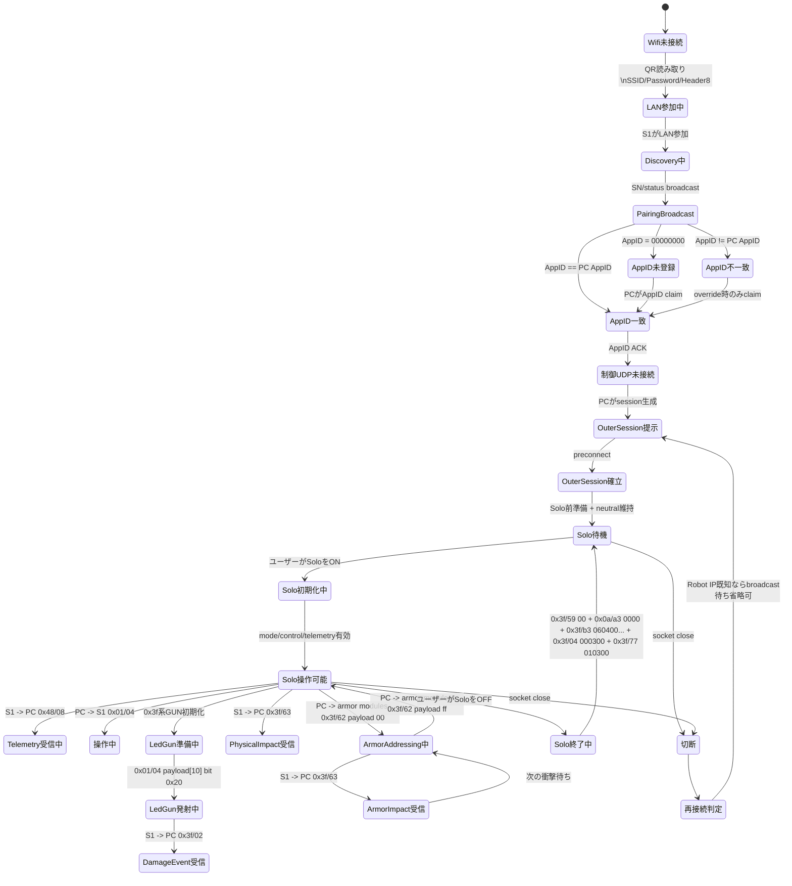

## 5. 標準接続シーケンス

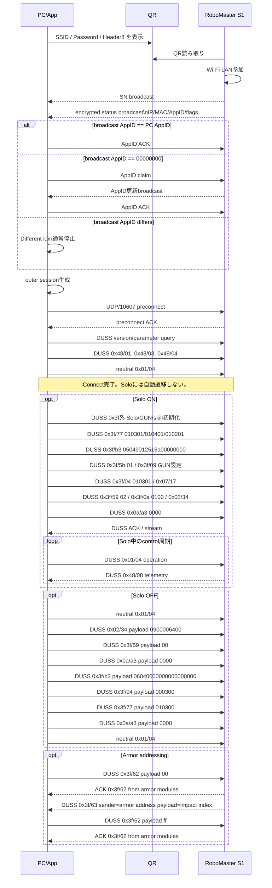

## 6. QRコード仕様

QR payload構造:

```text
offset  size  内容
0       2     length header
2       8     Header8
10      2     固定値 ca 6c
12      N     XOR(SSID + Password)
```

Header8とAppID:

```python
HEADER8_APPID_MASK = bytes.fromhex("71ca63d86dc67f34")
header8 = xor(appid_ascii_8_bytes, HEADER8_APPID_MASK)
appid_ascii_8_bytes = xor(header8, HEADER8_APPID_MASK)
```

Header8フィールド:

| 項目 | 仕様 |
| --- | --- |
| 生成入力 | 8文字hex ASCIIのAppID |
| 生成式 | `Header8 = AppID ASCII 8 bytes XOR 71ca63d86dc67f34` |
| 復元式 | `AppID ASCII 8 bytes = Header8 XOR 71ca63d86dc67f34` |
| QR格納値 | Header8 |
| S1 broadcast照合値 | 復元後AppID |
| 妥当性条件 | 復元後AppIDが8文字hex ASCII |

length header:

```python
ssid_length_field = len(ssid_utf8) + utf8_continuation_count(ssid_utf8) + 1
value = 0xbc00 + ssid_length_field + (len(password_utf8) << 6)
length_header = value.to_bytes(2, "little")
```

## 7. Discovery / AppID

S1 status broadcast復号後の主要フィールド:

```text
[0]      magic/state系
[1]      flags
[2:6]    IP
[6:12]   MAC
[16:24]  AppID 8 bytes
```

AppID claim / ACK:

```text
PC -> S1:56789
payload = AppID 8 bytes ASCII
```

分岐:

| broadcast AppID | PC動作 |
| --- | --- |
| `00000000` | 自分のAppIDをclaim |
| PC AppIDと一致 | 同じAppIDをACKとして返す |
| PC AppIDと不一致 | Different id。通常は停止。override時のみclaim |
| broadcastなし、Robot IP既知 | 既に通常接続中と判断し、AppID待ちを省略可 |

AppID ACKは `payload = AppID 8 bytes ASCII` の1 datagramを送る。固定回数の複数送信は行わない。再送が必要な場合は、broadcastが更新されない、またはACK確認前にtimeoutした場合の再試行として扱う。

Disconnect時の処理はローカルUDP socket / worker停止で完了する。

## 8. Outer Session

outer sessionは2バイト little-endian相当の識別子で、PC側がpreconnectでS1へ提示する。

session生成規則:

```text
初回接続:
  PC側で16bit値を生成する。
  生成値はHeader8/AppIDから導出しない。

再接続:
  直前にS1から受信したouter sessionをlittle-endian 16bitとして +1 した値を提示する。
```

観測される再接続session遷移例:

```text
935d -> 945d
db68 -> dc68
4f0d -> 500d
c20a -> c30a
6b0e -> 6c0e
da20 -> db20
7e70 -> 7f70
```

PCがpreconnectでsessionをS1へ提示する。

## 9. Preconnect

preconnectは48バイト。session部分だけPC側で差し替える。

例:

```text
30 80 <session:2> 00 00 00 04 ...
```

packet例:

```text
3080935d...
3080945d...
3080db68...
3080dc68...
```

preconnect ACKはS1から同じsessionで返る。

```text
S1 -> PC
payload[0:2] = 09 80
payload[2:4] = outer_session
```

実装側は、preconnect送信後に `09 80 <outer_session>` を受信するまで制御DUSSへ進まない。ACK待ち中に別sessionのS1 inbound packetが見えた場合は、そのsessionを現在のS1側状態として扱い、次のpreconnect sessionを `inbound_session + 1` に更新して再送する。これは再接続時に、PC側が保持していた前回sessionとS1側で見えているsessionがずれる場合を吸収するためである。

## 10. Outer UDP Envelope

Outer UDP Envelopeは、UDP/10607上でDUSS frameを包む外側ヘッダである。

送信側は次の状態変数を保持する。

| 状態変数 | サイズ | 用途 |
| --- | --- | --- |
| `outer_session` | 2 bytes | preconnectでS1へ提示したsession |
| `direct_tx_tick` | 16 bit | 次に送信するdirect packetのtick |
| `direct_ref_tick` | 16 bit | S1側が受理済みとして返したdirect tick |
| `latest_direct_tick` | 16 bit | PCが最後に送信したdirect tick |
| `direct_packet_index` | 8 bit | direct packet識別子 |
| `control_tx_tick` | 16 bit | 次に送信するcontrol packetのstream tick |
| `control_ref_tick` | 16 bit | S1 inbound windowから同期したcontrol参照tick |

tickは16 bit little-endianで扱い、加算時は `0xffff` でwrapする。

受信packet分類:

| 分類 | 条件 | 用途 |
| --- | --- | --- |
| heartbeat | UDP payload length = 34 | 生存確認。tick同期には使わない |
| direct response | DUSS frameがouter offset 20から始まる | direct DUSS ACK/応答 |
| stream/data packet | UDP payload lengthが34以外で、DUSS frameがouter offset 34以降から始まる | telemetry/statusとcontrol tick同期 |
| window packet | `outer[4:6] == 0000` かつ `len >= 28` | control/direct参照tick同期 |

### 10.1 共通チェック値

outer offset 7 は先頭7 bytesのXOR。

```python
outer[7] = outer[0] ^ outer[1] ^ ... ^ outer[6]
```

offset 7はsessionを含むouter先頭7 bytesに連動する。送信時はpacket生成の最後に必ず再計算する。

### 10.2 長さフィールド

```python
byte0 = total_length & 0xff
byte1 = 0x80 | ((total_length >> 8) & 0x03)
```

例:

```text
269 bytes = 0x10d
先頭2 bytes = 0d 81
```

### 10.3 Direct Packet

DUSSがouter offset 20から始まる形式。初期化、mode切替、設定、問い合わせ、ACK要求付きコマンドに使う。

```text
offset  size  内容
0       2     total length/type
2       2     outer session
4       2     direct_tx_tick
6       1     0x05
7       1     offset 0..6 XOR
8       2     direct_ref_tick
10      2     direct_tx_tick再掲
12      4     0
16      1     direct_packet_index
17      1     0x01
18      2     outer flags
20      N     DUSS frame
```

送信手順:

```text
current = direct_tx_tick

outer[4:6]   = current
outer[8:10]  = direct_ref_tick
outer[10:12] = current
outer[16]    = direct_packet_index

latest_direct_tick = current
direct_tx_tick = current + 8
direct_packet_index = direct_packet_index + 1
```

`direct_ref_tick` は直前に送信したdirect tickそのものではなく、S1から返ったwindow上で受理済みになったdirect tickである。

そのため、direct packetを間隔を空けて送る場合は `direct_ref_tick == 直前direct_tx_tick` になる。連続して複数のdirect packetを送る場合は、S1からのwindow更新が間に合うまで `direct_ref_tick` は据え置きになり、複数packetで同じ値を使う。

受信同期:

```text
S1 inbound window packetを受信した場合:
  direct_ref_tick = inbound outer[24:26]

DUSS ACKを受信した場合:
  ACK対象seqと送信済みdirect tickを対応付ける。
  window packetで同じtickが返った時点でdirect_ref_tickを更新する。
```

### 10.4 Control Packet

DUSSがouter offset 34から始まる形式。走行、ジンバル、LED GUN状態など周期操作に使う。

```text
offset  size  内容
0       2     total length/type
2       2     outer session
4       2     0x0000
6       1     0x04
7       1     offset 0..6 XOR
8       4     control stream tickを2回反復
12      4     0
16      4     control reference tickを2回反復
20      4     0
24      2     direct_ref_tick
26      2     latest_direct_tick
28      4     0
32      2     DUSS length
34      N     DUSS frame
```

送信手順:

```text
stream = control_tx_tick

outer[8:10]   = stream
outer[10:12]  = stream
outer[16:18]  = control_ref_tick
outer[18:20]  = control_ref_tick
outer[24:26]  = direct_ref_tick
outer[26:28]  = latest_direct_tick
outer[32:34]  = len(DUSS frame)

control_tx_tick = stream + 8
```

受信同期:

```text
S1 inbound packetを受信した場合:
  sessionが一致するpacketだけ処理する。

S1 inbound packetが34-byte heartbeatの場合:
  control_tx_tickは同期しない。

S1 inbound packetがstream/data packetの場合:
  control_tx_tick = inbound outer[10:12]

S1 inbound window packetの場合:
  control_ref_tick = inbound outer[16:18]
  direct_ref_tick  = inbound outer[24:26]
```

`outer[24:26]` と `outer[26:28]` は別フィールドである。

| 状態 | `outer[24:26]` | `outer[26:28]` |
| --- | --- | --- |
| direct未送信または全direct受理済み | `direct_ref_tick` | `latest_direct_tick` |
| direct送信直後でwindow未更新 | 直前に受理済みのtick | 最後に送信したdirect tick |

全directがS1 windowで受理済みになった状態では同じ値になる。direct送信直後のwindow未更新状態では `outer[24:26] != outer[26:28]` になる。これは仕様上の正常状態である。

## 11. DUSS Frame

DUSSは DJI Universal Serial Service の略称で、outer envelope内に入る内部コマンドフレームである。

DUMLは DJI Universal Markup Language の略称で、DJI機器の内部通信フレーム形式を指す別名である。本仕様書では、RoboMaster S1の内部コマンドフレームをDUSS frameと表記する。

主なフィールド:

```text
length
0x55 marker
header CRC8
sender
receiver
seq
attr
cmdset
cmdid
payload
body CRC16
```

実装では、送信時に毎回以下を生成する。

```text
DUSS sequence
CRC8
CRC16
outer length
outer XOR
outer tick/window
```

通常経路はDUSS frame、CRC、outer envelopeを生成して送信する。

## 12. Solo初期化

接続完了とSolo入室は別状態として扱う。AppID claim / ACK とpreconnect完了後、PCはversion/parameter/control準備系DUSSとneutral controlを送信し、Soloには自動で入らない。Solo操作、走行、ジンバル、GUN操作、telemetry有効化は、ユーザーがSoloトグルをONにした後のSolo初期化列で有効化する。

代表的な初期化コマンド:

| cmdset/cmdid | 用途 |
| --- | --- |
| `0x00/0x01` | version / identity query |
| `0x00/0x4f` | parameter query |
| `0x48/0x01` | App/robot infoまたは制御開始前処理 |
| `0x48/0x04` | control state enter |
| `0x48/0x03` | telemetry/profile購読または設定登録 |
| `0x3f/0x04` | Solo/Labo等のmode/state設定 |
| `0x3f/0x77` | LED GUN / skill初期化 |
| `0x3f/0xb3` | LED GUN関連初期化 |
| `0x3f/0x09` | 大きいGUN/skill設定 |
| `0x3f/0xa3` | project/hash/skill table系 |

Solo setupの送信順はdirect/control混在順である。生成実装では、DUSS seqは現在の接続状態から単調増加させ、Solo ON/OFFや再入室で初回ログのseqへ巻き戻さない。capture済みログのseq値は参照値であり、生成時は現在seq、outer session、outer tick、CRCを毎回再計算する。

実装条件:

```text
1. preconnect完了後、Solo前準備としてversion/parameter/control準備DUSSを送る。
2. Solo OFF中はneutral controlのみを維持し、ユーザー操作controlは送らない。
3. Solo ON時にSolo setup残り、入室演出、GUN有効化、mode/state列を送る。
4. 初期化中もneutral control packetを周期送信する。
5. S1 inbound packetを受信するたび、outer window/tick状態を更新する。
6. 走行、ジンバル、GUN発射は、Solo ON完了後のcontrol packet `0x01/04` で行う。
```

## 13. 走行・ジンバル制御

周期操作DUSS:

```text
sender   = 0x02
receiver = 0x09
attr     = 0x00
cmdset   = 0x01
cmdid    = 0x04
payload  = 11 bytes
```

代表payload:

| 操作 | payload |
| --- | --- |
| stop | `0000042000010840000210` |
| forward | `0100542a00010840000210` |
| back | `01b6022000010840000210` |
| left | `0100b41500010840000210` |
| right | `014a052000010840000210` |
| gimbal stop | `0000042000010840000210` |
| gimbal left | `020004200001283f000210` |
| gimbal right | `020004200001d840000210` |
| gimbal up | `0200042000010840004210` |
| gimbal down | `020004200001084000c610` |

このDUSSは20から50Hz程度で継続送信する。

前後操作はpayload末尾のuint16 little-endian軸を使う。中立値は `0x1002` である。WinAppの実操作ではこの軸が概ね `0x0c22..0x1462` の範囲で変化するため、GUIや自作アプリでは中立近傍の微小値ではなく、この範囲の値を使って操作量を作る。

```text
payload layout for Solo operation:
offset 0      uint8   operation enable/state
offset 1      uint8   option/state
offset 2..3   uint16  fixed/axis group, neutral 0x2004
offset 4..5   uint16  fixed, 0x0001
offset 6..7   uint16  lateral/yaw axis, neutral 0x4008
offset 8      uint8   fixed, 0x00
offset 9..10  uint16  forward/back or pitch axis, neutral 0x1002
```

軸値:

| axis | neutral | low direction | high direction |
| --- | ---: | ---: | ---: |
| offset 6..7 | `0x4008` | `0x3d88..0x3f28` | `0x41a8..0x4698` |
| offset 9..10 | `0x1002` | `0x0c22..0x0ef6` | `0x1112..0x1462` |

## 14. LED GUN

Windows AppのLED GUN発射は、Solo周期操作 `0x01/0x04` のpayload内に発射状態bitを入れる。単独のLED GUNボタンとして実装する場合は、車体/ジンバル軸をneutralにした発射payloadを送る。

発射bit:

```text
payload[10] bit 0x20
```

例:

```text
通常stop:
0000042000010840000210

LED GUN trigger入りstop:
0000042000010840000230
```

ジンバル操作中:

```text
020004200001d840000210  通常
020004200001d840000230  LED GUN trigger付き
```

GUI等で「撃つ」操作だけを行う場合の基準payload:

```text
0000042000010840000230
```

このpayloadはneutral control `0000042000010840000210` に発射bitを立てたものであり、発射時に車体/ジンバル操作を混ぜない。

必要条件:

```text
Solo/GUN初期化が完了していること。
payload[10]の発射bitは、`0x3f/77`、`0x3f/b3`、`0x3f/09` 等のGUN関連初期化完了後に有効になる。
```

### 14.1 LED色設定

LED色設定はGUN/LED module宛てのDUSSで送信する。payloadはRGB値を1byteずつ並べ、最後に予約byte `00` を付ける。

```text
PC -> S1
sender = 0x02
receiver = 0x09
attr = 0x40
cmdset/cmdid = 0x3f/0x34
payload = RR GG BB 00
```

payload:

| offset | size | type | 内容 |
| ---: | ---: | --- | --- |
| 0 | 1 | uint8 | red, `0..255` |
| 1 | 1 | uint8 | green, `0..255` |
| 2 | 1 | uint8 | blue, `0..255` |
| 3 | 1 | uint8 | reserved, `00` |

例:

| 色 | payload |
| --- | --- |
| red | `ff000000` |
| green | `00ff0000` |
| blue | `0000ff00` |
| white | `ffffff00` |

S1はACKとして `cmdset/cmdid=0x3f/0x34`、payload `00` を返す。

### 14.2 GUN種別設定

GUN種別は、GUN/skill初期化列のうち `0x3f/09` の大きい設定blockで切り替える。発射操作自体はLED GUNと物理GUNで同じcontrol packet `0x01/04` のtrigger bitを使用する。

共通の発射control:

```text
cmdset/cmdid = 0x01/0x04
payload[10] bit 0x20 = trigger
```

LED GUN設定blockと物理GUN設定blockの主要差分:

| parameter key | LED GUN value | 物理GUN value |
| --- | --- | --- |
| `ea030000` | `01000000` | `00000000` |
| `07040000` | `00000000` | `01000000` |

実装時は、GUN種別を選択しただけでは送信せず、Apply時に以下を生成して送信する。

LED GUN:

```text
0x3f/09 LED_GUN_CONFIG
0x3f/59 02
```

物理GUN:

```text
0x3f/5b 01
0x3f/09 PHYSICAL_GUN_CONFIG
0x3f/59 02
0x3f/09 PHYSICAL_GUN_CONFIG
0x3f/59 02
```

`LED_GUN_CONFIG` と `PHYSICAL_GUN_CONFIG` は同じkey/value list形式であり、上表のkey/value差分を含めて生成する。sequence番号、outer session、outer tick、CRCは送信時の現行connection状態から生成する。

GUN種別切替列は、GUN設定blockとGUN有効化DUSSで構成する。効果音DUSS、および効果音を伴うmode/skill遷移DUSSは、効果音機能の仕様に分離する。

ダメージイベント:

```text
S1 -> PC
cmdset/cmdid = 0x3f/0x02
payload = 530000000002020000c8c2
```

このpayloadはLED GUN被弾イベント本体として扱う。

物理GUN/アーマー衝撃による被弾イベント:

```text
S1 -> PC
cmdset/cmdid = 0x3f/0x63
attr = 0x80
receiver = 0x02
seq = 8192
payload = 1 byte
```

アーマー判別中の `0x3f/63` が物理衝撃による被弾/衝撃検出イベントである。

| 方向 | sender | payload | 送信回数 |
| --- | --- | --- | ---: |
| back | `0x38` | `01` | 3 |
| front | `0x58` | `02` | 3 |
| left | `0x78` | `03` | 3 |
| right | `0x98` | `04` | 3 |

物理衝撃イベントは同一衝撃につき3回送信される。判定側は同一 `sender`、同一 `payload`、近接時刻の `0x3f/63` を1回の被弾として扱う。

LED GUN被弾と物理GUN/衝撃被弾の区別:

| 被弾種別 | cmdset/cmdid | sender | payload |
| --- | --- | --- | --- |
| LED GUN被弾 | `0x3f/02` | イベント送信元 | `530000000002020000c8c2` |
| 物理GUN/アーマー衝撃 | `0x3f/63` | アーマー面アドレス | `01`..`04` |

関連通知:

| cmdset/cmdid | 用途 |
| --- | --- |
| `0x3f/02` | LED GUN被弾イベント |
| `0x3f/63` | 物理GUN/アーマー衝撃イベント。senderで面を判別 |
| `0x3f/0e` | LED GUN発射許可/クールダウン状態通知 |
| `0x3f/10` | 発射/被弾/ゲーム状態遷移通知。ダメージ判定は `0x3f/02` または `0x3f/63` で行う |
| `0x3f/a5` | game/skill状態通知 |
| `0x02/e4` | heartbeat/status |

### 14.3 LED GUN 発射クールダウン

S1はLED GUN発射状態を `0x3f/0e` で通知する。この通知は状態表示および実機側の受付状態確認に使用する。PC側アプリは、この通知だけを根拠に発射コマンド送信を自律抑止しない。

```text
S1 -> PC
cmdset/cmdid = 0x3f/0x0e
payload length = 20
```

payload:

| offset | size | type | value / meaning |
| ---: | ---: | --- | --- |
| 0 | 4 | float32_le | `800.0` |
| 4 | 4 | float32_le | `800.0` |
| 8 | 2 | uint16_le | GUN状態値。通常観測値 `50` |
| 10 | 2 | uint16_le | GUN状態値。通常観測値 `50` |
| 12 | 4 | uint32_le | `cooldown_ms` |
| 16 | 4 | uint32_le | reserved, `0` |

`cooldown_ms`:

| value | state | required app behavior |
| ---: | --- | --- |
| `0` | 発射可能 | trigger bit `0x20` を含む `0x01/04` control payloadを送信できる |
| `>0` | 発射クールダウン中 | 実機側が発射受付を制限している状態 |

`cooldown_ms=0` はLED GUNが発射可能であることを示す。統合AppはCooldown時間のON/OFFや値設定を行わず、GUN有効化列と1周期1control DUSSの送信周期を守る。Cooldown状態の有無はS1からの `0x3f/0e` 通知で監視する。

発射連打時の状態遷移:

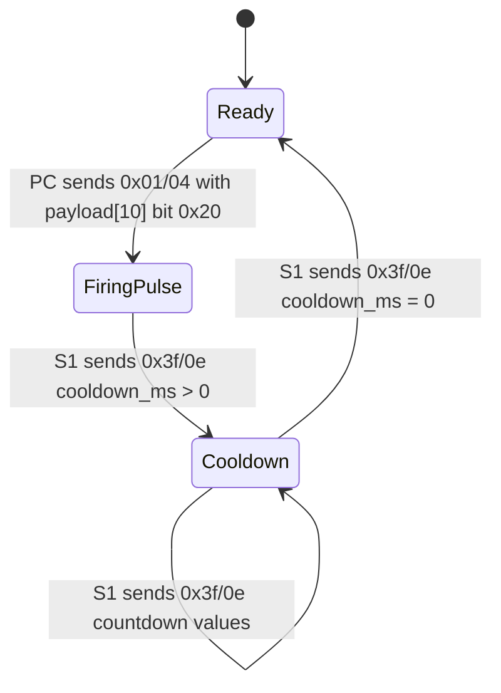

`0x3f/0e` の `cooldown_ms` はS1からPCへ通知される発射受付状態である。PC側はこの値を表示または状態監視に使用する。PCからS1へCooldown時間を直接設定するDUSS commandは本仕様では定義しない。

同一control周期に複数のtrigger付きDUSSを詰める、またはWinAppの発射シーケンスより短い単純trigger pulseを高頻度で送ると、S1が発射制限状態へ入りやすい。発射操作は、GUN初期化後にWinAppで観測されるcontrol payload列を1周期1DUSSで送信する。

`0x3f/10` と `0x3f/50` は発射操作周辺で出現する状態通知である。発射可能状態の判定は `0x3f/0e` の `cooldown_ms` を基準にする。

## 15. Telemetry

telemetry stream:

```text
S1 -> PC
cmdset/cmdid = 0x48/0x08
```

payload種別:

| payload | 用途 |
| --- | --- |
| len=11, prefix `000a` | gimbal角度/姿勢系 |
| len=62, prefix `0001` | odometry/heading/velocity系 |

### 15.0 Robot Stats

WinAppの状態画面に表示される `Driving Distance(m)` と `Driving Time(min)` は、S1から周期送信される `0x3f/03` に対応する。

```text
S1 -> PC
cmdset/cmdid = 0x3f/0x03
payload length = 12
```

payload:

| offset | size | type | 内容 |
| ---: | ---: | --- | --- |
| 0 | 4 | uint32_le | reserved / state |
| 4 | 4 | uint32_le | Driving Distance。単位 m |
| 8 | 4 | uint32_le | Driving Time。単位 sec |

表示換算:

```text
Driving Distance(m) = uint32_le(payload[4:8])
Driving Time(min) = uint32_le(payload[8:12]) / 60
```

例:

```text
payload = 0000000085000000ab010000
distance = 0x85 = 133 m
time = 0x01ab = 427 sec = 7.12 min
```

バッテリー残量は単一バッテリーの値として扱う。S1は `0x48/08` odometry telemetryのlen=62 payload内に残量percentを格納する。

```text
S1 -> PC
sender = 0x09
receiver = 0x02
cmdset/cmdid = 0x48/0x08
payload length = 62
```

payload:

| offset | size | type | 内容 |
| ---: | ---: | --- | --- |
| 0 | 2 | uint16_le | subtype = `0001` |
| 10 | 1 | uint8 | Battery percent |

例:

```text
payload[0:2] = 0001
payload[10] = 0x55
Battery = 85 %
```

バッテリー残量表示は `0x48/08` len=62 payload offset `10` の1byte値を使用する。既知の残量値 `36 %`、`40 %`、`41 %` に対して、このfieldはそれぞれ `0x24`、`0x28`、`0x29` と一致する。offset `11` は `0x00` のため `uint16_le(payload[10:12])` でも同じ数値になるが、field定義は `uint8` とする。

`0x07/09` はdevice/status値、`0x02/e4` offset `8` の `0x64` はheartbeat/status値、`0x3f/0e` の `50 / 50` はGUN状態値として扱う。

### 15.1 Gimbal Telemetry

payload len=11:

```text
offset  size  type   内容
0       2     u16    subtype = 000a
2       2     i16    gimbal raw0、0.1 deg単位
4       2     i16    gimbal raw1、0.1 deg単位
6       2     i16    gimbal raw2、0.1 deg単位
8       2     i16    gimbal raw3、0.1 deg単位
10      1     u8     flag
```

表示換算:

```text
deg = raw / 10.0
```

### 15.2 Odometry Telemetry

payload len=62:

```text
offset  size  type     内容
0       2     u16      subtype = 0001
2       2     i16      internal raw0
4       2     i16      internal raw1
6       2     i16      internal raw2
10      1     u8       battery percent
12      4     float32  heading/yaw angle
26      4     float32  odometry X position
30      4     float32  odometry Y position
38      4     float32  velocity X set A
42      4     float32  velocity Y set A
50      4     float32  velocity X set B
54      4     float32  velocity Y set B
```

速度設定との整合:

| 速度設定 | X位置 offset26 | Y位置 offset30 | velocity X |
| --- | ---: | ---: | ---: |
| 中速Solo | `1.977 -> 3.346` | `0.013 -> 0.020` | 最大約`0.530` |
| 高速Solo | `3.317 -> 5.788` | `0.022 -> 0.067` | 最大約`0.713` |

## 16. 速度設定

速度設定は設定変更時に別DUSSとして送信され、S1側に保持される。

速度設定DUSS:

| 設定 | sender -> receiver | attr | cmdset/cmdid | payload |
| --- | --- | --- | --- | --- |
| Fast | `0x02 -> 0x09` | `0x40` | `0x3f/0x3f` | `01` |
| Medium | `0x02 -> 0x09` | `0x40` | `0x3f/0x3f` | `02` |
| Slow | `0x02 -> 0x09` | `0x40` | `0x3f/0x3f` | `03` |
| Custom | `0x02 -> 0x09` | `0x40` | `0x3f/0x3f` | `04` |

Custom選択時は、`0x3f/0x3f payload=04` の後に、以下の `0x03/0xf9` を送信する。

`0x03/0xf9` payload:

```text
parameter_id: 4 bytes
value:        float32 little-endian
```

| UI項目 | parameter_id | 既定値 |
| --- | --- | ---: |
| Forward Speed (m/s) | `810636fe` | `1.50` |
| Backward Speed (m/s) | `d9980ced` | `1.50` |
| Starting Acceleration | `1b175310` | `50` |
| Braking Acceleration | `e96d5133` | `50` |
| Lateral Speed (m/s) | `6fe6a05e` | `1.50` |
| Lateral Starting Acceleration | `0e1a53a0` | `50` |
| Lateral Braking Acceleration | `dc7051c3` | `50` |

送信例:

```text
0x3f/0x3f 04
0x03/0xf9 810636fe0000c03f
0x03/0xf9 d9980ced0000c03f
0x03/0xf9 1b17531000004842
0x03/0xf9 e96d513300004842
0x03/0xf9 6fe6a05e0000c03f
0x03/0xf9 0e1a53a000004842
0x03/0xf9 dc7051c300004842
```

統合Appの速度UI:

```text
1. Preset radioまたはCustom値をUIで選択する。
2. Applyを押した時だけ速度設定DUSSを送信する。
3. Custom以外では `0x3f/0x3f` のpreset payloadだけを送る。
4. Custom選択時だけ `0x3f/0x3f payload=04` と7個の `0x03/0xf9` parameterを送る。
5. Custom値の編集だけでは自動でCustomへ切り替えず、DUSSも送信しない。
```

## 17. Battle / Labo / 映像 / その他

### 17.1 Battleモード

Battleモード入退室では、Soloと同じneutral controlを維持しながら、`0x3f/04` のmode payloadとBattle固有parameterを送信する。

主要DUSS:

| cmdset/cmdid | 方向 | payload | 解釈 |
| --- | --- | --- | --- |
| `0x01/04` | PC -> S1 | `0000042000010840000210` | neutral周期操作 |
| `0x3f/04` | PC -> S1 | `000300`, `010301`, `040300`, `060301`, `090301` | game mode状態遷移 |
| `0x07/17` | PC -> S1 | empty | 周期的なデバイス/状態query |
| `0x3f/34` | PC -> S1 | `c8000000` | Battle parameter |
| `0x3f/77` | PC -> S1 | `010301`, `010401`, `010201`, `010300`, `010400`, `010200` | GUN/skill状態切替 |
| `0x3f/b3` | PC -> S1 | `0704ba12516a00000000`, `08040000000000000000` | Battle GUN/skill parameter |
| `0x3f/37` | PC -> S1 | `0100000002004d044e04` | Battle parameter |

`0x3f/04` payload:

```text
000300  neutral / mode exit / mode not active
010301  Solo active
040300  Battle pre-entry / transition
060301  Battle transition / battle parameter phase
090301  Battle active / battle keepalive phase
```

Battle入室時は `0x3f/04 040300` の後、`0x3f/04 060301` と `0x3f/34 c8000000` を組み合わせて送り、さらに `0x3f/04 090301` を周期的に維持する。Battle終了時は `0x3f/b3 08040000000000000000`、`0x3f/04 040300`、`0x3f/04 000300`、`0x3f/77 010300` を送信してneutralへ戻る。

統合AppはBattleモードをUIに公開しない。Cooldown切替機能も実装しない。接続後はSolo OFF待機状態になり、SoloトグルONでSolo入室列を送る。

Solo入室時はSolo前準備列の後、入室演出として次を送信する。

```text
0x01/04 neutral
0x3f/77 010301
0x3f/77 010401
0x3f/77 010201
0x3f/b3 05049012516a00000000
0x3f/77 010401
0x3f/77 010201
0x3f/5b 01
0x3f/09 IR_GUN_CONFIG
0x3f/04 010301
0x07/17 empty
0x3f/59 02
0x3f/09 IR_GUN_CONFIG
0x3f/04 010301
0x3f/0a 0100
0x02/34 0900006400
0x3f/59 02
0x0a/a3 0000
0x0a/a3 0000
```

Solo/Battleの判定は `0x3f/04` 単体ではなく、同時期に送信される `0x3f/09`、`0x3f/34`、`0x3f/b3` などのparameter列を含めて行う。

同一接続中にSolo ON/OFFを繰り返す場合、DUSS seqは現在値から単調に進める。再入室時に初回接続時のseqへ巻き戻してはならない。

Solo OFF時は、次を送信してSolo待機へ戻す。

```text
0x01/04 neutral
0x02/34 0900006400
0x3f/59 00
0x0a/a3 0000
0x3f/b3 06040000000000000000
0x01/04 neutral
0x3f/04 000300
0x3f/77 010300
0x0a/a3 0000
```

LED GUNの発射クールダウンは、S1が通知する `0x3f/0e` の `cooldown_ms` に現れる。統合AppはPC側でCooldown抑止やCooldown時間設定を行わない。連続発射時に `cooldown_ms>0` が通知された場合は、S1側で発射受付が制御される。

### 17.2 Armor addressing

Armor addressingは、4面アーマーのsender addressを機体方向へ対応付ける手順である。

主要DUSS:

| cmdset/cmdid | 方向 | payload | 解釈 |
| --- | --- | --- | --- |
| `0x3f/62` | PC -> S1 | `00` | armor addressing開始 |
| `0x3f/62` | S1 -> PC | `00` | armor addressing ACK。senderが各armor module |
| `0x3f/63` | S1 -> PC | `01`, `02`, `03`, `04` | armor impact event。各衝撃につき3回送信 |
| `0x3f/62` | PC -> S1 | `ff` | armor addressing終了 |

`0x3f/62` 開始ACK sender:

```text
0x38
0x58
0x78
0x98
0xb8
0xd8
```

`0x3f/63` のpayloadは、addressing中の衝撃順IDである。方向指定手順を `back -> front -> left -> right` とした場合、senderと機体方向は以下に対応する。

| 衝撃順 | 方向 | sender | cmdset/cmdid | payload |
| ---: | --- | --- | --- | --- |
| 1 | back | `0x38` | `0x3f/63` | `01` |
| 2 | front | `0x58` | `0x3f/63` | `02` |
| 3 | left | `0x78` | `0x3f/63` | `03` |
| 4 | right | `0x98` | `0x3f/63` | `04` |

アーマー方向アドレス:

| 方向 | armor module sender |
| --- | --- |
| back | `0x38` |
| front | `0x58` |
| left | `0x78` |
| right | `0x98` |

同一衝撃で `0x3f/63` が3回送信される。3回とも sender と payload は同一である。受信側は `(cmdset=0x3f, cmdid=0x63, sender, payload)` を同一イベントとして扱う。

Armor addressing状態遷移:

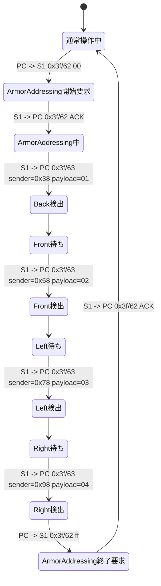

Armor addressingシーケンス:

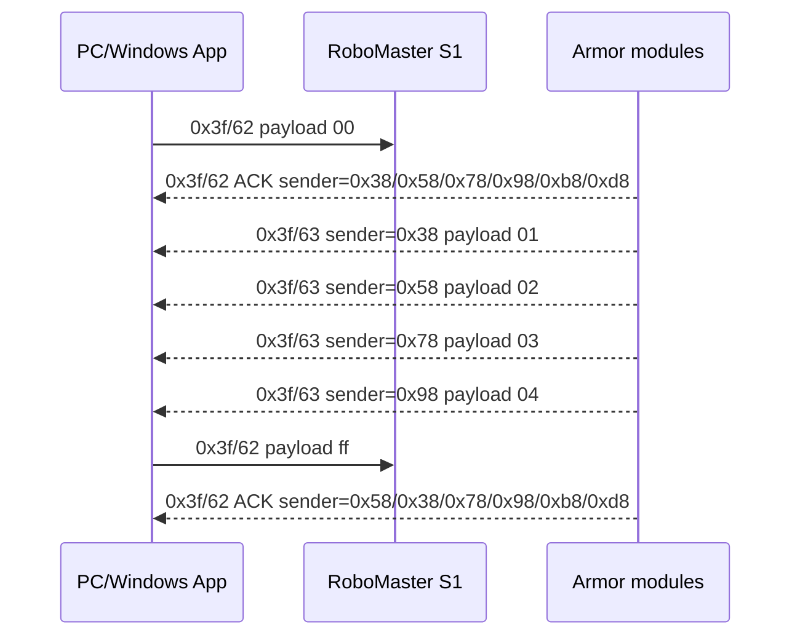

### 17.2.1 Voice language / Volume

Voice languageとVolumeは、PCからS1へ `0x3f` commandとして送信する。どちらも1byte payloadで設定し、S1は同じcmdset/cmdid、payload `00` でACKを返す。

Voice language:

```text
PC -> S1
sender = 0x02
receiver = 0x09
attr = 0x40
cmdset/cmdid = 0x3f/0x16
payload length = 1
```

payload:

| payload | UI表示 |
| --- | --- |
| `00` | English |
| `02` | 日本語 |
| `04` | Deutsch |
| `05` | Español |
| `06` | 한국어 |
| `07` | Français |
| `08` | русский |

`01` と `03` はWinAppの当該選択画面には表示されない予約/別言語IDとして扱う。1回の言語選択操作につき、選択した言語IDを1回送信する。

Volume:

```text
PC -> S1
sender = 0x02
receiver = 0x09
attr = 0x40
cmdset/cmdid = 0x3f/0x1b
payload length = 1
```

payload:

| offset | size | type | 内容 |
| ---: | ---: | --- | --- |
| 0 | 1 | uint8 | Volume。範囲 `0..80` |

例:

| Volume | payload |
| ---: | --- |
| 0 | `00` |
| 7 | `07` |
| 9 | `09` |
| 10 | `0a` |
| 80 | `50` |

### 17.2.2 Mic / Audio stream

Mic / Audioは、制御DUSSと実音声データを分けて扱う。

音声受信:

```text
S1 -> PC
sender = 0x01
receiver = 0x02
attr = 0x00
cmdset/cmdid = 0x3f/0x1d
```

`0x3f/1d` はS1側からPCへ送信されるOpus音声フレームである。payload長はおおむね `229..242` bytesで、送信周期は約20ms、約50frame/secである。受信側はpayloadをOpus packetとして復号し、48kHz/mono PCMとして再生する。

音量レベル表示は、`0x3f/1d` payloadのバイト列から直接計算してはならない。payloadは圧縮bitstreamであり、バイト値のRMSは音量を表さない。レベル表示はOpus復号後のPCM sampleからRMSを計算する。

音声受信本体は `0x3f/1d` である。`0x3f/1d` が流れている状態では、S1からPCへ約20ms周期で継続送信される。

音声受信開始:

```text
PC -> S1
sender = 0x02
receiver = 0x01
attr = 0x40
cmdset/cmdid = 0x3f/0x1e
payload = 01
```

ACK:

```text
S1 -> PC
sender = 0x01
receiver = 0x02
attr = 0xc0
cmdset/cmdid = 0x3f/0x1e
payload = 00
```

このACKの後、約275ms後から `0x3f/1d` が送信される。`0x3f/1d` のUDP宛先portは、`0x3f/1e` を送信したPC側のcontrol socket portになる。

受信状態の確認/関連状態取得として、PCから次のqueryも送信される。

```text
PC -> S1
sender = 0x02
receiver = 0x01
attr = 0x40
cmdset/cmdid = 0x3f/0x1f
payload length = 0
```

ACK:

```text
S1 -> PC
sender = 0x01
receiver = 0x02
attr = 0xc0
cmdset/cmdid = 0x3f/0x1f
payload length = 4
```

観測payload:

```text
000059c6
```

続けて:

```text
PC -> S1
sender = 0x02
receiver = 0x09
attr = 0x40
cmdset/cmdid = 0x3f/0x57
payload length = 0
```

ACK:

```text
S1 -> PC
sender = 0x09
receiver = 0x02
attr = 0xc0
cmdset/cmdid = 0x3f/0x57
payload length = 9
```

観測payload:

```text
008813881388138813
```

`0x3f/1f` と `0x3f/57` はACKを返すが、これら2つのquery送信だけでは `0x3f/1d` は開始しない。音声受信開始には `0x3f/1e payload=01` を送信する。

`0x3f/1d` はS1からPCへ送られる音声データであり、PCからS1へ音声を送る時のデータ形式ではない。

PCからS1へ音声を送る操作では、まず `0x3f/5f` で音声送信セッションを制御し、その直後に長いDUSS frameを含む音声データブロックをUDP `10609 -> 10607` で送信する。

音声送信開始:

```text
PC -> S1
sender = 0x02
receiver = 0x09
attr = 0x40
cmdset/cmdid = 0x3f/0x5f
payload length = 17
payload[0] = 0x00
```

S1は同じcmdset/cmdidでACKを返す。

```text
S1 -> PC
sender = 0x09
receiver = 0x02
attr = 0xc0
cmdset/cmdid = 0x3f/0x5f
payload = 00
```

音声送信終了:

```text
PC -> S1
sender = 0x02
receiver = 0x09
attr = 0x40
cmdset/cmdid = 0x3f/0x5f
payload length = 17
payload[0] = 0x02
```

S1は同じcmdset/cmdidで終了ACKを返す。

```text
S1 -> PC
sender = 0x09
receiver = 0x02
attr = 0xc0
cmdset/cmdid = 0x3f/0x5f
payload = 00020000
```

PCからS1へ送る音声データブロック:

```text
UDP
source port = 10609
destination port = 10607
direction = PC -> S1
```

音声データブロックは、`0x3f/5f` 開始ACK後に送信される。full blockはUDP length `1008`、UDP payload length `1000` で、末尾blockは録音長に応じて短くなる。記録された例ではfull blockが4..6個、末尾blockが1個送信されている。

UDP payload内の音声frame:

```text
outer wrapper length = 20
inner DUSS length = 20 + audio_len + 2
inner sender = 0x02
inner receiver = 0x09
inner attr = 0x00
inner cmdset/cmdid = 0x00/0x09
```

inner DUSS headerのlengthは10bit値として扱う。

```text
length = byte[1] | ((byte[2] & 0x03) << 8)
byte[2] base = 0x04
```

full blockでは:

```text
UDP payload length = 1000
inner DUSS length = 980
audio_len = 960
```

inner DUSS payload:

| offset | size | type | 内容 |
| ---: | ---: | --- | --- |
| 0 | 4 | uint32_le | audio block index |
| 4 | 1 | uint8 | reserved = `00` |
| 5 | 2 | uint16_le | audio_len |
| 7 | audio_len | bytes | audio payload |

inner DUSSには通常と同じheader CRC8とbody CRC16を付与する。

Mic / Audio state:

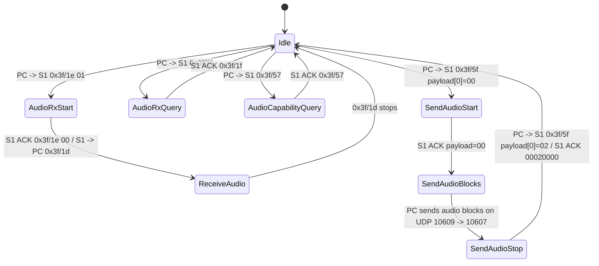

Mic / Audio sequence:

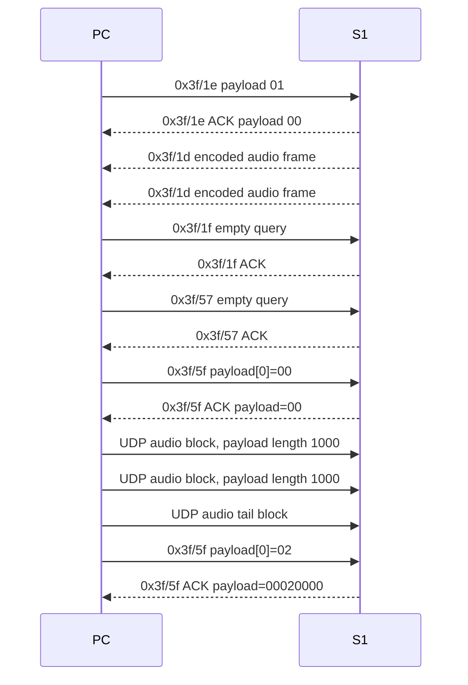

### 17.3 Chassis/Gimbal auto calibration

Chassis/Gimbal auto calibrationは、PCが校正モードへ入れた後、S1が姿勢検出と進捗通知を行う。

```text
水平設置
front面を重力方向
left面を重力方向
back面を重力方向
right面を重力方向
水平へ戻す
gimbal auto calibration実行
完了
```

主要DUSS:

| cmdset/cmdid | 方向 | payload | 解釈 |
| --- | --- | --- | --- |
| `0x03/f9` | PC -> S1 | `e4a3997d03`, `e4a3997d01` | chassis/gimbal calibration状態切替 |
| `0x03/f9` | S1 -> PC | `00e4a3997d03`, `00e4a3997d01` | `0x03/f9` ACK |
| `0x07/17` | PC -> S1 | empty | device/status query |
| `0x07/09` | S1 -> PC | 4 bytes | device/status値 |
| `0x07/3f` | S1 -> PC | `0000` | chassis orientation作業区切り通知 |
| `0x04/08` | PC -> S1 | empty | gimbal auto calibration開始要求 |
| `0x04/30` | S1 -> PC | 2 bytes | gimbal auto calibration進捗 |
| `0x48/08` | S1 -> PC | len=11/62 | 姿勢/odometry telemetry |

状態遷移主体:

| 状態/遷移 | 主体 | 根拠DUSS |
| --- | --- | --- |
| auto calibration準備へ入る | PC | PC -> S1 `0x03/f9 e4a3997d03` |
| calibration状態を切り替える | PC | PC -> S1 `0x03/f9 e4a3997d01` |
| chassis姿勢の検出 | S1 | S1 -> PC `0x48/08 len=11`、S1 -> PC `0x07/09` status |
| chassis orientation作業の区切り | S1 | S1 -> PC `0x07/3f 0000` |
| gimbal auto calibration開始 | PC | PC -> S1 `0x04/08 empty` |
| gimbal auto calibration進捗 | S1 | S1 -> PC `0x04/30 progress/state` |
| gimbal auto calibration完了 | S1 | S1 -> PC `0x04/30 6400` |

chassis orientation作業の各区切り時刻でPCが送信するDUSSは、周期操作 `0x01/04`、mode維持 `0x3f/04 000300`、status query `0x07/17` である。区切りはS1が `0x07/3f 0000` を送信することで通知する。したがって、chassis側の作業進行はS1側の姿勢検出結果で進む。

gimbal auto calibrationは、PCが `0x04/08 empty` を送信して開始する。開始後の進捗と完了はS1が `0x04/30` で通知する。したがって、gimbal側はPC開始、S1進捗管理である。

`0x03/f9` calibration状態切替:

| 方向 | cmdset/cmdid | payload | ACK payload |
| --- | --- | --- | --- |
| PC -> S1 | `0x03/f9` | `e4a3997d03` | `00e4a3997d03` |
| PC -> S1 | `0x03/f9` | `e4a3997d01` | `00e4a3997d01` |

`0x07/3f` chassis orientation区切り通知:

| 時刻[s] | 方向 | sender | receiver | payload |
| ---: | --- | --- | --- | --- |
| 22.6006791 | S1 -> PC | `0x07` | `0x02` | `0000` |
| 53.5978580 | S1 -> PC | `0x07` | `0x02` | `0000` |
| 84.5971784 | S1 -> PC | `0x07` | `0x02` | `0000` |
| 115.6021980 | S1 -> PC | `0x07` | `0x02` | `0000` |

`0x48/08 len=11` 姿勢telemetryの区間平均:

| 区間 | 時刻[s] | raw0 | raw1 | raw2 | raw3 |
| --- | --- | ---: | ---: | ---: | ---: |
| 水平設置 | 0.0..10.0 | 102.0 | 0.0 | -74.0 | -21.0 |
| front面を重力方向 | 10.0..24.0 | -1340.9 | 932.8 | -1075.9 | 275.2 |
| left面を重力方向 | 24.0..40.0 | 931.8 | 721.2 | -2190.5 | -211.4 |
| back面を重力方向 | 40.0..54.0 | 414.9 | 497.1 | -2433.8 | -52.3 |
| right面を重力方向 | 54.0..63.0 | -105.9 | -568.6 | -2158.8 | 276.5 |
| gimbal calibration中 | 63.0..113.0 | -698.3 | -7.4 | 5.1 | -77.9 |
| 水平復帰後 | 113.0..118.0 | -703.0 | 0.0 | 0.0 | -2.0 |

`0x04/08` gimbal auto calibration開始要求:

| 時刻[s] | 方向 | sender | receiver | seq | attr | payload |
| ---: | --- | --- | --- | ---: | --- | --- |
| 63.3992886 | PC -> S1 | `0x02` | `0x04` | 18264 | `0x40` | empty |
| 63.9505801 | PC -> S1 | `0x02` | `0x04` | 18264 | `0x40` | empty |
| 64.9486864 | PC -> S1 | `0x02` | `0x04` | 18264 | `0x40` | empty |

同一seq `18264` で3回送信される。これは同一開始要求の再送である。

`0x04/30` gimbal auto calibration進捗payload:

```text
offset  size  内容
0       1     progress percent
1       1     state: 0x01=in progress, 0x00=complete
```

進捗値:

| payload | progress | state |
| --- | ---: | --- |
| `0001` | 0 | in progress |
| `0a01` | 10 | in progress |
| `1401` | 20 | in progress |
| `1901` | 25 | in progress |
| `1e01` | 30 | in progress |
| `2301` | 35 | in progress |
| `2801` | 40 | in progress |
| `2d01` | 45 | in progress |
| `3201` | 50 | in progress |
| `3701` | 55 | in progress |
| `3c01` | 60 | in progress |
| `4101` | 65 | in progress |
| `4601` | 70 | in progress |
| `4b01` | 75 | in progress |
| `5001` | 80 | in progress |
| `5a01` | 90 | in progress |
| `6400` | 100 | complete |

gimbal calibration進捗タイムライン:

| 時刻[s] | payload | progress | state |
| ---: | --- | ---: | --- |
| 63.5668908..67.9130648 | `0001` | 0 | in progress |
| 68.0771785..68.3746069 | `0a01` | 10 | in progress |
| 68.5164067..70.9129817 | `1401` | 20 | in progress |
| 71.0769346..73.9191333 | `1901` | 25 | in progress |
| 74.0735294..77.3661495 | `1e01` | 30 | in progress |
| 77.5178247..79.9206704 | `2301` | 35 | in progress |
| 80.0745719..82.9179333 | `2801` | 40 | in progress |
| 83.0708632..86.3745765 | `2d01` | 45 | in progress |
| 86.5185023..88.9205413 | `3201` | 50 | in progress |
| 89.0730114..91.9156310 | `3701` | 55 | in progress |
| 92.0693747..95.3706141 | `3c01` | 60 | in progress |
| 95.5158578..97.9184683 | `4101` | 65 | in progress |
| 98.0725611..100.9144465 | `4601` | 70 | in progress |
| 101.0674889..104.3704115 | `4b01` | 75 | in progress |
| 104.6310744..109.5798118 | `5001` | 80 | in progress |
| 109.7212681..111.1426174 | `5a01` | 90 | in progress |
| 111.2856128..112.6470415 | `6400` | 100 | complete |

自動キャリブレーション状態遷移:

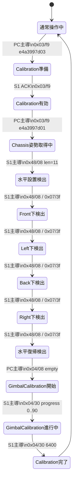

自動キャリブレーションシーケンス:

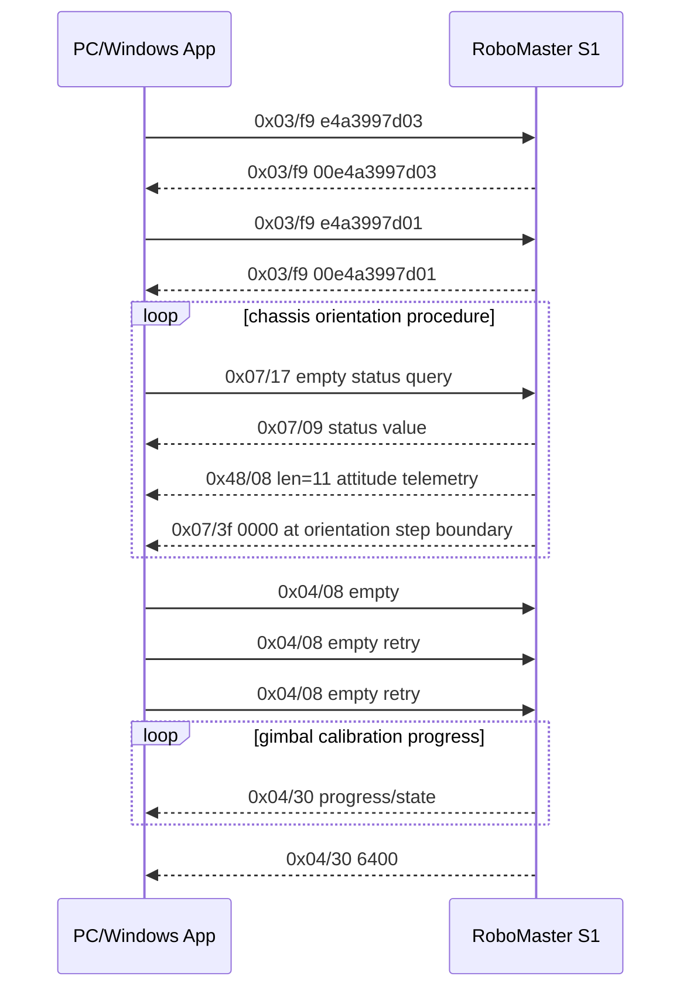

### 17.4 Gimbal sensitivity

Control Sensitivityは、Windows AppではGimbal Pitch / Gimbal Yawを0..100で設定する画面として表示される。統合Appではこの設定を機体へ永続設定として送らず、GUI内のgimbal controlゲインとして扱う。

統合Appの実装動作:

```text
Default:
  Gimbal Pitch = 40
  Gimbal Yaw   = 50

Custom:
  Gimbal Pitch = 0..100
  Gimbal Yaw   = 0..100

Apply:
  機体へ設定DUSSは送らない。
  以後に生成する `0x01/04` gimbal操作payloadの速度量へローカル反映する。
```

Chassis/Gimbal自動キャリブレーションでは、gimbal sensitivity画面とは別に以下を使う。

| cmdset/cmdid | payload | 備考 |
| --- | --- | --- |
| `0x03/0xf9` | `e4a3997d03` / `e4a3997d01` | auto calibration状態切替 |
| `0x04/0x08` | empty | gimbal auto calibration開始要求 |

`0x03/0xf9` と `0x04/0x08` のgimbal sensitivityとの対応は未規定。

### 17.5 Laboモード

Laboモードは、S1上でScratch/Python系プログラムを実行するためのアプリ実行状態である。Soloと同じUDP/10607制御に加えて、FTPでDSPプログラムをS1へアップロードし、UDP DUSSで実行準備、実行開始、実行状態監視、終了を行う。

#### 17.5.1 Labo状態

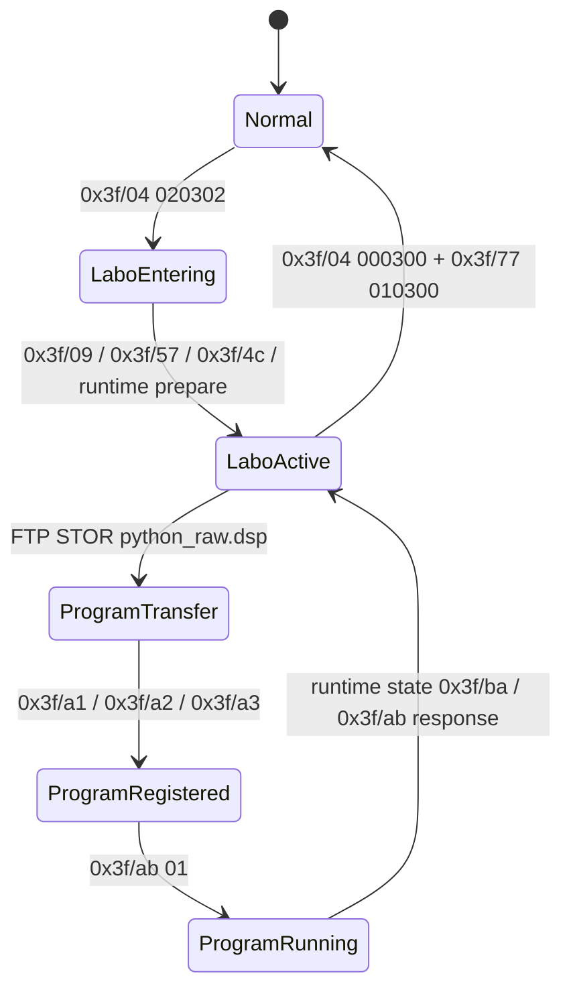

Labo状態維持:

| cmdset/cmdid | sender -> receiver | attr | payload | 周期/タイミング | 用途 |
| --- | --- | --- | --- | --- | --- |
| `0x3f/04` | `0x02 -> 0x09` | `0x00` | `020302` | Labo中は約1秒周期 | Labo active state維持 |
| `0x3f/04` | `0x02 -> 0x09` | `0x00` | `000300` | Labo入場前、Labo終了時、通常画面維持 | normal/neutral state維持 |
| `0x01/04` | `0x02 -> 0x09` | `0x00` | `0000042000010840000210` | 約7-8Hz | neutral control。操作入力がない間も継続 |
| `0x3f/77` | `0x02 -> 0x09` | `0x40` | `010300` | Labo終了時 | 通常状態へ戻すmode/skill切替 |

`0x3f/04 020302` はLabo activeを維持するkeepaliveとして扱う。Labo中にこれを止める、または `0x3f/04 000300` と `0x3f/77 010300` を送ると通常状態へ戻る。

#### 17.5.2 Labo設定と実行準備

Labo入場後にPCは以下の設定を送る。

| cmdset/cmdid | sender -> receiver | payload例 | 備考 |
| --- | --- | --- | --- |
| `0x3f/09` | `0x02 -> 0x09` | `05000000ea03000000000000ef0300000a000000f003000000000000f1030000b80b0000f2030000dc0500000000000000000000` | Labo/skill設定。複数IDと値の一括設定 |
| `0x3f/57` | `0x02 -> 0x09` | empty | Labo capability/state query |
| `0x3f/4c` | `0x02 -> 0x09` | `00` | runtime prepare |

`0x3f/09` payloadは以下のTLV風フィールドとして扱う。

| offset | size | value | 意味 |
| --- | ---: | --- | --- |
| `0x00` | 4 | `05000000` | 要素数 |
| `0x04` | 4 | `ea030000` | key `0x03ea` |
| `0x08` | 4 | `00000000` | value |
| `0x0c` | 4 | `ef030000` | key `0x03ef` |
| `0x10` | 4 | `0a000000` | value `10` |
| `0x14` | 4 | `f0030000` | key `0x03f0` |
| `0x18` | 4 | `00000000` | value |
| `0x1c` | 4 | `f1030000` | key `0x03f1` |
| `0x20` | 4 | `b80b0000` | value `3000` |
| `0x24` | 4 | `f2030000` | key `0x03f2` |
| `0x28` | 4 | `dc050000` | value `1500` |
| `0x2c` | 8 | `0000000000000000` | terminator/reserved |

#### 17.5.3 プログラム転送

```text
TCP 21
USER anonymous
PWD
CWD python
EPSV
TYPE I
STOR python_raw.dsp
QUIT
```

FTP転送先は `/python/python_raw.dsp`。データ接続はEPSVで開く。FTP転送はLaboプログラム本体の配置であり、実行開始はUDP DUSS側のruntime controlで行う。

#### 17.5.4 プログラム登録と実行制御

| cmdset/cmdid | sender -> receiver | attr | payload例 | 用途 |
| --- | --- | --- | --- | --- |
| `0x3f/a1` | `0x02 -> 0xa9` | `0x40` | `010004000f030000`, `0100040051140000` | project prepare / slot prepare |
| `0x3f/a2` | `0x02 -> 0xa9` | `0x40` | 18 bytes | project signature/content parameter |
| `0x3f/a3` | `0x02 -> 0xa9` | `0x40` | `xx` + ASCII hex hash | project/hash/skill table registration |
| `0x3f/ba` | `0x42 -> 0xc9` | `0x80` | `00` | runtime state notification |
| `0x3f/ba` | `0x02 -> 0xc9` | `0x80` | `00` | runtime state acknowledge/query |
| `0x3f/ab` | `0x02 -> 0xc9` | `0x80` | `01` | program start/request |
| `0x3f/ab` | `0x42 -> 0xc9` | `0x80` | `0f00`, `0000` | runtime response/state |

`0x3f/a3` は1byteの種別値に続いてASCII hex文字列を送る。種別値は `0x02`、`0x05`、`0x0d`、`0x51`、`0x52`、`0x55`、`0x9d` が観測される。ASCII hex文字列はプログラムまたはプロジェクトの識別子として扱い、ACK payloadは主に `00`、`0000`、`d4` が返る。

#### 17.5.5 Laboと走行基準モードの関係

RoboMaster S1には、走行基準として以下の3種類がある。

| mode | 挙動 |
| --- | --- |
| Chassis Lead | gimbalがchassis yawに追従する |
| Gimbal Lead | chassisがgimbal yawに追従する |
| Free | chassisとgimbalを独立させる |

現在の観測通信で定義できるLabo入退場シーケンスは、`0x3f/04 020302` を中心とするLabo active状態と、FTP/Runtime制御である。Chassis Lead / Gimbal Lead / Freeの走行基準切替は、Labo入退場シーケンスとは別状態として扱う。

実装上は以下のように分離する。

```text
Labo active:
  0x3f/04 020302 keepalive
  FTP + runtime commands

Travel reference mode:
  chassis_lead / gimbal_lead / free
  走行入力の座標系とgimbal追従関係を決める状態
```

FPV画面で「gimbal方向へ前進する」挙動は、Gimbal Lead相当の走行基準モードとして扱う。Labモードに入っただけでこの走行基準が変わるとは扱わない。Labモードから走行基準を変更する場合は、Laboプログラム内部のSDK命令、または別DUSSコマンドで切り替える必要がある。

#### 17.5.6 Laboシーケンス

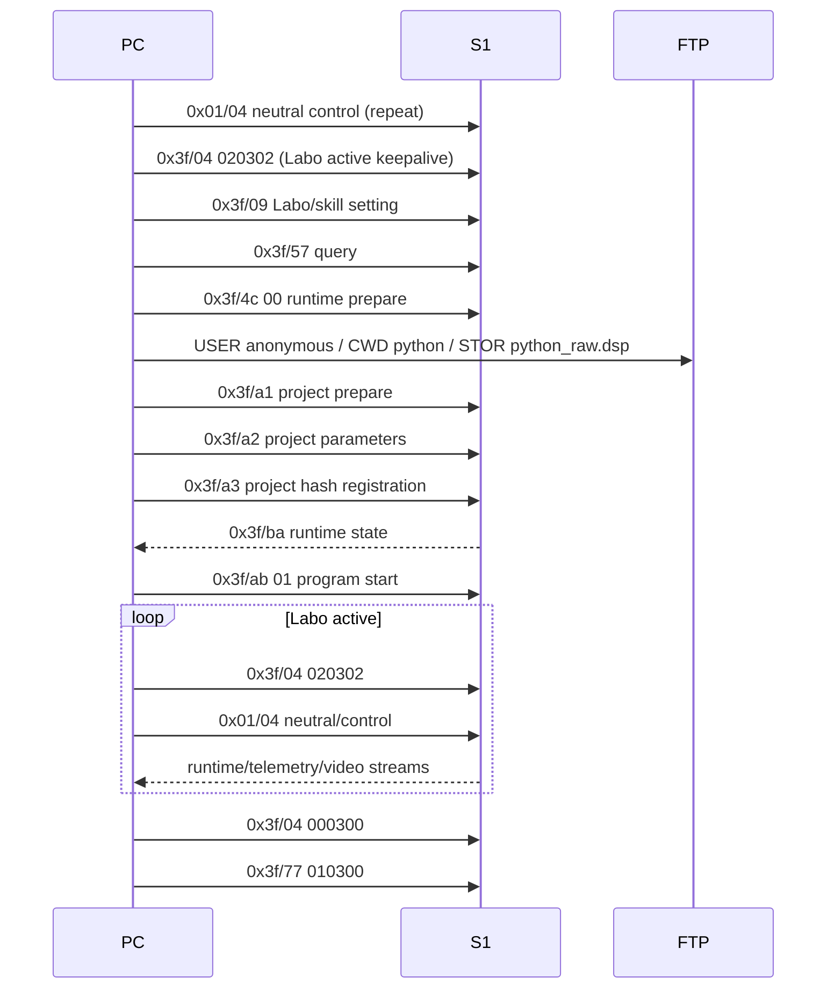

### 17.6 映像解像度設定

映像解像度設定変更に対応するPC -> S1 DUSSは `0x02/18`。

設定コマンド:

| cmdset/cmdid | sender -> receiver | payload | S1応答 |
| --- | --- | --- | --- |
| `0x02/18` | `0x02 -> 0x01` | `0a03000000` | `00` |
| `0x02/18` | `0x02 -> 0x01` | `0403000000` | `00` |

結論:

```text
映像解像度切替:
  cmdset/cmdid = 0x02/0x18
  payload = 5 bytes

設定値:
  0a03000000
  0403000000
```

実操作では、設定変更に応じて以下の順で送信される。

```text
0a03000000
0403000000
0a03000000
```

payload先頭1バイトが解像度設定値、残り4バイト `03 00 00 00` が固定引数である。`0a` と `04` の画面上名称は未規定。

S1は各設定コマンドに対して `cmdset=0x02 cmdid=0x18 payload=00` でACKを返す。

H.264ストリームを `0x02/18` 送信時刻で4区間に分割し、各区間のSPSを確認した結果はすべて `1280x720` である。

| 区間 | 対応する状態 | SPS |
| --- | --- | --- |
| 変更前 | 初期状態 | `1280x720` |
| `0a03000000` 後 | mode `0A03` | `1280x720` |
| `0403000000` 後 | mode `0403` | `1280x720` |
| `0a03000000` 後 | mode `0A03` | `1280x720` |

`0x02/18` はWindows App上の「解像度設定変更」操作で送信されるvideo mode設定である。実装では `0A03` / `0403` をvideo mode codeとして扱い、表示上は「適用mode」と「実ストリーム解像度」を分ける。実ストリーム解像度は受信H.264 SPSから取得する。

統合AppのVideo設定UIは、Resolution、Anti-Flickering、3D Qualityをradioで選択し、Applyを押した時だけ現在選択値をまとめて送信する。radio選択だけでは送信しない。

```text
Resolution:
  720p/30fps  -> 0x02/18 0403000000
  1080p/30fps -> 0x02/18 0a03000000

Anti-Flickering:
  50 Hz -> 0x02/46 01
  60 Hz -> 0x02/46 02

3D Quality:
  Low    -> 0x02/46 00
  Medium -> 0x02/46 01
  High   -> 0x02/46 02
```

表示中の解像度は設定名ではなく、受信H.264 SPSから得た実ストリームサイズを表示する。

### 17.7 H.264映像ストリーム

S1 -> PCの大容量UDP packetにはH.264 Annex-B bytestreamが入る。

高スループットpacket:

```text
S1 -> PC
sport = 10607
UDP payload length = 1472付近
outer[0:2] = c0 85 など 0x85系
outer header = 20 bytes
payload[20:] = H.264 Annex-B fragment
```

packet例:

```text
c0 85 <session> ... <20-byte outer> 00 00 00 01 ...
```

抽出規則:

```text
1. S1:10607 -> PC:10609 の大容量UDP packetを選ぶ
2. 先頭2 bytesが 0x85 系のstream packetを選ぶ
3. 先頭20 bytesのouter headerを除去する
4. 残りを時系列順に連結する
5. Annex-B H.264として保存する
```

H.264 bytestream抽出結果:

```text
packets: 11047
bytes: 16040244
Annex-B start code: 2127
NAL type 1: 2097
NAL type 7 SPS: 15
NAL type 8 PPS: 15
```

生成物はAnnex-B H.264 bytestreamである。

## 18. 実装上の必須条件

1. AppIDは必ずユーザー指定または確認済み値を使う。
2. 通常接続ツールのAppIDはユーザー指定または確認済み値を使う。
3. Disconnect時の処理はローカルUDP socket / worker停止で完了する。
4. Robot IPが既知でbroadcastが無い場合は、既に通常接続中として再接続扱いにできる。
5. outer sessionはPC側で選び、preconnectでS1へ通知する。
6. 再接続で前sessionが分かる場合は `previous + 1` を使う。
7. outer offset 7は必ずXOR再計算する。
8. 256 bytes超のouter lengthは上位bitをbyte1へ入れる。
9. S1 inboundを読み捨てず、outer window/tick生成に反映する。
10. 34-byte heartbeatはDUSS control用stream tickの上書き対象外。
11. DUSS CRC8/CRC16は毎回再計算する。
12. GUI機能範囲はQR生成、接続、telemetry表示、H.264表示、操作、debug logで構成する。
13. ConnectだけではSoloへ自動入室しない。SoloトグルON/OFFでSolo入退室列を送る。
14. DUSS seqは接続中に単調増加させ、Solo再入室で初期値へ戻さない。
15. Speed、Video、GUN種別、Voice、Volume、Control SensitivityはApply操作時だけ反映する。
16. Cooldown制御UIは実装しない。`0x3f/0e` はS1通知として表示・解析対象にする。

## 19. 実装チェックリスト

送信packet生成:

| 項目 | 条件 |
| --- | --- |
| outer length | UDP payload全体長から生成する |
| outer offset 7 | outer先頭7 bytesのXORを毎回再計算する |
| direct offset 4..5 | `direct_tx_tick` を入れる |
| direct offset 8..9 | `direct_ref_tick` を入れる |
| direct offset 10..11 | `direct_tx_tick` を再掲する |
| control offset 8..11 | `control_tx_tick` を2回入れる |
| control offset 16..19 | `control_ref_tick` を2回入れる |
| control offset 24..25 | `direct_ref_tick` を入れる |
| control offset 26..27 | `latest_direct_tick` を入れる |
| DUSS CRC8/CRC16 | DUSS frame生成時に毎回再計算する |

受信packet処理:

| 受信内容 | 実装動作 |
| --- | --- |
| session不一致 | outer tick/window同期に使わない |
| 34-byte heartbeat | `control_tx_tick` 同期に使わない |
| stream/data packet | `control_tx_tick = inbound outer[10:12]` |
| window packet | `control_ref_tick = inbound outer[16:18]` |
| window packet | `direct_ref_tick = inbound outer[24:26]` |
| DUSS ACK | ACK対象seqと送信済みdirect tickを対応付ける |
| `0x48/08` | telemetryとしてdecodeする |
| `0x3f/02` | LED GUN被弾イベントとして扱う |
| `0x3f/63` | 物理GUN/アーマー衝撃イベントとして扱う |

Control packetの注意:

```text
outer[24:26] と outer[26:28] は別フィールド。
direct送信直後は異なる値になる。
この状態を不一致エラーとして扱ってはいけない。
```

## 20. 未規定項目

| 項目 | 状態 |
| --- | --- |
| 初回session seed生成アルゴリズム | PC側生成値。AppID/QRとは独立 |
| `0x48/08 len=11` raw0..raw3正式名称 | gimbal角度系。yaw/pitch/relativeの正式対応名は未規定 |
| `0x48/08 len=62` velocity二系統の正式名 | position/velocity。world/bodyまたはfilteredの正式対応名は未規定 |
| `0x3f/10` payload bit定義 | 発射/被弾周辺状態通知。全bit意味は未規定 |
| Battle `0x3f/34 c8000000` の意味 | Battle parameter。具体値の意味は未規定 |
| Armor `0xb8`, `0xd8` module位置 | `0x3f/62` ACKに出るarmor module。4面衝撃手順では衝撃イベント未発生 |
| Windows AppのControl Sensitivity永続設定DUSS | 統合Appの対象外。統合AppのControl Sensitivityはローカルgimbal操作ゲイン |
| Labo `0x3f/a1/a2/a3/ab/ba` の詳細意味 | project登録/実行状態。各bit意味は未規定 |
| 映像ストリーム再生 | H.264 Annex-B抽出済み。再生可否は外部プレイヤー確認項目 |
